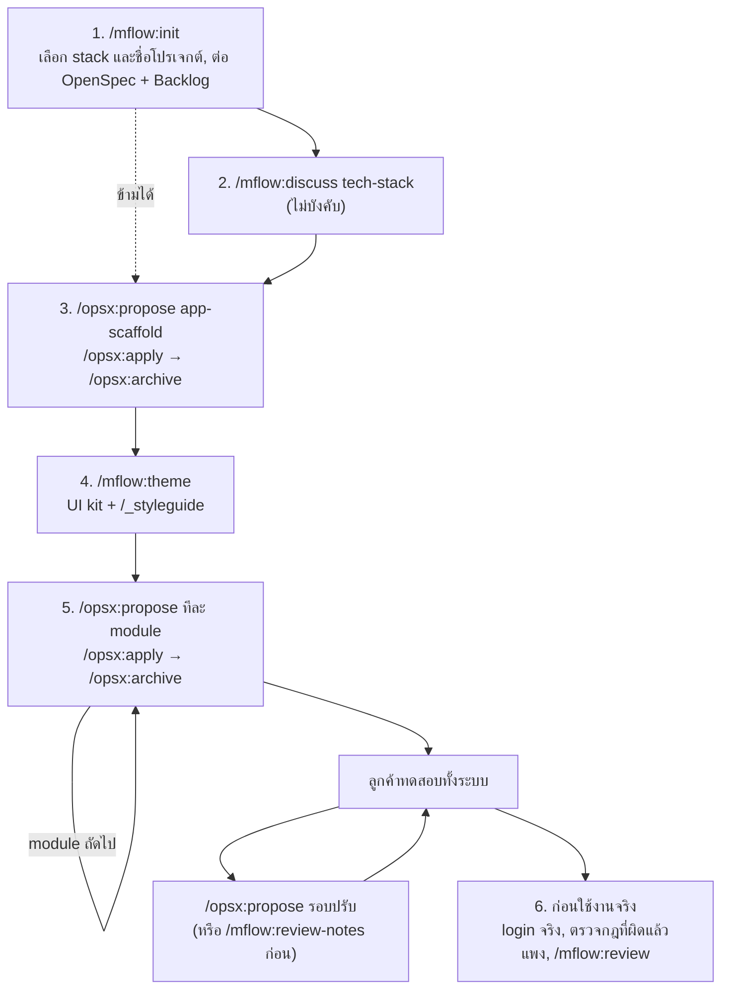

# mflow ทางลัด: ตั้งต้นด้วย mflow แล้วสร้างระบบด้วย OpenSpec

| รายการ | ค่า |
|---|---|
| เอกสาร | คู่มือทางลัด: ใช้ mflow เฉพาะส่วนตั้งต้น (stack และหน้าตา) แล้วสร้างทั้งระบบด้วย OpenSpec |
| เวอร์ชัน plugin | 0.24.0 |
| วันที่ | 2026-10-10 |
| อ่านคู่กับ | `docs/manual.md` (คู่มือหลัก ทางเต็มทีละหน้าจอ) |

**สารบัญ:** 1 ใช้ทางนี้เมื่อไร · 2 ภาพรวม · 3 ก่อนเริ่ม · 4 ขั้นตอนทีละขั้น · 5 ให้ลูกค้าทดสอบและปรับ · 6 ก่อนใช้งานจริง · 7 เรียก mflow กลับมาเมื่อไร · 8 เอกสารและ test อยู่ที่ไหน · 9 ข้อควรระวัง · 10 ตัวอย่าง: ระบบบริหารบุคลากรโรงเรียน

---

## 1. ใช้ทางนี้เมื่อไร

ทางเต็มของ mflow (`docs/manual.md`) สร้าง prototype ทีละหน้าจอ และตรวจทุกหน้าจออย่างละเอียด ทั้งสลับผู้ใช้ทุก role ทุกขนาดจอ และ screenshot จึงเหมาะกับระบบที่กฎซับซ้อนหรือผิดแล้วแพง ทางลัดนี้ใช้ mflow เฉพาะสองเรื่องที่ทำครั้งเดียวแล้วคุ้ม คือ **tech stack** และ **หน้าตา (UI kit)** จากนั้นสร้างทั้งระบบด้วย OpenSpec ทีละ module ให้ลูกค้าเห็นระบบทั้งหมดเร็วที่สุด แล้วปรับตามที่ลูกค้าทดสอบ

| เหมาะกับ | ไม่เหมาะกับ (ใช้ทางเต็มดีกว่า) |
|---|---|
| ระบบที่ส่วนใหญ่เป็นงานเพิ่ม ดู แก้ ลบข้อมูล ค้นหา และรายงาน | ส่วนที่คำนวณเงิน เช่น เงินเดือน ค่าธรรมเนียม ค่าปรับ |
| ลูกค้าต้องเห็นระบบทั้งหมดก่อน จึงจะบอกได้ว่าต้องการอะไรเพิ่ม | กฎที่มีผลทางกฎหมาย หรือรายงานที่ต้องส่งหน่วยงานภายนอก |
| domain ที่คุ้นเคย เช่น ข้อมูลบุคลากร ลงเวลา ลา คลังเอกสาร | ระบบที่สิทธิ์ซับซ้อนมาก เช่น หลายบริษัท หลายสาขา ข้อมูลแยกกันเด็ดขาด |

ระบบหนึ่งระบบใช้สองทางผสมกันได้ ส่วนใหญ่สร้างด้วยทางลัด แล้วเฉพาะส่วนที่ผิดแล้วแพงใช้ `hotspot` และ `golden` ของทางเต็ม (หัวข้อ 7)

## 2. ภาพรวม



| ขั้น | คำสั่ง | ได้อะไร | ความถี่ |
|---|---|---|---|
| 1 | `/mflow:init` | AGENTS.md, STATUS.md, OpenSpec, Backlog.md, กฎใน `openspec/config.yaml` | ครั้งเดียว |
| 2 | `/mflow:discuss tech-stack`, `code-structure` | ฐานข้อมูล, library, Docker, โครง folder ที่ตกลงแล้ว | ครั้งเดียว (ไม่บังคับ) |
| 3 | `/opsx:propose app-scaffold` | แอปเปล่าที่ build และ run ได้ | ครั้งเดียว |
| 4 | `/mflow:theme` | UI kit, หน้า `/_styleguide`, กฎให้ทุกหน้าใช้ kit | ครั้งเดียว |
| 5 | `/opsx:propose <module>` | ระบบจริงทีละ module | ต่อ module |
| ปรับ | `/opsx:propose <รอบปรับ>` | แก้ตามที่ลูกค้าทดสอบ | ต่อรอบทดสอบ |

## 3. ก่อนเริ่ม

ต้องมีเครื่องมือชุดเดียวกับทางเต็ม (Node, git, OpenSpec, Backlog.md, SDK ของ stack) ดูตารางใน `docs/manual.md` หัวข้อ 3 แล้วติดตั้ง plugin:

```
/plugin marketplace add mounchons/mflow-marketplace
/plugin install mflow@mflow-marketplace
```

ถ้าโฟลเดอร์ยังไม่เป็น git repo ให้รัน `git init` ก่อน

## 4. ขั้นตอนทีละขั้น

### ขั้น 1: `/mflow:init <ชื่อโปรเจกต์>`

- **Claude ถาม:**
  1. stack แบบ `a)` `b)` `c)` ตอบเป็นตัวอักษร: a) ASP.NET Core MVC + HTMX (รองรับครบที่สุด), b) React + Vite กับ ASP.NET Core Web API, c) stack อื่นที่คุณบอก (ยังไม่ได้ทดสอบกับ mflow)
  2. ชื่อโปรเจกต์ในโค้ด (ในข้อความเดียวกับ stack) Claude เสนอสามชื่อพร้อมชื่อที่แนะนำ ตอบเป็นตัวอักษรหรือพิมพ์ชื่อเอง เช่น `SchoolHr` ทุก project ขึ้นต้นด้วยชื่อนี้: `SchoolHr.Web.Backend` (หลังบ้าน), `SchoolHr.Web.Frontend` (หน้าบ้าน), `SchoolHr.Api`
  3. ขอ yes ก่อนรัน `openspec init` และ `backlog init`
  4. คำถามเรื่อง domain ไม่เกินสามข้อ ข้อที่ยังไม่รู้ตอบว่า "ข้าม" ได้ จะกลายเป็น `TODO`
- **ได้:** `AGENTS.md` (ส่วน `## Stack`), `STATUS.md`, `docs/vision.md`, `docs/decisions/`, `openspec/` พร้อมกฎใน `config.yaml` และ `backlog/`
- **ต่อไป:** ขั้น 2 ถ้าอยากล็อกรายละเอียด stack หรือข้ามไปขั้น 3

### ขั้น 2 (ไม่บังคับ): `/mflow:discuss tech-stack` แล้ว `/mflow:discuss code-structure`

- **ใช้เมื่อ:** อยากตกลงให้ชัดก่อนว่าใช้ฐานข้อมูลอะไร library ไหน (Claude ตรวจ licence ให้) ใช้ Docker ไหม และ folder ของแต่ละแอปอยู่ตรงไหน
- **พิมพ์:**
  ```
  /mflow:discuss tech-stack
  /mflow:discuss 01 approve
  /mflow:discuss code-structure
  /mflow:discuss 02 approve
  ```
- **ได้:** `docs/decisions/discuss/01-tech-stack.md`, `02-code-structure.md` และส่วน `## Stack` กับ `## Architecture` ใน AGENTS.md ที่เติมแล้ว
- **ถ้าข้าม:** บอกเรื่องเหล่านี้ใน `/opsx:propose app-scaffold` (ขั้น 3) แทน ตอน `/mflow:theme` Claude จะเตือนหนึ่งครั้งว่ายังไม่ได้ตกลง แต่เป็นแค่คำแนะนำ ทำต่อได้

### ขั้น 3: สร้างแอปเปล่าด้วย OpenSpec

`/mflow:theme` ต้องมีแอปที่ build ได้ก่อน จึงจะสร้าง kit ลงในโค้ดจริงได้ ถ้ารัน theme ตอนที่ยังไม่มีแอป Claude จะให้เลือกระหว่าง preview แบบ HTML ล้วน (ภายหลังต้อง `/mflow:theme port` เพิ่มอีกขั้น) หรือสร้างแอปก่อน ทางลัดนี้แนะนำให้สร้างแอปก่อน

```
/opsx:propose app-scaffold โครงแอปเปล่าตาม ## Stack ใน AGENTS.md:
  solution และ project ตาม code structure, test project ใต้ tests/,
  ต่อฐานข้อมูลผ่าน EF Core พร้อม migration แรก, หน้า health check,
  คำสั่ง build/test/run ที่ใช้ได้จริงเขียนลง AGENTS.md ## Commands
/opsx:apply
/opsx:archive
```

- **ตรวจ:** build ผ่าน, เปิดแอปได้, `dotnet test` (หรือคำสั่ง test ของ stack) รันได้
- **ต่อไป:** `/mflow:theme`

### ขั้น 4: `/mflow:theme <แบรนด์ | @โลโก้ | @CI guide>`

- **Claude ถามครั้งเดียวเป็นชุด:** สีหลักหรือ CI, หน้าตาที่ต้องการ (ค่าเริ่มต้นแบบ admin หรือ back-office สมัยใหม่ ใช้ skill `frontend-design` ช่วยถ้าติดตั้งไว้), ฟอนต์ไทย, ความหนาแน่นของหน้า, อุปกรณ์ที่ใช้และขนาดจอที่ต้องตรวจ, รูปแบบวันที่ และปี ค.ศ. หรือ พ.ศ.
- **ตอบไว้ในคำสั่งเลยจะได้ไม่ต้องตอบไปมา:**
  ```
  /mflow:theme @docs/source/logo.png สีหลักน้ำเงินกรม ฟอนต์ Sarabun หน้าแบบหนาแน่น
    ใช้บน desktop และ tablet วันที่แบบ a ปี พ.ศ.
  ```
- **ได้:**
  - `tokens.css`, app shell (เมนูข้าง ☰ แถบบน), component ทั้งชุด (DataTable, FilterPanel, FormField, DatePicker, Dialog, QuickView …) หน้ารายการเปิดรายละเอียดของแถวใน dialog หรือ side panel โดยไม่เปลี่ยนหน้า หน้าตามาตรฐานคือ house style: sidebar สีกรมท่า top bar สีขาว สีฟ้า ฟอนต์ Inter + Noto Sans Thai ไอคอน Font Awesome 6 ปรับสีตาม CI ของลูกค้าได้
  - หน้า `/_styleguide` ที่รวมทุก component และหน้าตัวอย่าง ใช้ให้ลูกค้าตกลงหน้าตาครั้งเดียว ไม่ต้องตกลงทีละหน้า
  - `docs/ui/design-system.md` และ `.claude/rules/ui.md` ไฟล์หลังถูกโหลดทุกครั้งที่ Claude เปิดไฟล์ UI ตอน `/opsx:apply` ก็โหลดด้วย **นี่คือส่วนที่ทำให้หน้าที่สร้างด้วย OpenSpec ยังใช้ kit เดียวกัน**
  - ระบบผู้ใช้จำลอง: แถบ PROTOTYPE ที่สลับ role ได้ และ flag `Prototype:UseFakeData` (ดูหัวข้อ 6)
- **ใช้เวลา:** ประมาณหนึ่ง session เพราะสร้าง component ทั้งชุดและตรวจทุกขนาดจอ แต่ทำครั้งเดียว
- **ต่อไป:** เปิด `/_styleguide` ให้ลูกค้าดู แล้วเริ่ม module แรก

### ขั้น 5: สร้างทีละ module ด้วย OpenSpec

**แบ่ง change ตาม module ไม่ใช่ตามหน้าจอ** ระบบหนึ่งระบบมักมี 3–6 change ถ้ารวมเป็น change เดียวจะใหญ่เกินกว่าจะตรวจได้ และ AI จะพลาดง่ายขึ้น ส่วนการแยกทีละหน้าจอจะช้าเหมือนทางเต็ม

ข้อความที่ควรใส่ใน `/opsx:propose` ของทุก module:

```
/opsx:propose staff-records ข้อมูลบุคลากร: รายการ ค้นหา เพิ่ม แก้ไข ดูรายละเอียด
  - หน้าจอสร้างจาก component ใน docs/ui/design-system.md เท่านั้น
  - เก็บข้อมูลจริงด้วย EF Core และ migration ไม่ใช้ PrototypeData
  - role ที่ใช้: ผู้ดูแล เห็นและแก้ทุกคน, ครู เห็นเฉพาะของตัวเอง
    (เพิ่ม role ลง users.json และ roles.json ให้สลับทดสอบได้ในแถบ PROTOTYPE)
  - ข้อมูลตัวอย่างที่ดูเหมือนจริง 30 คน หลายตำแหน่ง หลายกลุ่มสาระ
  - กฎที่ยังไม่รู้ให้เลือกค่าที่สมเหตุสมผล เขียนเป็นข้อสมมติใน proposal
    และรวมเป็นรายการ "คำถามตอนทดสอบ"
  - test เฉพาะกฎและ flow หลัก รอบแรกยังไม่ต้องครบทุกกรณี
/opsx:apply
/opsx:archive
```

- **ถ้ายังคิดไม่ชัด:** ใช้ `/opsx:explore <เรื่อง>` ก่อน propose
- **ให้ AI ตัวอื่นเขียนโค้ดแทน:** `/mflow:delegate <ชื่อ change> --mode code --to codex` แล้วตรวจด้วย `/mflow:review agent/codex/<ชื่อ change>` ก่อน merge
- **ให้ Claude ส่งงานแต่ละ task ให้ subagent (Sonnet) เขียน:** `/mflow:subagent on` แล้ว `/clear` ก่อน `/opsx:apply`
- **หลัง archive:** `git diff --stat openspec/specs` ต้องเห็นว่า spec หลักเปลี่ยน
- **ต่อไป:** module ถัดไป จนครบทุก module ที่ลูกค้าต้องเห็น แล้วไปหัวข้อ 5

## 5. ให้ลูกค้าทดสอบและปรับ

1. **ก่อนส่ง:** เปิดทุกหน้าให้ได้ ข้อมูลตัวอย่างครบ และลองสลับ role ในแถบ PROTOTYPE ว่าแต่ละ role เห็นเมนูและข้อมูลถูก
2. **ระหว่างทดสอบ:** ให้ลูกค้าลองในมุมของแต่ละ role ใช้รายการ "คำถามตอนทดสอบ" จากทุก proposal ถามไปพร้อมกัน แล้วจดโน้ตหรืออัดเสียง (ถอดเป็นข้อความก่อนส่งให้ Claude)
3. **หลังทดสอบ เลือกหนึ่งทาง:**
   - **เร็ว:** วางโน้ตไว้ที่ `docs/source/reviews/` แล้ว `/opsx:propose feedback-round-1 @docs/source/reviews/<ไฟล์>` แยกเป็นหลาย change ถ้าความเห็นกระทบหลาย module ทางนี้ไม่ได้ลงทะเบียนโน้ตในทะเบียนเอกสาร briefing จึงขึ้นบรรทัด "new source doc(s) not processed → /mflow:capture" ทุกครั้งที่เปิด session เป็นแค่การเตือน ไม่ขวางงาน ถ้าไม่อยากเห็นให้ใช้ทางถัดไป ซึ่งลงทะเบียนโน้ตให้
   - **มีหลักฐานว่าตกลงอะไรกัน:** `/mflow:review-notes @<ไฟล์>` Claude จัดทุกบรรทัดเป็นตาราง (ปรับหน้าจอ, กฎ, field, สิทธิ์, คำถาม …) ให้คุณตรวจ แล้วเขียนสรุปที่ `docs/reviews/<วันที่>-<หัวข้อ>-summary.md` คำสั่งนี้ออกแบบมาสำหรับ prototype ของทางเต็ม จึงต้องบอก Claude ว่า "งานปรับหน้าจอส่งไป /opsx:propose ไม่ใช่ /mflow:screen"
4. **ทำซ้ำ** จนลูกค้าใช้ flow หลักได้ครบ

ถ้าเป็นงานราคาคงที่และต้องแยกว่าคำขอไหนอยู่นอกขอบเขต ให้ใช้ `/mflow:change-request <คำขอ>` กับคำขอนั้น Claude จะจัดประเภท (defect / clarification / new scope) พร้อมประมาณการเป็นชั่วโมง และบันทึกที่ `docs/reviews/change-requests/`

## 6. ก่อนใช้งานจริง

| เรื่อง | ทำอะไร |
|---|---|
| ผู้ใช้จริง | ทำ change ที่ใช้ login จริงแทน `FakeCurrentUser` และปิด `Prototype:UseFakeData` ถ้าเปิด flag นี้ใน Production แอปจะไม่ยอม start (ตั้งใจให้เป็นอย่างนั้น) |
| สิทธิ์ | ตกลงให้ชัดว่าใครเห็นข้อมูลของใคร ใช้ `/mflow:discuss access-control` ถ้ามีหลาย role หรือมีข้อมูลส่วนบุคคล |
| กฎที่ผิดแล้วแพง | เช่น สาย/ลาที่ไปหักเงินเดือน หรือรายงานส่งต้นสังกัด: `/mflow:hotspot <กฎ>` แล้ว `/mflow:golden @<Excel ที่ลูกค้าคำนวณจริง> <slug>` ให้ test เทียบกับตัวเลขจริง |
| ระบบภายนอก | เครื่องสแกนนิ้วหรือหน้า, ระบบเดิม: ทำ spike ต่อกับของจริงให้เร็วที่สุด เพราะส่วนนี้เดาไม่ได้ |
| ตรวจโค้ด | `/mflow:review <branch>` ก่อน merge ทุกครั้ง ได้คำตัดสิน `approve` หรือ `changes-requested` |
| test | เติม test ของกฎและ flow หลักที่รอบแรกข้ามไว้ |

## 7. เรียก mflow กลับมาเมื่อไร

ทางลัดไม่ได้ปิด mflow คำสั่งทุกตัวยังใช้ได้ ใช้เมื่อเจอสถานการณ์ของคำสั่งนั้น

| สถานการณ์ | คำสั่ง |
|---|---|
| ลูกค้าส่งเอกสารใหม่ (TOR, Excel, ตัวอย่างรายงาน) | `/mflow:capture` |
| ต้องตกลงเรื่องที่ตีความได้หลายแบบ (สิทธิ์, เลขเอกสาร, data model) | `/mflow:discuss <หัวข้อ>` |
| กฎคำนวณที่ซับซ้อนหรือผิดแล้วแพง | `/mflow:hotspot <กฎ>` แล้ว `/mflow:golden` |
| เปลี่ยนหน้าตาทั้งระบบ (สี ฟอนต์ เมนู) | `/mflow:theme update <อะไร>` |
| ตรวจโค้ดก่อน merge | `/mflow:review` |
| คำขอนอกขอบเขต | `/mflow:change-request` |
| จบวัน หรือส่งต่องานให้คนอื่น / tool อื่น | `/mflow:handoff` |
| ไม่แน่ใจว่าจะใช้คำสั่งไหน | `/mflow:help <เล่าสถานการณ์>` |

## 8. เอกสารและ test อยู่ที่ไหน

### เอกสารของ mflow (ตั้งแต่ 0.20.0)

mflow เขียนเอกสารทั้งหมดไว้ใต้ `docs/` โดยแบ่งเป็นห้าหมวด เอกสารของโปรเจกต์เอง (คู่มือผู้ใช้, data dictionary ที่ส่งลูกค้า …) วางข้างๆ ได้ตามปกติ

```text
docs/
├── vision.md              story map, ขอบเขต, คำถามที่ยังเปิด
├── source/                เอกสารลูกค้า (INDEX.md สร้างให้อัตโนมัติ)
│   └── reviews/           โน้ตและ transcript จากการทดสอบ
├── decisions/             สิ่งที่ตกลงแล้ว
│   ├── discuss/           AGENDA.md, 01-tech-stack.md, 02-code-structure.md, …
│   └── hotspots/          INDEX.md, <slug>/map.md, rules.md
├── ui/                    design-system.md, screens.md, theme/
├── reviews/               ผลทดสอบและการเปลี่ยนแปลง
│   ├── <วันที่>-<หัวข้อ>-summary.md
│   ├── code/              ผล /mflow:review
│   └── change-requests/   CR-<nnn>-<slug>.md
└── ai/                    งานของ AI ตัวอื่น
    ├── inbox/             รายงานที่ส่งกลับมา
    ├── analysis/          AN-NNN
    ├── design/            DS-NNN
    └── challenge/         CH-NNN
```

นอก `docs/` มีเฉพาะสิ่งที่ต้องอยู่ที่ root: `AGENTS.md`, `CLAUDE.md`, `STATUS.md`, `.mflow/` (ค่าตั้งและข้อมูลของ script), `openspec/` และ `backlog/` (ของ OpenSpec และ Backlog.md)

**โปรเจกต์ที่สร้างก่อน 0.20.0:** `/mflow:help check setup` จะเตือนว่าใช้โครงเก่า ส่วน `/mflow:init` แสดงแผนการย้ายก่อน (ย้าย folder ไหนไปไหน, แก้ path ในไฟล์ไหนบ้าง) ตอบ yes แล้วจึงย้าย จากนั้น commit ด้วย `git add -A` (git จะเห็นเป็นการเปลี่ยนชื่อไฟล์)

### test ควรอยู่ที่ไหน

test ของ .NET **ไม่อยู่ใต้ `src/` หรือ `apps/`** ให้แยกไว้ที่ `tests/` ที่ root ระดับเดียวกับ `src/` (หรือ `apps/`) ส่วน test ของหน้าเว็บอยู่ในแอปของมันเอง

| ประเภท | ที่อยู่ | เหตุผล |
|---|---|---|
| Unit / integration test ของ .NET (xUnit) | `tests/<ชื่อโปรเจกต์>.Domain.Tests/`, `tests/<ชื่อโปรเจกต์>.Api.Tests/` | `dotnet publish` และ Docker image ไม่ติด test ไปด้วย, ตั้ง `Directory.Build.props` แยกให้ test ได้, CI หา test ด้วย path เดียว |
| Golden data | `tests/<ชื่อโปรเจกต์>.Domain.Tests/Golden/` | `/mflow:golden` เขียนที่นี่ และ `/mflow:help check setup` ตรวจที่นี่ |
| Unit test ของ React (Vitest) | ข้างไฟล์ที่ทดสอบ เช่น `src/SchoolHr.Web.Frontend/src/**/Foo.test.tsx` | ธรรมเนียมของ Vite/Vitest ย้ายไฟล์แล้ว test ไปด้วย |
| E2E (Playwright) | ในแอปเว็บ เช่น `src/SchoolHr.Web.Backend/e2e/` หรือ `tests/e2e/` ถ้ามีหลายแอป | ใช้ config และ base URL ของแอปนั้น |

โครงที่แนะนำ (เป็นค่าเริ่มต้นของ `/mflow:discuss code-structure`):

```text
<repo>/
├── src/
│   ├── SchoolHr.Domain/           กฎธุรกิจ (layer ใช้ร่วมกันทุกแอป)
│   ├── SchoolHr.Application/
│   ├── SchoolHr.Infrastructure/
│   ├── SchoolHr.Api/              API (มีตัวเดียว จึงไม่มีส่วนต่อท้าย)
│   ├── SchoolHr.Web.Backend/      หลังบ้าน
│   └── SchoolHr.Web.Frontend/     หน้าบ้าน
├── tests/                         test ของ .NET ทุกตัว (ชื่อ project ที่ทดสอบ + .Tests)
├── docs/
├── deploy/                        docker, migration script
└── SchoolHr.slnx
```

ชื่อแอปทุกตัวเป็น `<ชื่อโปรเจกต์>.<ชนิด>` หรือ `<ชื่อโปรเจกต์>.<ชนิด>.<ส่วน>`: ชนิดคือ `Web` หรือ `Api` (หรือ `Worker`, `Mobile`) ส่วนบอกกลุ่มผู้ใช้ `Frontend` = หน้าบ้าน `Backend` = หลังบ้าน ถ้าชนิดไหนมีหรือจะมีมากกว่าหนึ่งแอป ทุกตัวใส่ส่วนตั้งแต่แรก ถ้าอยากแยกแอปกับ library ก็ใช้ `apps/` กับ `packages/` แทน `src/` ได้ ชื่อยังตามรูปแบบเดิม

## 9. ข้อควรระวัง

- **อย่าข้ามขั้น theme:** ถ้าไม่มี kit แต่ละ module จะได้หน้าตาคนละแบบ แก้ทีหลังแพงกว่าทำ theme ครั้งเดียวตอนต้น
- **change ใหญ่เกิน:** ถ้า tasks.md เกินประมาณ 20 task ให้แยกเป็นสอง change
- **กฎใน `openspec/config.yaml`:** `init` เขียนกฎให้ทุก task จบด้วย test ถ้ารอบแรกอยากเร็ว ให้บอกใน propose ว่าทำ test เฉพาะกฎและ flow หลัก (ไม่ต้องแก้ไฟล์) ส่วนข้อความที่ชี้ไปที่ `docs/decisions/hotspots` และ `PrototypeData/README.md` เป็นแค่ตัวชี้ ถ้าไม่มีไฟล์นั้น Claude ก็ข้ามไป
- **hook ของ mflow ยังทำงาน:** ตอนเปิด session มี briefing (แสดงหัวข้อ AGENDA ว่าไม่บังคับ) และระหว่างทำงานมีเตือนให้อัปเดต STATUS.md ทั้งสองอย่างไม่ขวางงาน ถ้ารำคาญคำเตือน ปรับ `stopGuard` ใน `.mflow/config.json`
- **ข้อมูลตัวอย่าง:** ระบบว่างเปล่าทำให้ลูกค้าให้ความเห็นได้น้อย ใส่ข้อมูลที่ดูเหมือนจริงทุก module
- **ก่อนใช้งานจริงลบฐานข้อมูลแล้วสร้างใหม่ได้:** ช่วงทดสอบยังไม่มีข้อมูลจริง การเปลี่ยนโครงตารางตาม feedback จึงยังถูก หลังใช้งานจริงแล้วทุกการเปลี่ยนต้องมี migration ที่ไม่ทำข้อมูลหาย

## 10. ตัวอย่าง: ระบบบริหารบุคลากรโรงเรียน

ระบบที่ลูกค้าอยากเห็นทั้งหมดก่อน: ข้อมูลพนักงานและครู, ลงเวลาเข้าออก, การลา, รายงาน

```text
# วันที่ 1: ตั้งต้น
git init
/mflow:init SchoolHR
  (ถาม stack: ตอบ a)
/mflow:discuss tech-stack
/mflow:discuss 01 approve
  → .NET 10 + PostgreSQL ใน Docker
/opsx:propose app-scaffold โครงแอปเปล่าตาม ## Stack, test ใต้ tests/, EF Core + migration แรก
/opsx:apply
/opsx:archive

# วันที่ 2: หน้าตา
/mflow:theme @docs/source/logo-school.png สีเขียวโรงเรียน ฟอนต์ Sarabun หนาแน่น
  desktop และ tablet วันที่แบบ a ปี พ.ศ.
  → เปิด /_styleguide ให้ลูกค้าดู

# วันที่ 3–6: ทีละ module
/opsx:propose staff-records ข้อมูลพนักงานและครู … (ข้อความตามหัวข้อ 4 ขั้น 5)
/opsx:apply
/opsx:archive
/opsx:propose work-calendar ปฏิทินวันทำงาน วันหยุดราชการ วันหยุดโรงเรียน
/opsx:apply
/opsx:archive
/opsx:propose attendance ลงเวลาเข้าออก มาสาย กลับก่อน ขาด
  ข้อสมมติ: สายหลัง 08:30, นำเข้าจากไฟล์ของเครื่องสแกนเป็น CSV
/opsx:apply
/opsx:archive
/opsx:propose leave-requests ขอลา อนุมัติโดยผู้บริหาร ประเภทลาตามระเบียบ
/opsx:apply
/opsx:archive
/opsx:propose attendance-reports รายงานรายวัน รายเดือน ส่งออก Excel
/opsx:apply
/opsx:archive

# สัปดาห์ที่ 2: ลูกค้าทดสอบ
  (ลูกค้าลองทุก role จากแถบ PROTOTYPE จดโน้ตไว้ที่ docs/source/reviews/2026-10-20-test-1.md)
/mflow:review-notes @docs/source/reviews/2026-10-20-test-1.md
  (บอก Claude: งานปรับหน้าจอส่งไป /opsx:propose)
/opsx:propose feedback-round-1 ตามสรุป docs/reviews/2026-10-20-test-1-summary.md
/opsx:apply
/opsx:archive

# ก่อนใช้งานจริง
/mflow:hotspot การนับสายและลาที่ไปหักเงินเดือน @docs/source/ระเบียบการลา.pdf
/mflow:golden @docs/source/สรุปเวลา-ก.ย.2569.xlsx attendance-deduction
/opsx:propose real-login login จริงแทนผู้ใช้จำลอง ปิด Prototype:UseFakeData
/opsx:apply
/mflow:review --uncommitted
/opsx:archive

# ทุกเย็น
/mflow:handoff
```
