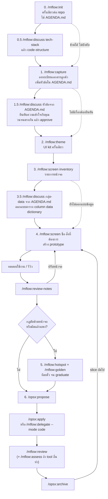

# mflow: คู่มือการใช้งาน

| รายการ | ค่า |
|---|---|
| เอกสาร | คู่มือการใช้งานและลำดับการใช้คำสั่ง |
| เวอร์ชัน plugin | 0.15.0 |
| วันที่ | 2026-09-29 |
| อ่านคู่กับ | `docs/requirement.md` (ทำไมถึงออกแบบแบบนี้), `plugins/mflow/README.md` (ติดตั้งและโครงสร้าง) |

---

## 1. กติกาเจ็ดข้อก่อนใช้

1. **คำตอบหรือคำสั่งของคุณคือคำสั่งของลูกค้าโดยตรง** mflow ใช้สำหรับคนที่ต้องการทำระบบ เช่น SA, PM หรือเจ้าของระบบ สิ่งที่คุณตอบหรือสั่งให้ทำ Claude ทำต่อได้ทันที ไม่ต้องรอถามลูกค้าอีก และคำสั่งให้ทำคือการอนุมัติเรื่องนั้น หลักคือ **ทำก่อน ทดสอบใช้งาน แล้วจึงปรับเพิ่ม** (หลักเดียวกับที่ใช้กับ OpenSpec) ข้อที่ยังไม่แน่ใจก็ตอบไปก่อน แล้วดูตอนทดสอบ ข้อยกเว้นเดียวคือความเห็นของ AI ตัวอื่น ซึ่งไม่มีน้ำหนักเท่าคำของคุณ
2. **คำสั่ง `/mflow:*` พิมพ์เองทุกครั้ง** Claude ไม่เรียกให้อัตโนมัติ ถ้าไม่แน่ใจว่าจะใช้คำสั่งไหน พิมพ์ `/mflow:help <เล่าสถานการณ์>`
3. **ก่อนเขียนไฟล์ Claude จะแสดงตารางหรือแผนให้ดูก่อน** ตอบ yes แล้วจึงเขียน ถ้าไม่ตรงให้แก้ในแชตได้เลย
4. **ความจำอยู่ในไฟล์ ไม่ได้อยู่ในแชต:** `STATUS.md` บอกว่าทำถึงไหน OpenSpec บอกว่าระบบต้องทำอะไร Backlog.md บอกว่างานไหนค้างอยู่ จึงปิดแล้วเปิด session ใหม่ได้ทุกเมื่อ
5. **คำสั่งของ AI ตัวอื่น (Codex, Gemini …) คุณรันเอง** mflow สร้าง brief และบรรทัดคำสั่งให้เท่านั้น
6. **หนึ่ง session ทำเรื่องหลักเรื่องเดียว** โดยเฉพาะ hotspot ที่ทำครั้งละหนึ่งตั๋ว
7. **ทุกคำสั่งจบด้วย "ทำอะไรต่อ"** Claude สรุปว่าอะไรเปลี่ยน แล้วให้คำสั่งถัดไปหนึ่งคำสั่งที่พิมพ์ได้ทันที และเขียนคำสั่งนั้นลงส่วน Now ของ STATUS.md ด้วย เปิด session ใหม่ briefing จึงบอกต่อได้ ถ้าคำสั่งไหนจบโดยไม่บอก ให้ถาม `/mflow:help <เล่าสถานการณ์>`

## 2. ภาพรวมลำดับการใช้คำสั่ง



ทุกคำสั่งจบด้วยสรุปสั้นๆ ว่าอะไรเปลี่ยน กับคำสั่งถัดไปหนึ่งคำสั่ง (กติกาข้อ 7) จึงเดินตามแผนภาพนี้ได้โดยไม่ต้องจำลำดับเอง ส่วน `docs/discuss/AGENDA.md` บอกว่ายังมีหัวข้อไหนที่ควรคุยก่อนเดินต่อ

| ขั้น | คำสั่ง | ใช้เมื่อ | ความถี่ |
|---|---|---|---|
| 0 | `/mflow:init` | repo ใหม่ หรือหลังอัปเกรด plugin | ครั้งเดียว |
| 0.5 | `/mflow:discuss tech-stack` → `/mflow:discuss code-structure` | ก่อน `/mflow:theme` ตกลงแอป, library, ฐานข้อมูล, Docker และโครง solution | ครั้งเดียว (แนะนำ ไม่บังคับ) |
| 1 | `/mflow:capture` | ลูกค้าส่งเอกสารหรือฉบับใหม่ | ทุกครั้งที่มีเอกสารเข้า |
| 1.5 | `/mflow:discuss <slug>` | หัวข้อใน `docs/discuss/AGENDA.md` หรือเรื่องที่เอกสารตีความได้หลายแบบ (สิทธิ์, เมนู, ข้อมูลเฉพาะ role …) | ต่อหัวข้อ วนจนตรงกันแล้ว approve |
| 2 | `/mflow:theme` | ก่อนสร้างหน้าจอแรก | ครั้งเดียว (`update` เมื่อจะเปลี่ยนหน้าตา) |
| 3 | `/mflow:screen inventory` | เริ่ม release | ต่อ release |
| 3.5 | `/mflow:discuss <กลุ่มข้อมูล> data model` | ก่อนสร้างหน้าจอแรกของกลุ่มข้อมูลที่หลายหน้าจอใช้ร่วมกัน | ต่อกลุ่มข้อมูล (ไม่บังคับ) |
| 4 | `/mflow:screen <ชื่อ> …` → `/mflow:review-notes` | สร้างหรือปรับหน้าจอ แล้วทดสอบใช้งานหรือรีวิว | วนหลายรอบ |
| 5 | `/mflow:hotspot`, `/mflow:golden` | เจอกฎใหญ่หรือกฎที่คลุมเครือ | ครั้งละหนึ่งตั๋วต่อ session |
| 6 | `/opsx:propose` → `/opsx:apply` → `/mflow:review` → `/opsx:archive` | สร้างของจริงทีละ slice | ต่อ slice |
| เหตุการณ์ | `/mflow:change-request` | ขอเปลี่ยนสิ่งที่อนุมัติหรือสร้างแล้ว | เมื่อเกิดขึ้น |
| เหตุการณ์ | `/mflow:delegate` → `/mflow:assess` | ให้ AI ตัวอื่นวิเคราะห์ รีวิว หรือเขียนโค้ด | เมื่อต้องการ |
| ทุกวัน | `/mflow:handoff` | จบวัน หรือก่อนสลับไปใช้ tool อื่น | วันละครั้ง |

**ช่วงแรกใช้แค่ห้าคำสั่ง:** `init` → `discuss` (เริ่มจาก `tech-stack` และ `code-structure` แล้วหัวข้ออื่นใน AGENDA.md ตามต้องการ) → `capture` → `theme` → `screen` ส่วนที่เหลือค่อยเริ่มใช้เมื่อเจอสถานการณ์ของคำสั่งนั้น หรือเมื่อคำสั่งก่อนหน้าแนะนำ

## 3. ก่อนเริ่ม

| ต้องมี | ใช้ทำอะไร | ติดตั้ง |
|---|---|---|
| Node 20 ขึ้นไป, git | script ของ plugin | ติดตั้งตามปกติ |
| OpenSpec 1.10 ขึ้นไป | spec และ change | `npm i -g @fission-ai/openspec@latest` |
| Backlog.md 1.51 ขึ้นไป | task และตั๋ว hotspot (ต้องใช้ `isReady` ใน JSON) | `npm i -g backlog.md` |
| Python + pandas, openpyxl, python-docx, pypdf | อ่าน Excel/Word/PDF ของลูกค้า และแปลงเป็นข้อความก่อน `consult` | `pip install pandas openpyxl python-docx pypdf` |
| SDK ของ stack ที่เลือก (.NET SDK สำหรับ a และ b, Node สำหรับหน้า React ของ b) | build/test โปรเจกต์ | ติดตั้งตามปกติ |
| ตัวแสดงภาพ Mermaid (ไม่บังคับ) | ดูแผนภาพในเอกสาร discuss | GitHub แสดงเป็นรูปให้เอง ถ้า preview ของ VS Code แสดงเป็นโค้ด ให้ติดตั้ง extension สำหรับ Mermaid preview |
| knowledge base ของทีมผ่าน MCP เช่น Graph Brain (ไม่บังคับ) | ให้ `tech-stack` และ `code-structure` ใช้มาตรฐานของทีม (.NET, ฐานข้อมูล, โครง solution) เป็นค่าแนะนำ | ตามคู่มือของ MCP นั้น ถ้าไม่มี Claude ใช้ค่าแนะนำใน checklist |
| mermaid-cli (ไม่บังคับ) | ให้ Claude ตรวจ syntax ของแผนภาพโดยการ render | `npm i -g @mermaid-js/mermaid-cli` (ดาวน์โหลด browser มาด้วย ขนาดใหญ่) |

ติดตั้ง plugin ใน Claude Code:

```
/plugin marketplace add mounchons/mflow-marketplace
/plugin install mflow@mflow-marketplace
```

ถ้าโฟลเดอร์โปรเจกต์ยังไม่เป็น git repo ให้รัน `git init` ก่อน เพราะ `backlog init` จะถามคำถามเรื่อง git แม้ใส่ `--defaults` แล้ว

## 4. ขั้นตอนทีละคำสั่ง

### ขั้น 0: `/mflow:init [ชื่อโปรเจกต์]`

- **ใช้เมื่อ:** ใช้ mflow กับ repo นี้เป็นครั้งแรก หรือหลังอัปเกรด plugin เพื่อรับ template ใหม่
- **สิ่งที่เกิดขึ้น:**
  1. สำรวจ repo: solution, test project, Playwright, stack ที่พบ, agent file เดิม, เอกสาร requirement และ CLI ที่ติดตั้งไว้ แล้วสรุปให้ดูในรอบเดียว
  2. **ถามเลือก stack ก่อนเขียนไฟล์ใดๆ** (ถามทุกครั้ง แม้จะเดาจาก repo ได้ชัด) ตอบด้วยตัวอักษรตัวเดียว:
     - `a)` ASP.NET Core MVC + Razor + Bootstrap 5 + HTMX: รองรับเต็ม และเป็นค่าแนะนำเมื่อ repo ยังว่าง
     - `b)` React + Vite + ASP.NET Core Web API: component ชุดเดียวกันในรูป React และ API เป็นฝ่ายตรวจสิทธิ์และแบ่งหน้า
     - `c)` stack อื่น (บอกชื่อ เช่น Next.js, Laravel): Claude เติมตาราง mapping (ไฟล์ UI, tokens, layout, component, ข้อมูล prototype, สวิตช์โหมด prototype, test) ให้ยืนยันก่อน ยังไม่ได้ทดสอบกับ mflow

     คำตอบบันทึกที่ `## Stack` ใน AGENTS.md ที่เดียว และคำสั่ง `theme` `screen` `golden` `review` อ่านจากตรงนั้น
  3. แสดงรายการไฟล์ที่จะสร้าง (dry-run) แล้วสร้าง `AGENTS.md`, `CLAUDE.md`, `STATUS.md`, `docs/vision.md`, `docs/hotspots/INDEX.md`, `docs/source/`, `docs/ai-inbox/`, `docs/discuss/`, `.mflow/config.json` ไฟล์ที่มีอยู่แล้วจะไม่ถูกเขียนทับ template จะไปอยู่ที่ `.mflow/suggested/` เพื่อ merge ให้พร้อมแสดง diff
  4. ต่อ OpenSpec และ Backlog.md โดยถาม yes ก่อนรันแต่ละคำสั่ง
  5. รันคำสั่ง build และ test ของ stack ที่เลือกจริง (เช่น `dotnet build`, `dotnet test`) แล้วเขียนเฉพาะคำสั่งที่ผ่านลงใน AGENTS.md คำสั่งที่รันไม่ได้จะติด `(unverified)`
  6. ย้ายเอกสารลูกค้าที่พบไปไว้ใน `docs/source/` แล้วคัดแยกตามขั้น 1
- **สิ่งที่คุณต้องตอบ:** เลือก stack (ข้อ 2) แล้วตอบคำถามอีกไม่เกินสามข้อ เรื่องจุดประสงค์ของระบบ, bounded context และคำศัพท์ของลูกค้า ข้อไหนยังไม่รู้ให้ตอบว่าข้าม จะเหลือเป็น `TODO` ไว้
- **ได้อะไร:** repo พร้อมใช้งาน และตั้งแต่ session ถัดไป hook จะเริ่มทำงาน
- **ได้ `docs/discuss/AGENDA.md` ทันที** โดยสองหัวข้อแรกคือ `tech-stack` และ `code-structure` (แนะนำให้คุยก่อน `/mflow:theme` ไม่บังคับ)
- **ต่อไป:** `/mflow:discuss tech-stack` แล้ว `/mflow:discuss code-structure` → `/mflow:capture` ถ้ามีเอกสาร → `/mflow:theme`

### ขั้น 0.5: ตกลง tech stack และโครงสร้างโค้ด (`/mflow:discuss tech-stack`, `/mflow:discuss code-structure`)

- **ทำไมต้องก่อน:** stack ที่เลือกตอน init (a/b/c) เป็นแค่จุดเริ่ม ทุกขั้นหลังจากนี้ (kit, หน้าจอ, data model, OpenSpec) สร้างบนคำตอบของสองเรื่องนี้ ถ้าเปลี่ยนก่อน `/mflow:theme` ยังถูก หลังจากนั้นต้องสร้าง kit และหน้าจอใหม่
- **`tech-stack` คุยอะไร:**
  - **แยกแอป:** web แต่ละตัว (เช่น back office, portal ของลูกค้า), API, mobile, background worker ใครใช้ เข้าจากไหน อยู่ใน release นี้หรือทีหลัง
  - **web:** framework (MVC + HTMX, React + Vite, Next.js), CSS และ component (ตามสัญญาของ kit), form, การดึงข้อมูล, ภาษา ถ้ามีหลาย web app ต้องตัดสินว่า kit อยู่ที่เดียว (เช่น `packages/ui`) หรือแยกต่อแอป
  - **mobile:** responsive web/PWA ก่อน, React Native (Expo), Flutter หรือ native
  - **API:** .NET 10 LTS + C# 14 (ค่าแนะนำ), minimal API หรือ controller, versioning, OpenAPI, auth, validation, mapping, mediator, logging, health check
  - **ข้อมูล:** PostgreSQL 18 + EF Core 10 (Npgsql), การตั้งชื่อ, migration, tenant, backup
  - **ไฟล์และเอกสาร:** ที่เก็บไฟล์, Excel, PDF, e-mail
  - **Docker:** docker-compose สำหรับเครื่อง dev (ฐานข้อมูลใช้พอร์ตว่าง ไม่ใช่พอร์ตมาตรฐาน), Dockerfile แบบ multi-stage, environment (dev/UAT/production), reverse proxy, secret, CI/CD
  - **test:** xUnit, Testcontainers, Playwright, Vitest
  - **licence:** เน้น open source และฟรี **ต้องตรวจ licence จริงของเวอร์ชันที่เลือกทุกตัว** เพราะบาง library เปลี่ยนเป็น commercial แล้ว (เช่น MediatR, AutoMapper, FluentAssertions 8, EPPlus, QuestPDF ฟรีเฉพาะตามเงื่อนไข community, Redis เปลี่ยน licence และมี Valkey เป็นตัวแทน) ตัวที่ต้องเสียเงินต้องให้คุณตัดสินเอง
  - **ตัวเสริม (Redis/Valkey, queue, job scheduler, search, real-time, object storage, observability):** แต่ละตัวได้ผลเดียว คือ **ใช้เลย** เมื่อมีเหตุผลจากเอกสาร (ปริมาณข้อมูล, เวลาตอบสนอง, job ที่อยู่ในขอบเขต) **ภายหลัง** พร้อมเงื่อนไขว่าจะเพิ่มเมื่อไร และสิ่งที่เตรียมไว้ตอนนี้ให้เพิ่มง่าย หรือ **ไม่ต้องใช้** ไม่เพิ่มแบบเผื่อไว้
- **`code-structure` คุยอะไร:** repo เดียวหรือหลาย repo, โฟลเดอร์ของแต่ละแอป, solution .NET แยก project ตาม layer (`<Product>.Domain` หรือ `.Core` ให้เลือกชื่อเดียว, `.Application`, `.Infrastructure`, `.Api`/`.Web`) โดยอ้างอิงเข้าด้านในเท่านั้นและมี architecture test บังคับ, โฟลเดอร์แยกตาม feature, test project ของแต่ละ layer, `global.json` `Directory.Build.props` `Directory.Packages.props`, และ path ของ `## Stack` ทุกแถวต้องชี้ที่โฟลเดอร์จริง
- **ข้อมูลมาจากไหน (ตามลำดับ):** เอกสารลูกค้าและคำของคุณ → มาตรฐานของทีมใน knowledge base ถ้าเชื่อมไว้ (เช่น Graph Brain: มาตรฐาน .NET 10, PostgreSQL 18, Clean Architecture) ติดป้าย `[ที่มา: brain <ชื่อโน้ต>]` → ข้อเสนอของ Claude `[เสนอ]` โน้ตของโปรเจกต์เก่าเป็นแค่ตัวอย่าง ถ้าขัดกันจะเป็นข้อตัดสินใจให้คุณเลือก
- **ตอนอนุมัติ:** แอป, library พร้อม licence และตัวเสริมที่ทำภายหลังไปอยู่ใน `## Stack` ของ AGENTS.md (profile และ path ถูกปรับถ้าต่างจากที่เลือกตอน init, คำสั่งใน `## Commands` ติด `(unverified)` จนกว่าจะรันใหม่) โครง solution และกฎการอ้างอิงไปอยู่ใน `## Architecture` ส่วนการสร้าง solution จริงเป็น task หรือ `/opsx:propose`

### ขั้น 1: `/mflow:capture [@ไฟล์ …] [--replaces @ไฟล์เก่า]`

- **ใช้เมื่อ:** ลูกค้าส่ง TOR, Word, Excel, PDF หรือโน้ตมา หรือส่งฉบับแก้ไขมา
- **เตรียม:** วางไฟล์ต้นฉบับไว้ใน `docs/source/` และ **ห้ามแก้ต้นฉบับ** ฉบับใหม่ให้บันทึกเป็นไฟล์ใหม่ เช่น `2026-10-tor-v2.pdf`
- **พิมพ์:**
  - `/mflow:capture` แบบไม่ใส่ไฟล์ = อ่านเฉพาะไฟล์ใหม่และไฟล์ที่เปลี่ยน (ตรวจจาก hash) ไฟล์ที่เคยอ่านแล้วจะถูกข้าม
  - `/mflow:capture @docs/source/2026-10-tor-v2.pdf --replaces @docs/source/2026-09-tor-v1.pdf` = เทียบฉบับใหม่กับฉบับเก่าทีละหัวข้อ แล้วตั้งฉบับเก่าเป็น `superseded`
- **สิ่งที่เกิดขึ้น:** แสดงรายการไฟล์ที่จะอ่านและที่จะข้าม → อ่านตามชนิดไฟล์ → คัดแยกทุกข้อความเป็นตารางให้ดูก่อน (ข้อกำหนดถาวรไป AGENTS.md, ขอบเขตไป vision, กฎใหญ่ไป hotspot, ข้อที่คลุมเครือ Claude ถามคุณในตารางเลย ข้อที่ยังตอบไม่ได้ไป open questions …) → หลังคุณตอบ yes จึงเขียน → บันทึกลงทะเบียนเอกสาร
- **ชนิดไฟล์ที่รองรับตอนนี้:** `.pdf` `.md` `.txt` `.csv` `.json`, `.docx` (แปลงเก็บไว้ที่ `.mflow/cache/`) และ `.xlsx` (อ่านด้วย python) ส่วน `.doc` `.xls` `.pptx` ยังไม่รองรับ ให้ขอไฟล์ `.docx`/`.xlsx`/PDF จากลูกค้า หรือแปลงเองก่อน
- **ได้อะไร:** `docs/source/INDEX.md` (สร้างอัตโนมัติ ห้ามแก้เอง) บอกว่าไฟล์ไหนใช้อยู่ ไฟล์ไหนถูกแทนแล้ว และถูกใช้กับเรื่องใด
- **และได้ `docs/discuss/AGENDA.md` (หัวข้อที่ควร discuss):** เรื่องในเอกสารที่ตีความได้หลายแบบ ขัดกันเอง หรือยังไม่ได้บอกทั้งที่ระบบต้องใช้ จะถูกเพิ่มเป็นหัวข้อแนะนำ แต่ละแถวมีเหตุผลพร้อมที่มา และบอกว่าควรคุยก่อนขั้นไหน เช่น

  | # | หัวข้อ | ทำไมควรคุย | ควรคุยก่อน | สถานะ |
  |---|---|---|---|---|
  | 1 | สิทธิ์ เมนู และข้อมูลที่แต่ละ role เห็น (`access-control`) | TOR มี 4 role แต่ไม่บอกว่าใครเห็นงานของสาขาไหน [ที่มา: tor-v1.pdf §3.1] ถ้าเข้าใจผิดต้องแก้ทุกหน้าจอ | ก่อน `/mflow:screen inventory` | ยังไม่เริ่ม |
  | 2 | รูปแบบเลขเอกสาร (`numbering`) | ใบแจ้งหนี้ต้องมีเลขที่ แต่ไม่บอกรูปแบบและรอบรีเซ็ต [ที่มา: tor-v1.pdf §5.2] | ก่อนหน้าจอแรกของใบแจ้งหนี้ | กำลังคุย `02` |

  - **เป็นคำแนะนำเท่านั้น:** จะคุยหัวข้อไหนก่อน หรือไม่คุยเลยก็ได้ ไม่มีคำสั่งไหนรอรายการนี้ ไม่อยากคุยหัวข้อไหน เขียน `ข้าม: <เหตุผล>` ในช่องสถานะ หรือสั่ง `/mflow:discuss agenda skip <slug> <เหตุผล>`
  - **capture ครั้งใหม่เพิ่มหัวข้อได้:** เอกสารใหม่หรือฉบับแก้ไขเพิ่มหัวข้อใหม่ หรือเพิ่มหลักฐานให้หัวข้อเดิม ถ้าไปเปลี่ยนเรื่องที่อนุมัติไปแล้ว จะมีป้าย **ทบทวน:** ในช่องเหตุผล ให้เปิดเอกสาร discuss ฉบับใหม่ของหัวข้อนั้น
  - **สถานะอัปเดตเอง:** script อ่านจากเอกสาร discuss (ยังไม่เริ่ม, กำลังคุย `NN`, อนุมัติแล้ว `NN`, ยกเลิก `NN`) แก้เฉพาะช่องสถานะ ส่วนอื่นไม่แตะ
  - `/mflow:screen inventory` เพิ่มหัวข้อ data model ของกลุ่มข้อมูลที่หลายหน้าจอใช้ (`<กลุ่ม>-data`) ส่วน `/mflow:discuss agenda` อ่านเอกสารทั้งหมดแล้วสร้างหรือเรียงรายการใหม่ (ใช้กับโปรเจกต์ที่ capture ไว้ก่อน 0.15)
  - ตอนเริ่ม session Claude จะบอกหัวข้อที่ยังไม่เริ่ม (ไม่เกินสามชื่อ) เป็นคำแนะนำ

### ขั้น 1.5: `/mflow:discuss` ยืนยันความเข้าใจก่อนเดินต่อ

- **ใช้เมื่อ:** มีหัวข้อที่ยังไม่เริ่มใน `docs/discuss/AGENDA.md` หรือหลัง `/mflow:capture` เมื่อเอกสารลูกค้าตีความได้หลายแบบในเรื่องที่ตัดผ่านหลายหน้าจอ เช่น การกำหนดสิทธิ์, การผูกเมนูกับ role, ข้อมูลที่เฉพาะบาง role เห็น, โครงสร้างสาขา, เลขเอกสาร ควรทำก่อน `/mflow:screen inventory` เพราะถ้าเข้าใจผิดตอนนี้แก้แค่ย่อหน้าเดียว แต่ถ้าสร้างหน้าจอไปแล้วต้องตามแก้ทุกหน้าจอ
- **พิมพ์:**
  - `/mflow:discuss` = ดูเอกสาร discuss ทั้งหมดพร้อมสถานะ และหัวข้อแนะนำจาก `docs/discuss/AGENDA.md` ที่ยังไม่เริ่ม
  - `/mflow:discuss agenda` = สร้างหรือเรียงรายการหัวข้อแนะนำใหม่จากเอกสารทั้งหมด, `/mflow:discuss agenda skip <slug> <เหตุผล>` = ข้ามหัวข้อ
  - `/mflow:discuss access-control` = เริ่มหัวข้อจากรายการแนะนำด้วย slug ของมัน
  - `/mflow:discuss สิทธิ์ เมนู และข้อมูลที่แต่ละ role เห็น @docs/source/2026-09-tor-v1.pdf` = ร่างเอกสารใหม่
  - `/mflow:discuss 01` = ปรับตามที่คุณเขียนตอบไว้ในไฟล์
  - `/mflow:discuss 01 ผู้จัดการเขตต้องเห็นทุกสาขาในเขตด้วย` = ปรับตามที่พิมพ์บอกในแชต
  - `/mflow:discuss 01 consult` = ให้ AI ตัวอื่นช่วยวิเคราะห์ (ดูหัวข้อ "ให้ AI หลายตัวช่วยคิด" ด้านล่าง)
  - `/mflow:discuss 01 approve` = อนุมัติ แล้วนำแต่ละข้อไปรวมกับ flow หลัก
  - `/mflow:discuss 01 drop <เหตุผล>` = ยกเลิกเอกสาร เช่น เมื่อเรื่องนั้นกลายเป็น hotspot
- **สิ่งที่เกิดขึ้น:** Claude ตั้งชื่อหัวข้อให้คุณยืนยัน แล้วเขียน `docs/discuss/01-access-control.md` เป็นภาษาไทย มีหัวข้อ: เรื่องที่ต้องการยืนยัน, สิ่งที่ Claude เข้าใจ, แบบที่เสนอ (เช่น ตาราง role × เมนู, role × ขอบเขตข้อมูล, field ที่บาง role ไม่เห็น) พร้อมตัวอย่างสถานการณ์ด้วยชื่อสมมติ, ข้อที่ต้องตัดสินใจ (คุณตอบแทนลูกค้าได้ทุกข้อ), สิ่งที่จะดูตอนทดสอบใช้งาน, เรื่องที่ไม่รวม และปลายทางเมื่ออนุมัติ
- **หัวข้อที่ใช้บ่อย** (มี checklist ให้ Claude ใช้ตรวจว่าครอบคลุมครบหรือยัง): tech stack และโครงสร้างโค้ด (ดูขั้น 0.5), สิทธิ์ เมนู และข้อมูลที่แต่ละ role เห็น (access-control), ตาราง column และ data dictionary (data-model ดูขั้น 3.5), โครงสร้างบริษัท/สาขา, เมนู, เลขเอกสาร, ภาพรวมการอนุมัติ, การแจ้งเตือน, ประวัติการแก้ไข, นำเข้า/ส่งออก/พิมพ์, การเชื่อมต่อระบบอื่น, master data, การย้ายข้อมูลจากระบบเดิม
- **ภาพประกอบ:** เอกสาร discuss อธิบายด้วยภาพควบคู่กับข้อความ หัวข้อ 3 เริ่มด้วย "ภาพรวม" อย่างน้อยหนึ่งภาพ และข้อตัดสินใจที่แต่ละทางเลือกหน้าตาหรือ flow ต่างกันจะมีภาพเล็กของแต่ละทางเลือก

  | อยากเห็น | ภาพที่ใช้ |
  |---|---|
  | ขั้นตอนงาน ใครทำอะไรก่อนหลัง | flowchart แยกเลนตาม role |
  | ใครคุยกับใคร และถ้าล้มเหลวเกิดอะไร (ระบบภายนอก, การแจ้งเตือน) | sequence diagram |
  | สถานะของเอกสารเปลี่ยนอย่างไร | state diagram |
  | ตารางและความสัมพันธ์ | ER diagram |
  | ลำดับชั้นองค์กร ใครเห็นข้อมูลหน่วยไหน | flowchart จากบนลงล่าง |
  | หน้าจอของแต่ละ role หน้าตาอย่างไร | ภาพหน้าจอจริงจาก `/mflow:screen` ถ้ามีแล้ว ถ้ายังไม่มีใช้ wireframe ตัวอักษร |

  - **ภาพไม่ใช่ความจริงหลัก:** ข้อความและตารางที่ติดป้ายคือความจริง ภาพต้องไม่มีข้อมูลที่ข้อความไม่มี ถ้าแก้ข้อเท็จจริง Claude จะแก้ทุกภาพที่เกี่ยวข้องใน revision เดียวกัน
  - **ภาพก็บอกที่มา:** ส่วนที่ Claude ตีความหรือเสนอจะมีคำว่า `(อนุมาน)` หรือ `(เสนอ: codex)` อยู่ในภาพ ใน flowchart จะเป็นเส้นประด้วย และใต้ภาพมีบรรทัดบอกว่าภาพนี้ตอบคำถามอะไร
  - **ไม่ตรงกับที่คิด:** เขียน `> ความเห็น:` ใต้ภาพได้เลย AI ตัวอื่นที่ `consult` ก็แย้งภาพได้ และเสนอภาพที่แก้แล้วมาด้วยได้
  - **ตัวอย่าง wireframe:** หน้าเดียวกัน วาดแยกตาม role

    ```text
    หน้ารายการงาน: คุณสมชาย (หัวหน้าสาขาบางนา)
    | ค้นหา ________  สถานะ ▼  [ ค้นหา ]     [ + สร้างงาน ]
    | เลขงาน          | ลูกค้า    | ยอดขาย  | ต้นทุน

    หน้ารายการงาน: คุณวิภา (พนักงานขาย)
    | ค้นหา ________  สถานะ ▼  [ ค้นหา ]
    | เลขงาน          | ลูกค้า    | ยอดขาย
    ```
    ต่างกัน: พนักงานขายไม่เห็นต้นทุนและไม่มีปุ่มสร้างงาน

  - **ตอนอนุมัติ:** ภาพไปกับข้อเท็จจริงที่มันแสดง ER diagram ไปอยู่ข้าง data dictionary ใน `PrototypeData/README.md` ส่วน state diagram ไปที่ `rules.md` ถ้าเรื่องนั้นกลายเป็น hotspot ภาพอื่นอยู่ในเอกสาร discuss ที่ freeze แล้ว
  - **Claude ตรวจภาพให้:** `check` นับจำนวนภาพ และเตือน label ใน flowchart ที่จะทำให้ภาพพัง (วงเล็บ, `;` หรือ `#` ที่ไม่ได้ใส่ quote) แต่ไม่ขวางการอนุมัติ ถ้ามี code block ที่ลืมปิด จะอนุมัติไม่ได้ เพราะมันซ่อนทุกอย่างที่อยู่ข้างล่าง
- **ป้ายท้ายข้อความ:** `[ที่มา: ไฟล์ §หัวข้อ]` มาจากเอกสารลูกค้า, `[ยืนยัน]` คุณบอกหรือยืนยันไว้ (มีผลเท่าคำสั่งของลูกค้า), `[อนุมาน]` Claude ตีความเอง, `[เสนอ]` Claude เสนอ ให้ตรวจ `[อนุมาน]` กับ `[เสนอ]` ละเอียดที่สุด
- **วิธีตอบ:**
  - เขียนในไฟล์: พิมพ์ตัวอักษรของทางเลือก (`a` `b` `c` ไม่ต้องสลับภาษาแป้นพิมพ์) ต่อท้าย `**เลือก:**` ของแต่ละข้อตัดสินใจ เช่น `b` หรือ `b แต่ให้ผู้จัดการเขตเห็นด้วย` หรือเพิ่มบรรทัดที่ขึ้นต้นด้วย `> ความเห็น:` ใต้ข้อที่อยากแก้ แล้วสั่ง `/mflow:discuss 01`
  - หรือพิมพ์ในแชตพร้อมคำสั่ง เช่น `/mflow:discuss 01 D1 a, D2 b`
  - ยังไม่แน่ใจ: ตอบตามที่ Claude แนะนำไปก่อนได้ แล้วเพิ่มเรื่องที่อยากดูไว้ในหัวข้อ 5 "สิ่งที่จะดูตอนทดสอบใช้งาน"
  - ทุกรอบ Claude เพิ่มเลข revision และจดใน "บันทึกการแก้ไข" ว่าแก้อะไร เพราะข้อไหน
- **ให้ AI หลายตัวช่วยคิด (คุณเป็นคนเลือก):**
  1. `/mflow:discuss 01 consult` (หรือ `--to codex,opencode`) ได้ brief หนึ่งฉบับ และคำสั่ง PowerShell/Bash ของแต่ละ tool ซึ่งเขียนผลลงไฟล์แยกของตัวเองใน `docs/ai-inbox/` เช่น `2026-10-01-codex-discuss-01-r2.md`
  2. คุณรันคำสั่งของ tool ที่ต้องการเอง ถ้าเป็น ChatGPT/Gemini web ให้แนบ context pack ที่ได้
  3. `/mflow:discuss 01` Claude ตรวจหลักฐานที่แต่ละ AI อ้างแล้ววางความเห็นทั้งหมดลงในเอกสาร: ในแต่ละข้อตัดสินใจมีบรรทัด `codex เลือก: …` `opencode เลือก: …` ต่อจากคำแนะนำของ Claude เรื่องที่ AI เห็นต่างกันกลายเป็นข้อตัดสินใจใหม่ ข้อมูลที่ถูกต้องชัดเจนติดป้าย `[เสนอ: codex]` และทุกข้อ (รวมข้อที่ไม่ใช้พร้อมเหตุผล) อยู่ในตารางหัวข้อ 8
  4. Claude ตัดข้อเสนอได้เฉพาะเมื่อมีหลักฐานว่าผิด เรื่องที่เป็นการชั่งน้ำหนักจะเป็นข้อตัดสินใจให้คุณเลือกเสมอ และ Claude ไม่เลือกแทนคุณจากความเห็นของ AI
  5. อยากให้ AI ตอบกันเองอีกรอบ: สั่ง `consult` ซ้ำหลังปรับเอกสาร รอบใหม่จะเห็นหัวข้อ 8 ของรอบก่อน
  6. อนุมัติไม่ได้จนกว่ารายงานที่ส่งกลับมาจะถูกรวมเข้าเอกสารครบ
- **คำของคุณชนะเอกสาร แต่ไม่เงียบ:** ถ้าสิ่งที่คุณบอกขัดกับเอกสารลูกค้า เอกสาร discuss ที่อนุมัติแล้ว หรือ spec ที่สร้างแล้ว Claude ทำตามที่คุณบอก (ถือเป็นคำสั่งล่าสุดของลูกค้า) แจ้งครั้งเดียวพร้อมอ้างที่มา และจดไว้ใน "บันทึกการแก้ไข" โดยไม่ถามซ้ำ ส่วนความเห็นของ AI ตัวอื่นที่ขัดกับเอกสารลูกค้า Claude คงข้อความจากเอกสารไว้
- **อนุมัติ:** ทำได้เมื่อทุกข้อตัดสินใจมีคำตอบ ไม่มีบรรทัด `> ความเห็น:` ค้าง และไม่มีช่องที่ยังไม่ได้เติมจาก template (script ตรวจให้) → Claude แสดงตารางว่าแต่ละข้อจะไปอยู่ที่ไหน (vision, AGENTS.md, hotspot, Backlog decision, task, task ทดสอบใช้งาน) → ตอบ yes → เขียน แล้วเอกสารถูก freeze ไว้เป็นบันทึกเหตุผล
- **การอนุมัติของคุณคือการยืนยันของลูกค้า:** ไม่มีขั้นรอลูกค้ายืนยันซ้ำ หัวข้อ 5 "สิ่งที่จะดูตอนทดสอบใช้งาน" กลายเป็น task `ทดสอบใช้งาน: <ชื่อเอกสาร>` (label `prototype`) ที่แต่ละข้อเป็นเกณฑ์ตรวจรับ หลังทดสอบ `/mflow:review-notes` ติ๊กข้อที่ผ่าน ข้อที่ไม่ตรงก็ปรับในรอบถัดไป
- **เปลี่ยนใจภายหลัง:** ถ้ายังไม่ได้สร้าง ให้เปิดเอกสารใหม่หัวข้อเดิม แล้วฉบับเก่าจะเป็น `superseded` ถ้าสร้างแล้ว ให้ใช้ `/mflow:change-request` (บันทึกผลกระทบ แล้วทำต่อตามที่คุณสั่ง)
- **ต่างจาก hotspot:** discuss ยืนยันความเข้าใจทั้งเรื่องในเอกสารเดียวและวนได้เร็ว ส่วน hotspot ไล่กฎที่ต้องใช้คำตอบหรือตัวอย่างจำนวนมากทีละตั๋วหลาย session เอกสาร discuss อาจสร้างแถว hotspot ได้
- **ได้อะไร:** ความเข้าใจที่ตรงกันก่อนสร้างหน้าจอ และ `/mflow:screen inventory` จะใช้ role และเมนูจากเอกสารที่อนุมัติแล้ว
- **ต่อไป:** `/mflow:theme`

### ขั้น 2: `/mflow:theme [แบรนด์ | @โลโก้ | @CI guide]`

- **ใช้เมื่อ:** ก่อนสร้างหน้าจอแรก ทำครั้งเดียว
- **ถ้ายังไม่มีโค้ดแอป:** Claude ถามก่อนว่า a) ทำ static preview ก่อน (แนะนำ) หรือ b) scaffold แอปก่อนผ่าน `/opsx:propose` แล้วค่อยทำ theme ใน stack (ดูหัวข้อ "static preview" ด้านล่าง)
- **สิ่งที่คุณต้องตอบ (ในรอบเดียว):** โลโก้, สีหลักหรือ CI guide ของลูกค้า, ความรู้สึกของแอป (หน้าจอแน่นแบบ back-office หรือโปร่ง), ฟอนต์ไทย และ **อุปกรณ์ที่ต้องรองรับ** (a จอคอมและโน้ตบุ๊ก / b เพิ่มแท็บเล็ต / c ทุกขนาดรวมมือถือ) พร้อมขนาดจอที่ลูกค้าจะใช้ตรวจรับ เช่น 1366×768 และ **รูปแบบวันที่** (a `DD/MM/YYYY` แนะนำ / b `DD-MM-YYYY` / c `DD.MM.YYYY` / d `YYYY-MM-DD` กับปี ค.ศ. แนะนำ หรือ พ.ศ.) ถ้าลูกค้าไม่มี CI Claude จะเสนอสามชุดสีไว้บนหน้า style guide ให้เลือก ถ้าลูกค้ามี mockup (HTML หรือภาพ) ใน `docs/source/` จะใช้เป็นจุดเริ่ม และบอกทุกจุดที่ kit ต่างจาก mockup
- **ได้อะไร:**
  - `wwwroot/css/tokens.css` เป็นที่เดียวที่เก็บสี ฟอนต์ radius และระยะห่าง
  - `_Layout.cshtml` ที่มี sidebar (เมนูกรองตามสิทธิ์), top bar, toast และ prototype banner ที่มี **ปุ่มสลับ role**
  - **หน้าจอ responsive:** หน้าเต็มหน้าต่าง sidebar กับเนื้อหาเลื่อนแยกกัน top bar ติดด้านบน และเมนูมีสามสถานะตามความกว้างจอ

    | ความกว้างหน้าต่าง | เมนู | เนื้อหา |
    |---|---|---|
    | ≥ 1280px | เต็ม (ไอคอน + ชื่อ) กด ☰ ย่อเป็นไอคอน | ตัวกรอง 4 คอลัมน์ |
    | 768–1279px | แถบไอคอน ชื่ออยู่ใน tooltip กด ☰ ขยาย | ตัวกรอง 2–3 คอลัมน์ การ์ดเรียงลง |
    | < 768px | ซ่อน กด ☰ เปิด drawer ทับหน้า ปิดด้วย Esc หรือแตะนอกเมนู | ตัวกรองและฟอร์ม 1 คอลัมน์ ตารางเลื่อนแนวนอนในกล่องของตัวเอง |

    ตัวเลขปรับได้ให้ขนาดจอที่ลูกค้าตรวจรับตกในสถานะที่ต้องการ และบันทึกไว้ใน `docs/ui/design-system.md` ปุ่ม ☰ จำค่าที่เลือกไว้ หน้าจอไม่มี media query ของตัวเอง เนื้อหาจัดตัวเองตามความกว้างของพื้นที่เนื้อหาผ่าน grid ของ kit
  - ชั้นสิทธิ์ที่ใช้ต่อได้ถึงของจริง: permission key, `ICurrentUser`, `MenuDefinition`, การตรวจสิทธิ์ที่ endpoint และผู้ใช้จำลองใน `PrototypeData/users.json` กับ `roles.json` ที่สร้างจากเอกสาร discuss เรื่องสิทธิ์ที่อนุมัติแล้ว (ถ้ายังไม่มีจะได้ผู้ใช้ "ผู้ดูแลระบบ" คนเดียวที่เห็นทุกอย่าง)
  - component ชุดกลาง: DataTable, FilterPanel, FormField, DatePicker, DateRangeField, PageHeader, Button, Card, Dialog, SidePanel (panel เลื่อนออกจากด้านขวา), Alert, Tabs, Dropdown, Tooltip, Loading, DetailView, StatusBadge, EmptyState, ConfirmDialog, Toast, SidebarMenu
  - **ตารางของ back-office (`DataTable`):**
    - แบ่งหน้าที่ server เสมอ: กรอง เรียง แล้วตัดเอาเฉพาะหน้าที่ต้องการในคำสั่ง query ของ database และนับจำนวนด้วยเงื่อนไขเดียวกัน ไม่ดึงทุกแถวมาไว้ในหน่วยความจำหรือ browser
    - pager แบบ `‹ 1 … 4 5 6 … 20 ›` (ไม่เกิน 7 หน้าแสดงทุกเลข) ปุ่ม ‹ › ปิดเมื่ออยู่หน้าแรกหรือหน้าสุดท้าย จอแคบย่อเป็น `‹ 5 / 20 ›` และมี "แสดง 1–25 จาก 1,234 รายการ" กับตัวเลือกจำนวนต่อหน้า
    - `FilterPanel` เป็น panel แยกอยู่เหนือตาราง ไม่อยู่ในตาราง
    - header search (ช่องค้นหาใต้หัวคอลัมน์) ออกแบบไว้แต่ไม่บังคับ เปิดเฉพาะคอลัมน์ที่หน้าจอกำหนด `searchable` ถ้าไม่มีคอลัมน์ไหนเปิด แถวค้นหาจะไม่แสดงเลย
  - **ช่องวันที่ (`DatePicker`):** พิมพ์ตามรูปแบบวันที่ของโปรเจกต์ (เช่น `27/09/2026`, `1/9/2026`, `27092026` หรือวาง `2026-09-27`) หรือเลือกจากปฏิทินที่แสดงภาษาอังกฤษคู่ภาษาไทย (หัวเดือน "October 2026" ใต้ด้วย "ตุลาคม", วันในสัปดาห์ Su/อา …) คลิกหัวเดือนเพื่อเลือกเดือน คลิกปีเพื่อเลือกปี มีปุ่ม Today · วันนี้ และ Clear · ล้าง ค่าที่ส่งให้ API เป็น ISO `YYYY-MM-DD` (ค.ศ.) เสมอ ไม่ว่าจะแสดงแบบไหน ไม่ใช้ `<input type="date">` ของ browser รูปแบบวันที่ตั้งครั้งเดียวใน `docs/ui/design-system.md` แล้วช่องวันที่ ตาราง และทุกที่ที่แสดงวันที่ใช้ตามนั้น ถ้าเลือก พ.ศ. จะพิมพ์และแสดงเป็น 2569 แต่เก็บเป็น 2026 DatePicker เป็นสัญญา ไม่ใช่โค้ดตายตัว Claude เขียนใหม่ตาม stack ของโปรเจกต์ (React, ASP.NET Core MVC รวมถึงที่ใช้ jQuery unobtrusive validation) และ unit test ของตัวแปลงวันที่ทำให้ทุก stack ได้ผลเหมือนกัน
  - หน้า `/_styleguide` ให้คุณอนุมัติหน้าตาครั้งเดียว แทนการอนุมัติทีละหน้าจอ เปิดด้วยส่วน "การตัดสินใจของ theme" (พร้อมป้ายที่มา) และส่วน "โครงหน้าและเมนู" ที่มีปุ่มบังคับเมนูเต็ม/ไอคอน/ตามจอ/เปิด drawer กับตารางความกว้างจอ ให้ลองย่อหน้าต่างดูได้จริง
  - `docs/ui/design-system.md` และ `.claude/rules/ui.md` ที่บังคับให้ทุกหน้าจอใช้ kit
- **ภายหลัง:** `/mflow:theme update <สิ่งที่จะเปลี่ยน>` แก้ kit ครั้งเดียวแล้วทุกหน้าจอเปลี่ยนตาม และ `/mflow:theme update access` สร้างหรือปรับชั้นสิทธิ์และผู้ใช้จำลองหลังอนุมัติเอกสาร discuss เรื่องสิทธิ์ (โปรเจกต์ที่ทำ theme ไว้ก่อน 0.5 ต้องรันคำสั่งนี้ก่อนสร้างหน้าจอถัดไป) ส่วน `/mflow:theme update responsive` เพิ่มเมนู ☰ และการจัดหน้าตามขนาดจอให้ kit ที่สร้างก่อน 0.11 `/mflow:theme update components` เพิ่ม pager, header search แบบเลือกคอลัมน์, ช่องวันที่ และ component ใหม่ให้ kit ที่สร้างก่อน 0.14 และ `/mflow:theme update date-picker` เปลี่ยนรูปแบบวันที่หรือเปลี่ยนมาใช้ช่องวันที่แบบใหม่
- **static preview (`/mflow:theme preview` แล้ว `/mflow:theme port`):** ใช้เมื่อยังไม่มีโค้ดแอป ใช้ stack แบบ `c)` หรืออยากอนุมัติหน้าตาก่อนตั้งโปรเจกต์
  1. `/mflow:theme preview` สร้าง kit เป็น HTML/CSS/JS ล้วนใน `docs/ui/theme/`: `tokens.css`, `app.css`, `shell.js` (เมนูสามสถานะ ☰ drawer toast dialog side panel และปุ่มสลับ role จากสำเนาของ `PrototypeData/users.json`), `datatable.js`, `datepicker.js`, หน้า style guide `index.html` และหน้าตัวอย่าง `list.html` `form.html` (`dashboard.html` ถ้ามีหน้า dashboard) ไม่มี build และไม่ต้อง npm ถ้า stack ใช้ Bootstrap preview จะโหลด Bootstrap จาก CDN ให้หน้าตาตรงกับของจริง
  2. เปิดดูด้วย `python -m http.server 8810 --bind 127.0.0.1 --directory docs/ui/theme` แล้วเข้า `http://127.0.0.1:8810/` (font และ Bootstrap จาก CDN ต้องใช้อินเทอร์เน็ต) ลองย่อหน้าต่างดูเมนูแต่ละสถานะ
  3. คุณอนุมัติ → README ของ preview เปลี่ยนสถานะจาก `draft` เป็น `approved <วันที่>` ระหว่างนี้ `/mflow:theme update <อะไร>` แก้ที่ preview
  4. `/mflow:theme port` (ปกติเป็น task หนึ่งใน OpenSpec change ที่ scaffold แอป เพราะ port ไม่สร้างโปรเจกต์ให้) copy `tokens.css` `app.css` `assets/` ไปใช้ตรงๆ แล้วสร้าง shell, component และชั้นสิทธิ์ใน stack ตามสัญญา (`shell.js`, `datatable.js` และ `datepicker.js` เป็นแค่ตัวอย่างพฤติกรรม เพราะของจริงแบ่งหน้าที่ server และตารางตัวอย่างการแปลงวันที่กลายเป็น unit test) เทียบ style guide ของจริงกับ preview ทุกขนาดจอตรวจรับ
  5. preview ถูก freeze (`frozen <วันที่>, kit in <path>`) เป็นหลักฐานว่าอนุมัติอะไรไป หลังจากนี้แก้ kit ที่ stack เท่านั้น
  - `/mflow:screen` จะไม่สร้างหรือปรับหน้าจอจนกว่า kit จะ port เข้า stack แล้ว แต่ `/mflow:screen inventory` ทำได้ตั้งแต่ช่วง preview
  - ความเห็นจากการทดสอบเรื่องหน้าตา เมนู หรือการจัดหน้าบนจอเล็ก `/mflow:review-notes` จะส่งไปที่ `/mflow:theme update <อะไร>`
- **ตรวจทุกขนาดจอ:** `/mflow:screen` และ `/mflow:review` ตรวจหน้าจอที่ขนาดจอตรวจรับใน `docs/ui/design-system.md` (อย่างน้อยใหญ่สุดและเล็กสุด): หน้าไม่เลื่อนแนวนอน, เมนูเปิดได้, ไม่มีอะไรทับหรือถูกตัด ภาพหน้าจอเก็บทุก role ที่ขนาดใหญ่สุด และหนึ่ง role ที่ขนาดเล็กสุด

### ขั้น 3: `/mflow:screen inventory [@เอกสาร]`

- **ใช้เมื่อ:** เริ่ม release หลังจากมี story map ใน `docs/vision.md` แล้ว
- **ได้อะไร:** `docs/ui/screens.md` ที่มีหน้าจอละหนึ่งแถว (route, role, สิ่งที่แสดง, action, การคำนวณ) และจุดที่มีการคำนวณจะถูกเพิ่มเป็นแถวใน `docs/hotspots/INDEX.md`
- **สิ่งที่คุณต้องทำ:** ตรวจตาราง หลังจากนั้น Claude จึงสร้าง Backlog task หน้าจอละหนึ่งตัว (label `prototype`)
- **เพิ่มหัวข้อใน AGENDA.md ด้วย:** กลุ่มข้อมูลที่หน้าจอใช้แต่ยังไม่มีเอกสาร data model ที่อนุมัติ จะกลายเป็นหัวข้อ `<กลุ่ม>-data` เรียงจากกลุ่มที่หลายหน้าจอใช้ร่วมกันก่อน ให้เลือกทำขั้น 3.5 (ไม่บังคับ)

### ขั้น 3.5: ออกแบบข้อมูลด้วย `/mflow:discuss <กลุ่มข้อมูล> data model`

- **ใช้เมื่อ:** หลัง `/mflow:screen inventory` เมื่อรู้แล้วว่าหน้าจอไหนใช้ข้อมูลกลุ่มไหน และก่อนสร้างหน้าจอแรกของกลุ่มข้อมูลที่หลายหน้าจอใช้ร่วมกัน ขั้นนี้ไม่บังคับ หน้าจอ prototype สร้างได้โดยไม่มีเอกสารนี้ แต่ inventory จะบอกว่ากลุ่มข้อมูลไหนยังไม่ได้ออกแบบ
- **พิมพ์:**
  - `/mflow:discuss job-data` = เริ่มจากหัวข้อ `job-data` ที่ `/mflow:screen inventory` เพิ่มไว้ใน AGENDA.md
  - `/mflow:discuss งานขนส่ง data model @docs/source/2026-09-tor-v1.pdf` = ร่างเอกสารโดยบอกหัวข้อเอง เช่น `docs/discuss/04-job-data.md`
  - ต่อจากนั้นใช้เหมือนเอกสาร discuss ทั่วไป: ตอบในไฟล์, `consult` ให้ AI หลายตัวช่วยดู, `approve`
- **หนึ่งเอกสารต่อหนึ่งกลุ่มข้อมูล (aggregate):** ตารางหลักกับตารางลูกของมัน เช่น `Jobs` กับ `JobStops` แถวใน data dictionary ไม่นับในเพดาน ~200 บรรทัด เพราะต้องแสดงทุก column
- **ในเอกสารมี:**
  - รายการตาราง (หนึ่งแถวคืออะไร, ความสัมพันธ์, จำนวนแถวต่อเดือน), ER diagram และ state diagram ของสถานะ (ถ้ามี)
  - data dictionary ทีละตาราง: column, ชื่อไทย, type ในภาษาของ stack (.NET สำหรับ a และ b) และ type ของฐานข้อมูล (ตามที่ระบุใน AGENTS.md ถ้ายังไม่ได้เลือกฐานข้อมูล จะกลายเป็นข้อตัดสินใจ), required, key/default, ตัวอย่าง และป้ายที่มา
  - หน้าจอไหนกรอง เรียง หรือค้นหาด้วย column ไหน และต้องมี index อะไร
  - column มาตรฐาน: column สำหรับ data scope จากเอกสารเรื่องสิทธิ์ (`BranchId`, `CreatedBy`), audit column และ concurrency token
  - ข้อตัดสินใจ: key แบบ Guid หรือ int, ลบจริงหรือ soft delete, enum ในโค้ดหรือตาราง lookup, ตารางลูกหรือเก็บเป็น JSON, เก็บค่า ณ วันที่ออกเอกสาร (snapshot) หรืออ้างอิง master
  - เรื่องที่ถามคุณเป็นข้อตัดสินใจ: รูปแบบเลขเอกสาร, ต้องเก็บประวัติการแก้ไขไหม, ข้อมูลต่อเดือนประมาณเท่าไร, ต้องเก็บกี่ปี
- **ตัวอย่าง (ย่อ):**

  | Column | ชื่อไทย | .NET type | DB type | Required | Key / default | ตัวอย่าง | ที่มา |
  |---|---|---|---|---|---|---|---|
  | Id | รหัสภายใน | Guid | uniqueidentifier | ใช่ | PK | … | [เสนอ] |
  | JobNo | เลขงาน | string | nvarchar(20) | ใช่ | unique | `JOB-2569-00012` | [ที่มา: tor-v1 §3.2] |
  | CustomerId | ลูกค้า | Guid | uniqueidentifier | ใช่ | FK → Customers | … | [ที่มา: tor-v1 §3.1] |
  | BranchId | สาขา | Guid | uniqueidentifier | ใช่ | FK → Branches | … | [ที่มา: 01-access-control] |
  | TotalAmount | ค่าขนส่งรวม | decimal | decimal(18,2) | ใช่ | 0 | 12,500.00 | [อนุมาน] |

- **หลังอนุมัติ ข้อมูลของแต่ละ column อยู่ที่ไหน (มีที่เดียวเสมอ):**

  | ช่วง | ความจริงของ column อยู่ที่ | เอกสาร discuss |
  |---|---|---|
  | ก่อนอนุมัติ | เอกสาร discuss (draft) | กำลังคุย |
  | อนุมัติแล้ว ช่วง prototype | `PrototypeData/README.md` เป็น data dictionary ที่ยังแก้ได้ เขียนทันทีตอนอนุมัติแม้ยังไม่มีหน้าจอของกลุ่มนี้ แล้ว JSON ของ prototype ใช้ field ตามนี้ | เป็นบันทึกเหตุผล (freeze) |
  | สร้างของจริงแล้ว (archive change แล้ว) | EF Core entity และ migration ส่วนของกลุ่มนี้ใน README จะเหลือบรรทัดเดียวที่ชี้ไปที่โค้ด | บันทึกเหตุผล |

- **เปลี่ยนภายหลัง:**
  - **ระดับ field** (เพิ่ม ลบ หรือเปลี่ยนชื่อ column, ความยาว, required) เช่นลูกค้าขอเพิ่มช่องตอนรีวิว ให้แก้ใน README ผ่านกฎ schema-change ของ `/mflow:screen` ไม่ต้องเปิดเอกสาร discuss ใหม่
  - **ระดับโครงสร้าง** (กลุ่มข้อมูลใหม่, เปลี่ยน key หรือความสัมพันธ์, กลับการตัดสินใจเรื่องวิธีจัดเก็บ) ให้เปิดเอกสาร discuss ใหม่ ถ้าสร้างแล้วให้ใช้ `/mflow:change-request`
- **กับ prototype:** JSON ใช้ชื่อ field เดียวกับ property ในอนาคต (camelCase) และเก็บตารางลูกซ้อนไว้ในข้อมูลหลักเสมอ (จุดรับส่งอยู่ในงาน) แม้เอกสารจะเลือกเก็บเป็นตารางแยก เพราะ README บอกตารางลูกและ FK ไว้แล้ว ตอนสลับเป็น EF Core จึงไม่ต้อง map ใหม่
- **ตอนสร้างจริง:** `/opsx:propose` จะอ้างเอกสาร data model กับ README ให้เอง (ตั้งไว้ใน `openspec/config.yaml`) และ `/mflow:review` ตรวจว่า entity, column, type, precision และ nullable ตรงกับ dictionary และมี index ตามที่เอกสารระบุ
- **Data dictionary สำหรับส่งลูกค้า:** สร้างจากโค้ดจริงภายหลัง เช่น ใช้ skill `fspec-export` ถ้าติดตั้งไว้ (ไม่ใช่ส่วนหนึ่งของ mflow) อย่าเขียนด้วยมือแยกไว้อีกชุด เพราะจะไม่ตรงกับโค้ดภายในไม่กี่สัปดาห์
- **ต่อไป:** `/mflow:screen <ชื่อหน้าจอ> …`

### ขั้น 4: `/mflow:screen <ชื่อหน้าจอ> <สิ่งที่ต้องการ>` แล้ว `/mflow:review-notes`

**สร้างหรือปรับหน้าจอ**
- ตัวอย่าง:
  - `/mflow:screen job-list รายการงานขนส่ง`
  - `/mflow:screen job-list เพิ่มช่องค้นหาเลขงานและชื่อลูกค้า`
- หน้าจอสร้างใน stack จริง ใช้ข้อมูลจาก `PrototypeData/*.json` ที่ใช้ร่วมกันทุกหน้าจอ และตัวเลขที่ต้องคำนวณจะใส่เป็นค่าคงที่พร้อมคอมเมนต์ `// PROTOTYPE:`
- ถ้าต้องเพิ่ม field หรือ entity ในไฟล์ JSON Claude จะหยุดถามก่อน เพราะหน้าจออื่นใช้ไฟล์เดียวกัน
- entity ใหม่ใช้ field ตามเอกสาร data model ที่อนุมัติแล้ว (ถ้ามี) และ `PrototypeData/README.md` คือ data dictionary ของ prototype
- ทุกหน้าจอมี permission ของตัวเอง ข้อมูลถูกกรองตาม data scope ของผู้ใช้ และ field ที่ห้ามเห็นถูกซ่อน Claude ตรวจโดยสลับเป็นผู้ใช้ทุก role ที่เข้าได้ และหนึ่ง role ที่เข้าไม่ได้ (ต้องไม่เห็นเมนู และเปิด URL ตรงได้ 403) ถ้ายังไม่มีเอกสาร discuss เรื่องสิทธิ์ที่อนุมัติ หน้าจอจะถูกบันทึกว่า `access not confirmed` และ Claude จะแนะนำ `/mflow:discuss access-control`
- ถ้าอยากเปลี่ยนว่าใครเห็นอะไร และต่างจากเอกสาร discuss ที่อนุมัติแล้ว Claude จะไม่แก้ `roles.json` ตรงๆ แต่เสนอเอกสาร discuss ใหม่ หรือ change request ถ้าสร้างแล้ว
- ถ้าสิ่งที่ขอเกินกว่าที่ kit ทำได้ Claude จะเสนอ `/mflow:theme update` แทนการแต่งหน้าจอนั้นหน้าเดียว
- ช่องวันที่ใช้ `DatePicker` ของ kit ตารางใช้ `DataTable` ที่แบ่งหน้าที่ server และเปิด header search เฉพาะคอลัมน์ที่ขอ
- จบแต่ละหน้าจอ Claude ให้ URL ไว้ลองสลับ role แล้วบอกหน้าจอถัดไปที่ยังไม่มี prototype หรือแนะนำให้ทดสอบกับผู้ใช้แล้ว `/mflow:review-notes`

**ทดสอบใช้งานหรือรีวิว แล้วบันทึกผล**
- ระหว่างทดสอบหรือรีวิว ใช้ปุ่มสลับ role บนแถบ PROTOTYPE ดูระบบในมุมของแต่ละ role: เมนู ข้อมูลที่เห็น field ที่ถูกซ่อน และปุ่มที่กดได้
- `/mflow:review-notes @โน้ตหรือ transcript` (ถ้าเป็นไฟล์เสียง ต้องถอดเป็นข้อความก่อน)
- Claude จัดทุกบรรทัดเป็นตาราง: ปรับหน้าจอ, กฎที่ซ่อนอยู่, field, สิทธิ์, เอกสารที่ต้องพิมพ์, คำศัพท์, ลำดับความสำคัญ, นอกขอบเขต, คำถาม (Claude ถามคุณในตารางเลย) และคำขอใหม่ → ตอบ yes แล้วจึงเขียน
- ได้สรุปสิ่งที่ตกลงที่ `docs/reviews/<วันที่>-<หัวข้อ>-summary.md` ซึ่งนับเป็นขอบเขตที่ตกลงทันทีที่คุณยืนยันตาราง ไม่ต้องรอใครตอบกลับ ถ้าต้องการส่งให้คนที่ร่วมรีวิว (เช่น SA หรือ PM ส่งให้ลูกค้า) Claude ร่างอีเมลแจ้งเพื่อทราบให้ด้วย ไม่ขอให้ยืนยัน คำขอที่อยู่นอกขอบเขตจะเขียนว่า "จะประเมินและเสนอแยก" เสมอ
- เรื่องสิทธิ์ เมนู และการมองเห็นข้อมูล Claude เทียบกับเอกสาร discuss ที่อนุมัติแล้ว: ถ้าตรงกัน จะใส่ในหัวข้อ "สิทธิ์และข้อมูลที่แต่ละ role เห็น" ของสรุป ถ้าต่างและยังไม่ได้สร้าง จะเปิดเอกสาร discuss ใหม่ (เป็นการปรับเพิ่มหลังทดสอบตามปกติ) ถ้าสร้างแล้ว ใช้ change request
- ข้อตรวจของ task ทดสอบใช้งาน (จากหัวข้อ 5 ของเอกสาร discuss) ที่ผ่านแล้วจะถูกติ๊ก ข้อที่ไม่ผ่านจะถูกส่งไปปรับเหมือนข้อที่ต่างจากเอกสาร
- วนขั้น 4 จน flow ของหน้าจอใช้งานได้จริง

### ขั้น 5: `/mflow:hotspot` และ `/mflow:golden`

ใช้กับกฎที่ตัดข้ามหลายหน้าจอหรือผิดแล้วเสียหายมาก เช่น การคิดราคา, state machine, สต็อก, การอนุมัติ งานในขั้นนี้ได้ผลเป็น **การตัดสินใจ ไม่ใช่โค้ด**

| พิมพ์ | ทำอะไร |
|---|---|
| `/mflow:hotspot` | ดูภาพรวม hotspot ทุกตัวและจำนวนตั๋วที่หยิบได้ |
| `/mflow:hotspot <ไอเดีย> [@เอกสาร]` | chart เรื่องใหม่: ตั้ง slug, สร้าง `map.md` และ `rules.md`, สร้างตั๋วคำถาม (`ask` / `examples` / `research` / `spike`) และเขียนทางเลือกพร้อมคำแนะนำไว้ในตั๋ว `ask` ใช้หนึ่ง session |
| `/mflow:hotspot <slug>` | หยิบตั๋วถัดไปใน frontier (ตั๋วที่หยิบได้) มาแก้ **หนึ่งตั๋ว** แล้วบันทึกผลลง `rules.md` |
| `/mflow:hotspot <slug> <TASK-ID> [คำตอบ]` | แก้ตั๋วที่ระบุ ตั๋ว `ask` ตอบในคำสั่งได้เลย เช่น `/mflow:hotspot document-approval TASK-54 b` |
| `/mflow:golden @ไฟล์.xlsx <slug>` | ใช้ Excel ที่ลูกค้าคำนวณด้วยมือจริงเป็นเฉลย (golden data) ได้ไฟล์ JSON และ unit test ตาม stack (xUnit สำหรับ .NET) ข้อมูลส่วนบุคคลจะถูกปิดบัง และแถวที่ผิดปกติจะถูกแยกออกไปเป็นตั๋วถาม |

- **ตั๋ว `ask`:** Claude ถามคุณตรงๆ พร้อมทางเลือก ตัวอย่าง และคำแนะนำ คำตอบของคุณปิดตั๋วได้ทันที (ตอบว่า "ตามที่แนะนำ" ก็ได้) Claude ไม่เลือกแทนคุณ ถ้าอยากถามคนอื่นก่อน บอกให้ Claude ร่างคำถามลง `docs/hotspots/<slug>/questions-for-customer.md` (ตั๋วติด label `waiting-customer`) ได้คำตอบแล้วพิมพ์ `/mflow:hotspot <slug> <TASK-ID> <คำตอบ>`
- **จบแต่ละตั๋ว Claude บอกว่าทำอะไรต่อ:** ตั๋วนี้ตัดสินอะไร, `rules.md` เปลี่ยนตรงไหน, readiness bar ผ่านกี่ข้อ, ตั๋วที่หยิบได้ต่อไป (ID, ประเภท, ชื่อ) และตั๋วที่ติดรอ แล้วให้คำสั่งถัดไปหนึ่งคำสั่ง เช่น `/clear` แล้ว `/mflow:hotspot document-approval` (จะหยิบ TASK-54) ถ้าตั๋วถัดไปเป็น `ask` จะแสดงคำถามและทางเลือกให้ดูก่อน ตอบในคำสั่งถัดไปได้เลย ถ้าผ่าน readiness bar แล้วจะไป graduate และบอกให้ `/opsx:apply`
- **ถ้าเรื่องจบได้ในคุยครั้งเดียว** Claude จะบอกว่าไม่ต้องทำเป็น hotspot และแนะนำ `/opsx:propose` แทน
- **Graduate:** เมื่อผ่าน readiness bar ครบ 6 ข้อ Claude จะแสดงหลักฐานของแต่ละข้อ → ตอบ yes → สร้าง OpenSpec change จาก `rules.md` → `rules.md` ถูก freeze นับจากนั้นความจริงอยู่ที่ `openspec/specs/`

### ขั้น 6: สร้างของจริงทีละ slice

1. `/opsx:propose <ชื่อ change>` เขียน proposal, spec และ tasks (ถ้ายังคิดไม่ชัด ใช้ `/opsx:explore` ก่อน) change ที่เพิ่มหรือแก้ตารางจะอ้างเอกสาร data model และ `PrototypeData/README.md` และมี task สุดท้ายที่เปลี่ยนส่วนนั้นของ README เป็นบรรทัดชี้ไปที่ entity
2. `/opsx:apply` ให้ Claude ทำ หรือ `/mflow:delegate <ชื่อ change> --mode code --to codex` ให้ tool อื่นทำใน worktree แยก ค่าเริ่มต้นคือ Claude ทำเองทุก task ถ้าสั่ง `/mflow:subagent on` (แล้ว `/clear`) Claude จะส่งงานเขียนโค้ดของแต่ละ task ให้ subagent `mflow:dev` ที่รันบน Sonnet 5.5 แล้วตรวจ diff กับผล test เองก่อนติ๊ก task (ตั้งไว้ใน `operations.apply.guidance` ของ `openspec/config.yaml` อัปเดต OpenSpec แล้วไม่หาย) ปิดกลับด้วย `/mflow:subagent off` ระหว่างที่เปิด ถ้าไม่ใช้แค่รอบเดียว ให้บอกในข้อความ `/opsx:apply`
3. `/mflow:review [branch | --uncommitted | ชื่อ change | TASK-ID]` ตรวจกับ spec แล้วรัน test จริง และตรวจว่า entity ตรงกับ data dictionary ได้คำตัดสิน `approve` หรือ `changes-requested` ที่ `docs/reviews/code/` **merge เมื่อได้ `approve` และคุณตกลงแล้วเท่านั้น**
4. `/opsx:archive` แล้วเช็ก `git diff --stat openspec/specs` ว่า spec หลักเปลี่ยนจริง
5. กลับไปขั้น 4 สำหรับ slice ถัดไป

### เมื่อมีเหตุการณ์

**ขอเปลี่ยนสิ่งที่อนุมัติหรือสร้างแล้ว: `/mflow:change-request <ข้อความคำขอ | @อีเมล>`**
- Claude เทียบกับ spec ที่ archive แล้ว, หน้าจอที่อนุมัติแล้ว, เอกสาร discuss ที่อนุมัติแล้ว, vision, เอกสาร active และสรุปรีวิว แล้วจัดประเภทพร้อมอ้างหลักฐาน:
  - **defect:** แก้ให้ ไม่คิดเงิน
  - **clarification:** รายละเอียดที่ยังเปิดอยู่ในขอบเขตเดิม
  - **new scope:** งานใหม่ ได้ไฟล์ `docs/change-requests/CR-<nnn>-<slug>.md` พร้อมประมาณการเป็นช่วงชั่วโมงและผลต่อวันส่งมอบ
- **คำสั่งให้ทำของคุณคือการอนุมัติ** (สั่งมาพร้อมคำขอ หรือหลังเห็นประมาณการ) Claude บันทึก `Approved:` ในไฟล์ CR แล้วส่งต่อไป `/opsx:propose` (หรือ `/mflow:screen` ถ้าเป็นหน้าจอ prototype) ทันที ไม่รอลูกค้ายืนยัน ถ้าขอแค่ประเมิน task จะค้างเป็น To Do จนกว่าคุณสั่ง
- ร่างคำตอบภาษาไทยเฉพาะเมื่อคุณต้องการส่งให้คนอื่น เช่น SA หรือ PM ตอบอีเมลลูกค้า (มีทางเลือก ทำเลย / เฟสถัดไป / ทำเล็กลง ถ้ายังไม่ได้เลือก) โดยไม่ขอการอนุมัติเป็นลายลักษณ์อักษร

**ให้ AI ตัวอื่นช่วย: `/mflow:delegate` แล้ว `/mflow:assess`**
1. `/mflow:delegate <TASK-ID | ชื่อ change | slug | "หัวข้อ"> --mode analyze|review|code [--to codex|gemini|opencode|chat]`
   - ได้ brief ที่ `.mflow/briefs/` และบรรทัดคำสั่งทั้ง PowerShell และ Bash
   - ไม่ใส่ `--to` = brief ที่ใช้กับ tool ไหนก็ได้ พร้อมคำสั่งของทุก tool
   - `--to chat` (ChatGPT/Gemini web) = ได้ context pack ไว้แนบ ไฟล์ที่อาจมีรหัสผ่านจะถูกข้ามและแสดงไว้ในรายการ `skipped`
2. **คุณรันคำสั่งเอง** ผลจะถูกบันทึกลง `docs/ai-inbox/`
3. `/mflow:assess @docs/ai-inbox/<ไฟล์>` ตรวจว่า tool นั้นเข้าใจระบบและอ่านไฟล์ที่ต้องอ่านครบหรือไม่ แล้วตรวจ finding ทีละข้อกับโค้ดจริง คำตัดสินมี accept, accept-later, reject, needs-decision (Claude ถามคุณเลย) และ already-done → ตอบ yes แล้วจึงสร้าง task
4. ถ้าเป็นโหมด `code` ให้ `/mflow:review agent/<tool>/<id>` ด้วยก่อน merge

## 5. จังหวะประจำวัน

| เวลา | เกิดอะไรขึ้น | คุณทำอะไร |
|---|---|---|
| เปิด session | hook ใส่ briefing ให้ Claude อัตโนมัติ: ส่วน Now ของ STATUS.md, log ล่าสุด, change ที่ค้าง, task ที่ In Progress, hotspot ที่ยัง active, เอกสารที่ยังไม่ได้ประมวลผล, รายงานของ AI อื่นที่ยังไม่ได้ assess, เอกสาร discuss ที่รอคุณอ่าน และส่วนแยก "Discussion agenda (optional)" ที่บอกหัวข้อแนะนำที่ยังไม่เริ่ม (ไม่เกินสามชื่อ) กับหัวข้อที่อนุมัติแล้วแต่มีเอกสารใหม่มากระทบ | สั่งงานต่อจาก Now ได้เลย ไม่ต้องอธิบายซ้ำ ส่วน Now มีคำสั่งถัดไปที่คำสั่งก่อนหน้าเขียนไว้ |
| ระหว่างทำงาน | หลัง 10 นาทีแรก ถ้ามีไฟล์เปลี่ยนแต่ STATUS.md ยังไม่ถูกอัปเดต Claude จะเขียนบันทึกสั้นก่อนหยุด เตือนซ้ำไม่เกินทุก 30 นาที และหลัง compact ก็ยังจำงานก่อนหน้าได้ | ไม่ต้องทำอะไร ปรับเวลาได้ใน `.mflow/config.json` (`stopGuard`) |
| จบวัน | | `/mflow:handoff` เขียน STATUS.md แบบละเอียดจากข้อเท็จจริง (git, openspec, backlog และผล test) ให้คนที่ไม่เห็นแชตวันนี้ทำต่อได้ |
| ก่อนสลับไปใช้ tool อื่น | | `/mflow:handoff --for codex` ได้ brief ของงานถัดไปด้วย |

Codex และ tool อื่นไม่มี hook ให้ทำตามส่วน "Session ritual" ใน `AGENTS.md` คืออ่าน STATUS.md ตอนเริ่ม และเขียน log ตอนจบ

## 6. ตัวอย่างครบหนึ่งรอบ: ระบบจัดการงานขนส่ง

```text
# สัปดาห์ที่ 1: ตั้งต้น
git init
/mflow:init TransportHub
  (ถาม stack: ตอบ a)
  → ได้ docs/discuss/AGENDA.md ที่มี tech-stack และ code-structure เป็นสองหัวข้อแรก
/mflow:discuss tech-stack
  → ได้ docs/discuss/01-tech-stack.md: web back office + API .NET 10 + PostgreSQL 18 ใน Docker,
    library ที่ตรวจ licence แล้ว, Redis เป็น "ภายหลัง" (เพิ่มเมื่อมีหลาย instance)
/mflow:discuss 01 approve
/mflow:discuss code-structure
/mflow:discuss 02 approve
  → AGENTS.md ส่วน ## Stack และ ## Architecture ถูกเติม
  (วาง TOR ลูกค้าไว้ที่ docs/source/2026-09-tor-v1.pdf)
/mflow:capture
  → AGENDA.md ได้หัวข้อเพิ่ม เช่น access-control, numbering
/mflow:discuss access-control
  → ได้ docs/discuss/03-access-control.md (คุณอ่าน แล้วเขียนตอบในไฟล์)
/mflow:discuss 03 consult
  (คุณรันคำสั่งของ codex และ opencode ที่ได้)
/mflow:discuss 03
/mflow:discuss 03 approve
/mflow:theme @docs/source/ci-guide.pdf
/mflow:screen inventory
  → AGENDA.md ได้หัวข้อ job-data เพราะกลุ่มข้อมูล "งานขนส่ง" ใช้ใน 4 หน้าจอ แต่ยังไม่มีเอกสาร data model
/mflow:discuss job-data
  → ได้ docs/discuss/04-job-data.md (Jobs, JobStops, data dictionary, index, ข้อตัดสินใจ)
/mflow:discuss 04 consult
/mflow:discuss 04
/mflow:discuss 04 approve
  → PrototypeData/README.md กลายเป็น data dictionary ของ prototype

# สัปดาห์ที่ 2: prototype
/mflow:screen job-list รายการงานขนส่ง ค้นหาด้วยเลขงานและชื่อลูกค้า
/mflow:screen job-detail หน้ารายละเอียดงาน มีจุดรับและจุดส่งหลายจุด
  (ทดสอบใช้งานหรือประชุมรีวิว จดโน้ตไว้)
/mflow:review-notes @notes/2026-10-02-review.md
  → ลูกค้าบอกว่า "ค่าขนส่งคิดตามระยะทาง น้ำหนัก และ VIP ได้ส่วนลด"

# สัปดาห์ที่ 3: จับกฎค่าขนส่ง (หนึ่งตั๋วต่อ session)
/mflow:hotspot ค่าขนส่งคิดตามระยะทาง น้ำหนัก และลูกค้า VIP @docs/source/2026-09-tor-v1.pdf
  → slug: freight-rate, ได้ตั๋ว TASK-7 ถึง TASK-12
/mflow:hotspot freight-rate
  → จบตั๋ว Claude บอก readiness bar, ตั๋วถัดไป และคำสั่งถัดไป
/clear
/mflow:hotspot freight-rate
  → ตั๋วถัดไปเป็น ask: Claude แสดงคำถาม ทางเลือก และคำแนะนำไว้ก่อน
/clear
/mflow:hotspot freight-rate TASK-9 b
/mflow:golden @docs/source/ค่าขนส่ง-2026-08.xlsx freight-rate
/mflow:hotspot freight-rate          → ผ่าน readiness bar → graduate

# สัปดาห์ที่ 4: สร้างของจริง
/opsx:propose freight-rate-calculation
/mflow:delegate freight-rate-calculation --mode code --to codex
  (คุณรันคำสั่ง PowerShell ที่ได้)
/mflow:assess @docs/ai-inbox/2026-10-20-codex-freight-rate-calculation.md
/mflow:review agent/codex/freight-rate-calculation
  (approve → merge)
/opsx:archive
git diff --stat openspec/specs

# เมื่อลูกค้าขอเพิ่ม
/mflow:change-request @docs/source/2026-11-email-fuel-surcharge.pdf
  (สั่ง "ทำเลย" → บันทึก Approved ในไฟล์ CR แล้วไป /opsx:propose)

# ทุกเย็น
/mflow:handoff
```

## 7. ตารางลัด: สถานการณ์ → คำสั่ง

| สถานการณ์ | คำสั่ง |
|---|---|
| repo ใหม่ หรือเพิ่งอัปเกรด plugin | `/mflow:init` (ถามเลือก stack ก่อน) |
| จะเปลี่ยน stack ก่อน `/mflow:theme` (หลังจากนั้นต้องสร้าง kit และหน้าจอใหม่) | แก้ `## Stack` ใน AGENTS.md หรือรัน `/mflow:init` ซ้ำให้ถามใหม่ |
| ลูกค้าส่งเอกสารหรือฉบับใหม่ | `/mflow:capture [@ไฟล์] [--replaces @เก่า]` |
| จะเลือก tech stack, library, ฐานข้อมูล, Docker หรือโครงสร้างโฟลเดอร์ | `/mflow:discuss tech-stack` แล้ว `/mflow:discuss code-structure` |
| อยากรู้ว่าควร discuss หัวข้อไหนบ้าง | ดู `docs/discuss/AGENDA.md` หรือ `/mflow:discuss` (สร้างหรือเรียงใหม่ด้วย `/mflow:discuss agenda`) |
| อยากเช็กว่า Claude เข้าใจเรื่องหนึ่งตรงกับที่คิด (สิทธิ์, เมนู, ข้อมูลเฉพาะ role …) | `/mflow:discuss <หัวข้อ> [@ไฟล์]` |
| เขียนตอบในเอกสาร discuss แล้ว หรืออยากให้แก้ | `/mflow:discuss <NN> [สิ่งที่อยากแก้]` |
| อยากให้ AI หลายตัวช่วยคิดหัวข้อ discuss แล้วเลือกเอง | `/mflow:discuss <NN> consult` → รันคำสั่ง → `/mflow:discuss <NN>` |
| ออกแบบตาราง column และ data dictionary ของกลุ่มข้อมูลหนึ่ง | `/mflow:discuss <กลุ่มข้อมูล> data model [@ไฟล์]` |
| เอกสาร discuss ตรงกับที่คิดแล้ว | `/mflow:discuss <NN> approve` |
| ยังไม่เคยสร้างหน้าจอเลย | `/mflow:theme` |
| อยากอนุมัติหน้าตาและเมนู ☰ ก่อนมีโค้ดแอป | `/mflow:theme preview` → อนุมัติ → `/mflow:theme port` |
| จะเปลี่ยนสี ฟอนต์ หรือ component กลาง | `/mflow:theme update <อะไร>` |
| kit ไม่มีเมนู ☰ หรือหน้าไม่จัดตัวเองเมื่อย่อจอ (kit ที่สร้างก่อน 0.11) | `/mflow:theme update responsive` |
| kit ยังไม่มี pager แบบ ‹ 1 2 3 ›, header search แบบเลือกคอลัมน์, ช่องวันที่แบบใหม่ หรือ Button, Card, Dialog, SidePanel, Alert … (kit ที่สร้างก่อน 0.14) | `/mflow:theme update components` |
| อยากเปลี่ยนรูปแบบวันที่ (เช่น เป็น พ.ศ.) | `/mflow:theme update date-picker` |
| ทำรายการหน้าจอของ release | `/mflow:screen inventory` |
| สร้างหรือปรับหน้าจอ | `/mflow:screen <ชื่อ> <สิ่งที่ต้องการ>` |
| เพิ่งทดสอบใช้งานหรือประชุมรีวิว | `/mflow:review-notes @โน้ต` |
| กฎตัดข้ามหน้าจอ หรือผิดแล้วแพง | `/mflow:hotspot <ไอเดีย> [@ไฟล์]` |
| ทำ hotspot ต่อ | `/mflow:hotspot <slug>` |
| พร้อมตอบตั๋ว `ask` หรือได้คำตอบจากคนที่ไปถามมาแล้ว | `/mflow:hotspot <slug> <TASK-ID> <คำตอบ>` |
| ทำคำสั่งเสร็จแล้วไม่รู้จะทำอะไรต่อ | ดูส่วน Now ของ STATUS.md หรือ `/mflow:help <เล่าสถานการณ์>` |
| มี Excel จริงที่ใช้พิสูจน์กฎได้ | `/mflow:golden @ไฟล์.xlsx <slug>` |
| งานเล็กที่ชัดแล้ว | `/opsx:propose` → `/opsx:apply` → `/opsx:archive` |
| อยากให้ apply ส่งงานเขียนโค้ดให้ subagent บน Sonnet 5.5 (ค่าเริ่มต้นปิด) หรือจะปิดกลับ | `/mflow:subagent on` แล้ว `/clear` / `off` (`--shared` ให้ทั้งทีม, `status` ดูสถานะ) ระหว่างที่เปิด ถ้าไม่ใช้แค่รอบเดียวให้บอกในข้อความ `/opsx:apply` |
| ขอเปลี่ยนสิ่งที่อนุมัติหรือสร้างแล้ว | `/mflow:change-request <คำขอ>` |
| ให้ AI ตัวอื่นวิเคราะห์ รีวิว หรือเขียนโค้ด | `/mflow:delegate <id> --mode … [--to …]` |
| ผลจาก AI ตัวอื่นกลับมาแล้ว | `/mflow:assess @docs/ai-inbox/<ไฟล์>` |
| ตรวจโค้ดก่อน merge | `/mflow:review <branch>` |
| จบวัน หรือจะสลับ tool | `/mflow:handoff [--for <tool>]` |
| ไม่แน่ใจ | `/mflow:help <เล่าสถานการณ์>` |

## 8. ข้อควรระวังที่ทราบแล้ว (0.17.0)

| เรื่อง | ทำอย่างไรตอนนี้ |
|---|---|
| `init` เสนอ `openspec init --language th` ซึ่งจะได้ข้อความ "written in th" ตามตัวอักษร | ถ้าต้องการ spec ภาษาไทย ให้บอก Claude ใช้ `--language "Thai"` แทน |
| `backlog init` ในโฟลเดอร์ที่ยังไม่เป็น git repo จะถามคำถาม | รัน `git init` ก่อน `/mflow:init` |
| `backlog decision create` รับได้แค่ชื่อ | บันทึกเหตุผลของ decision ไว้ในไฟล์ decision เอง หรือใน `rules.md` ของ hotspot |
| ยังไม่มี `.mflow/.gitignore` | เพิ่มเอง: `cache/`, `suggested/`, `briefs/*.pack.md` |
| `/mflow:review <branch>` เทียบกับ `main` | repo ที่ใช้ `master` หรือ `develop` ให้บอกชื่อ branch หลักตอนสั่ง |
| golden JSON ต้องถูก copy ไปโฟลเดอร์ output ของ test | ตั้ง `CopyToOutputDirectory` ใน test project |
| คำสั่ง gemini และ opencode ยังไม่ได้รันกับโมเดลจริง | เช็ก `--help` ก่อนใช้ครั้งแรก |
| skill ทั้ง 15 ตัวยังไม่เคยรันใน session จริง | ใช้ครั้งแรกแบบนั่งดูทีละขั้น |
| หลัง `resume` Stop hook นับเป็น session ใหม่ | งานจาก session ก่อนที่ยังไม่ได้ลง log ให้สั่ง `/mflow:handoff` เอง |
| wireframe ตัวอักษรที่มีภาษาไทย ขอบขวาไม่ตรงกัน เพราะสระบน/ล่างและวรรณยุกต์ไม่กินช่องในฟอนต์ความกว้างคงที่ | Claude จะวาดกล่องแบบเปิดด้านขวา หรือวางข้อความไทยไว้ท้ายบรรทัด ถ้ามีหน้าจอจริงแล้วจะใช้ภาพหน้าจอแทน |
| mindmap, timeline และ journey ของ Mermaid เป็นชนิดใหม่ บาง preview ยังแสดงไม่ได้ | Claude ใช้ flowchart, sequence, state และ ER เป็นหลัก การเตือน label ที่จะพังตรวจเฉพาะ flowchart |
| ตั้งแต่ 0.8 คำสั่ง `/mflow:source` เปลี่ยนชื่อเป็น `/mflow:capture` แต่โฟลเดอร์ `docs/source/`, `source-index.mjs` และ `sourceDir` ยังชื่อเดิม | โปรเจกต์ที่ init ก่อน 0.8 ยังมี `/mflow:source` เขียนอยู่ใน `AGENTS.md` (ตาราง Where things live) และ `docs/source/README.md` ให้แก้สองจุดนี้เป็น `/mflow:capture` เอง หรือรัน `/mflow:init` ซ้ำเพื่อ merge template ใหม่ |
| โปรเจกต์ที่ `init` ก่อน 0.7 ไม่มีบรรทัดเรื่องเอกสาร discuss และ data dictionary ใน `openspec/config.yaml` | เพิ่มเองตามตัวอย่างด้านล่าง |
| คำสั่งแปลงเอกสารลูกค้าเป็นข้อความก่อน `consult` ต้องมี pandoc หรือ python (python-docx, openpyxl, pypdf) | ติดตั้งตามหัวข้อ 3 ถ้าแปลงไม่ได้ brief จะบอก AI ตัวอื่นว่าไฟล์นั้นอ่านไม่ได้ |
| โปรเจกต์ที่ init ก่อน 0.10 ไม่มี `## Stack` ใน AGENTS.md | คำสั่งแรกที่ต้องใช้ (`theme`, `screen`, `golden`, `review`) จะเดา stack จาก repo แล้วถามก่อน จากนั้นเพิ่ม section ให้ หรือรัน `/mflow:init` ซ้ำเพื่อ merge template ใหม่ |
| kit ที่ทำ theme ไว้ก่อน 0.11 ไม่มีเมนูสามสถานะ ปุ่ม ☰ และ grid ที่จัดตามความกว้าง | รัน `/mflow:theme update responsive` ก่อนสร้างหน้าจอถัดไป แล้วเติม "อุปกรณ์ที่ต้องรองรับ" และ "ขนาดจอตรวจรับ" ใน `docs/ui/design-system.md` |
| โหมด `preview` และ `port` ยังไม่เคยรันผ่าน `/mflow:theme` ใน session จริง (แบบที่ใช้มาจากโปรเจกต์ที่ทำด้วยมือ) | ครั้งแรกให้นั่งดูทีละขั้น โดยเฉพาะตอน port ที่ต้องเทียบ style guide กับ preview |
| preview ที่ทำก่อน 0.12 ไม่มีบรรทัด `Status:` ใน `docs/ui/theme/README.md` | `/mflow:screen` ถือว่าเป็น kit แบบเดิมและไม่ขวาง ถ้ายังไม่ได้ port ให้เพิ่ม `Status: approved <วันที่>` เอง |
| เมนูสามสถานะ ปุ่ม ☰ และการตรวจตามขนาดจอยังไม่เคยสร้างผ่าน `/mflow:theme` ใน session จริง (แบบที่ใช้เป็นตัวอย่างมาจากโปรเจกต์ที่ทำด้วยมือ) | ครั้งแรกให้นั่งดูหน้า style guide ที่ทุกขนาดจอตรวจรับ |
| เอกสาร discuss ที่เขียนก่อน 0.13 ใช้ `**พี่ปูเลือก:**`, `> พี่ปู:` และป้าย `[พี่ปู]` | ยังใช้ได้ `check` อ่าน marker เดิมเหมือนเดิม รอบแก้ถัดไป Claude เปลี่ยนเฉพาะบรรทัดคำตอบที่ยังเปิดเป็น `**เลือก:**` ส่วนที่ตอบแล้วคงไว้ |
| มีหลาย web app (เช่น back office กับ portal): `## Stack` เก็บ path ของ kit ได้ชุดเดียว และ `/mflow:theme` กับ `/mflow:screen` ยังทำงานกับ UI แอปเดียว | ตัดสินใน `tech-stack` ว่า kit อยู่ที่เดียว (เช่น `packages/ui`) หรือแยกต่อแอป และหน้าจอไหนอยู่แอปไหน การทำ kit แยกต่อแอปยังต้องทำด้วยมือ |
| โปรเจกต์ที่ init ก่อน 0.15 ยังไม่มี `docs/discuss/AGENDA.md` (capture อ่านเฉพาะไฟล์ใหม่หรือที่เปลี่ยน จึงไม่สร้างจากเอกสารเดิมให้) และ AGENTS.md ยังไม่มีตาราง Apps, Libraries และบรรทัด Later ใน `## Stack` | สั่ง `/mflow:discuss agenda` ครั้งเดียว ได้รายการที่มี `tech-stack` และ `code-structure` นำหน้า ส่วน AGENTS.md รัน `/mflow:init` ซ้ำเพื่อ merge template ใหม่ หรือให้การอนุมัติ `tech-stack` เติมให้ |
| โปรเจกต์ที่ init ก่อน 0.13 ยังไม่มีหัวข้อ `## Who decides` ใน AGENTS.md และบรรทัดหลัก "ทำก่อน ทดสอบ แล้วปรับ" ใน `openspec/config.yaml` | รัน `/mflow:init` ซ้ำเพื่อ merge template ใหม่ หรือเพิ่มเองตามตัวอย่างท้ายหัวข้อนี้ |
| โปรเจกต์ที่ init ก่อน 0.16 ยังไม่มี `operations.apply.guidance` ใน `openspec/config.yaml` ตอน `/opsx:apply` Claude จึงเขียนโค้ดเองบนโมเดลของ session | อัปเดต plugin เป็น 0.16 ก่อน (subagent `mflow:dev` มากับ plugin ไม่ต้องสร้างไฟล์ในโปรเจกต์) แล้วรัน `/mflow:init` ซ้ำเพื่อ merge หรือเพิ่มเองตามตัวอย่างท้ายหัวข้อนี้ |
| ตั้งแต่ 0.17 subagent `mflow:dev` ปิดเป็นค่าเริ่มต้น ตอน `/opsx:apply` Claude ทำเองทุก task จนกว่าจะเปิด | `/mflow:subagent on` แล้ว `/clear` (เปิดมีผลเมื่อ briefing ของ session ใหม่มีบรรทัด "is ON" ส่วนปิดมีผลทันที) |
| การส่งงานให้ `mflow:dev` ตอนเปิดเป็นคำแนะนำที่ OpenSpec ส่งให้ AI ส่วนตอนปิด hook บังคับจริง และยังไม่เคยรัน `/opsx:apply` แบบนี้ใน session จริง | ครั้งแรกหลังเปิด ให้ดูว่า Claude เรียก `mflow:dev` จริง ถ้าทำเองให้บอกในแชต |
| hook ที่ปิด `mflow:dev` ทำงานในทุกโปรเจกต์ที่เปิด plugin mflow ไว้ โปรเจกต์ที่ไม่ใช่ mflow จึงใช้ `mflow:dev` ไม่ได้ | ตั้งใจไว้แบบนี้ เพราะ subagent ตัวนี้มีไว้สำหรับ `/opsx:apply` ของ mflow |
| กฎ deny `Agent(mflow:dev)` ใน settings ของ Claude Code (เช่น `~/.claude/settings.json` หรือที่ 0.16 เขียนไว้ใน `.claude/settings.local.json`) ยังปิดได้เสมอไม่ว่า mflow จะตั้งอะไร | `/mflow:subagent status` บอกว่าอยู่ไฟล์ไหน ลบเองด้วยมือ |
| kit ที่ทำ theme ไว้ก่อน 0.14 บังคับ header search ทุกตาราง ใช้ช่องวันที่ของ browser และยังไม่มี Button, Card, Dialog, SidePanel, Alert, Tabs, Dropdown, Tooltip, Loading, DetailView เป็น component | รัน `/mflow:theme update components` Claude เทียบแล้วแสดงเฉพาะส่วนที่ขาดก่อนแก้ และปรับ `.claude/rules/ui.md` กับ `docs/ui/design-system.md` ให้ด้วย (`/mflow:init` ไม่ได้เขียนสองไฟล์นี้) คอลัมน์ที่มี header search อยู่แล้วจะถูกตั้ง `searchable` ไว้ หน้าจอเดิมจึงไม่เปลี่ยน |
| DatePicker, pager และ component ใหม่ของ 0.14 ยังไม่เคยสร้างผ่าน `/mflow:theme` ใน session จริง (แบบมาจากโปรเจกต์ที่ใช้งานจริงซึ่งเป็น Next.js) | ครั้งแรกให้นั่งดูหน้า style guide โดยเฉพาะปฏิทินสามมุมมอง และให้ unit test ของตัวแปลงวันที่ผ่านก่อน |
| ตั๋ว `ask` เก่าที่ติด label `waiting-customer` | ถ้าคุณตอบเองได้ พิมพ์ `/mflow:hotspot <slug> <TASK-ID> <คำตอบ>` ได้เลย |
| stack แบบ `c)` ยังไม่เคยทดสอบกับ mflow: skill เขียนชื่อแบบ `mvc-htmx` (ViewModel, `Prototype:UseFakeData` …) แล้วให้ Claude แปลงตามตาราง `## Stack` | ตรวจตาราง `## Stack` ให้ครบก่อน `/mflow:theme` โดยเฉพาะแถวสวิตช์โหมด prototype และนั่งดูหน้าจอแรกทีละขั้น |

โปรเจกต์ที่ init ก่อน 0.7: เพิ่มบรรทัดเหล่านี้ต่อท้ายใต้ key เดียวกันใน `openspec/config.yaml` โดยไม่ต้องลบบรรทัดเดิม:

```yaml
context: |
  Designs agreed before building (roles, data models, ...) are in docs/discuss/NN-*.md with status approved.
  The current data dictionary is PrototypeData/README.md until a change builds the entity.
rules:
  proposal:
    - If the change adds or alters tables, link the approved data-model doc in docs/discuss/ and follow PrototypeData/README.md; state any difference.
  tasks:
    - A change that builds an aggregate ends by replacing its section in PrototypeData/README.md with a pointer to the entity and migration.
```

โปรเจกต์ที่ init ก่อน 0.13: เพิ่มบรรทัดนี้ใต้ `context:` ใน `openspec/config.yaml` และคัดลอกหัวข้อ `## Who decides` จาก template ของ AGENTS.md ไปใส่ต่อจาก `## Purpose`

```yaml
context: |
  The user's answers and instructions are the customer's: build first, test in use, then refine through follow-up changes.
```

โปรเจกต์ที่ init ก่อน 0.16: เพิ่ม key นี้ระดับบนสุดใน `openspec/config.yaml` (ถ้ามี `operations:` อยู่แล้วให้เติมใต้ `apply.guidance` เดิม) แล้วตรวจด้วย `openspec instructions apply --change <ชื่อ change> --json` ว่ามี `operationGuidance`

```yaml
operations:
  apply:
    guidance:
      - Only when this session's mflow briefing says the apply subagent mflow:dev is ON, hand the code changes of each task to a fresh `mflow:dev` subagent, which runs on Sonnet 5.5, one task at a time in tasks.md order. Give it the change name, the task text, the contextFiles paths and the reports of the tasks already done in this session (files changed, tests). It is off until switched on with /mflow:subagent on; decide from this session only, never from notes or memories of earlier sessions. When it is off, not available, or the call is denied, implement every task yourself without pausing to ask.
      - When the subagent did a task, before marking it `- [x]` and starting the next one, check its diff against the task and its specs, and confirm the task's test passes (rerun it when the report shows no passing run).
```
