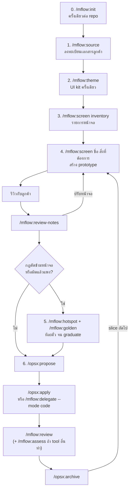

# mflow: คู่มือการใช้งาน

| รายการ | ค่า |
|---|---|
| เอกสาร | คู่มือการใช้งานและลำดับการใช้คำสั่ง |
| เวอร์ชัน plugin | 0.3.1 |
| วันที่ | 2026-09-25 |
| อ่านคู่กับ | `docs/requirement.md` (ทำไมถึงออกแบบแบบนี้), `plugins/mflow/README.md` (ติดตั้งและโครงสร้าง) |

---

## 1. กติกาห้าข้อก่อนใช้

1. **คำสั่ง `/mflow:*` พิมพ์เองทุกครั้ง** Claude ไม่เรียกให้อัตโนมัติ ถ้าไม่แน่ใจว่าจะใช้คำสั่งไหน พิมพ์ `/mflow:help <เล่าสถานการณ์>`
2. **ก่อนเขียนไฟล์ Claude จะแสดงตารางหรือแผนให้ดูก่อน** ตอบ yes แล้วจึงเขียน ถ้าไม่ตรงให้แก้ในแชตได้เลย
3. **ความจำอยู่ในไฟล์ ไม่ได้อยู่ในแชต:** `STATUS.md` บอกว่าทำถึงไหน OpenSpec บอกว่าระบบต้องทำอะไร Backlog.md บอกว่างานไหนค้างอยู่ จึงปิดแล้วเปิด session ใหม่ได้ทุกเมื่อ
4. **คำสั่งของ AI ตัวอื่น (Codex, Gemini …) พี่ปูรันเอง** mflow สร้าง brief และบรรทัดคำสั่งให้เท่านั้น
5. **หนึ่ง session ทำเรื่องหลักเรื่องเดียว** โดยเฉพาะ hotspot ที่ทำครั้งละหนึ่งตั๋ว

## 2. ภาพรวมลำดับการใช้คำสั่ง



| ขั้น | คำสั่ง | ใช้เมื่อ | ความถี่ |
|---|---|---|---|
| 0 | `/mflow:init` | repo ใหม่ หรือหลังอัปเกรด plugin | ครั้งเดียว |
| 1 | `/mflow:source` | ลูกค้าส่งเอกสารหรือฉบับใหม่ | ทุกครั้งที่มีเอกสารเข้า |
| 2 | `/mflow:theme` | ก่อนสร้างหน้าจอแรก | ครั้งเดียว (`update` เมื่อจะเปลี่ยนหน้าตา) |
| 3 | `/mflow:screen inventory` | เริ่ม release | ต่อ release |
| 4 | `/mflow:screen <ชื่อ> …` → `/mflow:review-notes` | สร้างหรือปรับหน้าจอ แล้วรีวิวกับลูกค้า | วนหลายรอบ |
| 5 | `/mflow:hotspot`, `/mflow:golden` | เจอกฎใหญ่หรือกฎที่คลุมเครือ | ครั้งละหนึ่งตั๋วต่อ session |
| 6 | `/opsx:propose` → `/opsx:apply` → `/mflow:review` → `/opsx:archive` | สร้างของจริงทีละ slice | ต่อ slice |
| เหตุการณ์ | `/mflow:change-request` | ลูกค้าขอเปลี่ยนหลังอนุมัติแล้ว | เมื่อเกิดขึ้น |
| เหตุการณ์ | `/mflow:delegate` → `/mflow:assess` | ให้ AI ตัวอื่นวิเคราะห์ รีวิว หรือเขียนโค้ด | เมื่อต้องการ |
| ทุกวัน | `/mflow:handoff` | จบวัน หรือก่อนสลับไปใช้ tool อื่น | วันละครั้ง |

**ช่วงแรกใช้แค่สี่คำสั่ง:** `init` → `source` → `theme` → `screen` ส่วนที่เหลือค่อยเริ่มใช้เมื่อเจอสถานการณ์ของคำสั่งนั้น

## 3. ก่อนเริ่ม

| ต้องมี | ใช้ทำอะไร | ติดตั้ง |
|---|---|---|
| Node 20 ขึ้นไป, git | script ของ plugin | ติดตั้งตามปกติ |
| OpenSpec 1.10 ขึ้นไป | spec และ change | `npm i -g @fission-ai/openspec@latest` |
| Backlog.md 1.51 ขึ้นไป | task และตั๋ว hotspot (ต้องใช้ `isReady` ใน JSON) | `npm i -g backlog.md` |
| Python + pandas, openpyxl, python-docx | อ่าน Excel/Word ของลูกค้า | `pip install pandas openpyxl python-docx` |
| .NET SDK | build/test โปรเจกต์ | ติดตั้งตามปกติ |

ติดตั้ง plugin ใน Claude Code:

```
/plugin marketplace add D:\ProjectClaude\mflow-marketplace
/plugin install mflow@mflow-marketplace
```

ถ้าโฟลเดอร์โปรเจกต์ยังไม่เป็น git repo ให้รัน `git init` ก่อน เพราะ `backlog init` จะถามคำถามเรื่อง git แม้ใส่ `--defaults` แล้ว

## 4. ขั้นตอนทีละคำสั่ง

### ขั้น 0: `/mflow:init [ชื่อโปรเจกต์]`

- **ใช้เมื่อ:** ใช้ mflow กับ repo นี้เป็นครั้งแรก หรือหลังอัปเกรด plugin เพื่อรับ template ใหม่
- **สิ่งที่เกิดขึ้น:**
  1. สำรวจ repo: solution, test project, Playwright, agent file เดิม, เอกสาร requirement และ CLI ที่ติดตั้งไว้ แล้วสรุปให้ดูในรอบเดียว
  2. แสดงรายการไฟล์ที่จะสร้าง (dry-run) แล้วสร้าง `AGENTS.md`, `CLAUDE.md`, `STATUS.md`, `docs/vision.md`, `docs/hotspots/INDEX.md`, `docs/source/`, `docs/ai-inbox/`, `.mflow/config.json` ไฟล์ที่มีอยู่แล้วจะไม่ถูกเขียนทับ template จะไปอยู่ที่ `.mflow/suggested/` เพื่อ merge ให้พร้อมแสดง diff
  3. ต่อ OpenSpec และ Backlog.md โดยถาม yes ก่อนรันแต่ละคำสั่ง
  4. รัน `dotnet build` และ `dotnet test` จริง แล้วเขียนเฉพาะคำสั่งที่ผ่านลงใน AGENTS.md คำสั่งที่รันไม่ได้จะติด `(unverified)`
  5. ย้ายเอกสารลูกค้าที่พบไปไว้ใน `docs/source/` แล้วคัดแยกตามขั้น 1
- **สิ่งที่พี่ปูต้องตอบ:** คำถามไม่เกินสามข้อ เรื่องจุดประสงค์ของระบบ, bounded context และคำศัพท์ของลูกค้า ข้อไหนยังไม่รู้ให้ตอบว่าข้าม จะเหลือเป็น `TODO` ไว้
- **ได้อะไร:** repo พร้อมใช้งาน และตั้งแต่ session ถัดไป hook จะเริ่มทำงาน
- **ต่อไป:** `/mflow:source` ถ้ามีเอกสาร แล้ว `/mflow:theme`

### ขั้น 1: `/mflow:source [@ไฟล์ …] [--replaces @ไฟล์เก่า]`

- **ใช้เมื่อ:** ลูกค้าส่ง TOR, Word, Excel, PDF หรือโน้ตมา หรือส่งฉบับแก้ไขมา
- **เตรียม:** วางไฟล์ต้นฉบับไว้ใน `docs/source/` และ **ห้ามแก้ต้นฉบับ** ฉบับใหม่ให้บันทึกเป็นไฟล์ใหม่ เช่น `2026-10-tor-v2.pdf`
- **พิมพ์:**
  - `/mflow:source` แบบไม่ใส่ไฟล์ = อ่านเฉพาะไฟล์ใหม่และไฟล์ที่เปลี่ยน (ตรวจจาก hash) ไฟล์ที่เคยอ่านแล้วจะถูกข้าม
  - `/mflow:source @docs/source/2026-10-tor-v2.pdf --replaces @docs/source/2026-09-tor-v1.pdf` = เทียบฉบับใหม่กับฉบับเก่าทีละหัวข้อ แล้วตั้งฉบับเก่าเป็น `superseded`
- **สิ่งที่เกิดขึ้น:** แสดงรายการไฟล์ที่จะอ่านและที่จะข้าม → อ่านตามชนิดไฟล์ → คัดแยกทุกข้อความเป็นตารางให้ดูก่อน (ข้อกำหนดถาวรไป AGENTS.md, ขอบเขตไป vision, กฎใหญ่ไป hotspot, ข้อที่คลุมเครือไป open questions …) → หลังพี่ปูตอบ yes จึงเขียน → บันทึกลงทะเบียนเอกสาร
- **ชนิดไฟล์ที่รองรับตอนนี้:** `.pdf` `.md` `.txt` `.csv` `.json`, `.docx` (แปลงเก็บไว้ที่ `.mflow/cache/`) และ `.xlsx` (อ่านด้วย python) ส่วน `.doc` `.xls` `.pptx` ยังไม่รองรับ ให้ขอไฟล์ `.docx`/`.xlsx`/PDF จากลูกค้า หรือแปลงเองก่อน
- **ได้อะไร:** `docs/source/INDEX.md` (สร้างอัตโนมัติ ห้ามแก้เอง) บอกว่าไฟล์ไหนใช้อยู่ ไฟล์ไหนถูกแทนแล้ว และถูกใช้กับเรื่องใด

### ขั้น 2: `/mflow:theme [แบรนด์ | @โลโก้ | @CI guide]`

- **ใช้เมื่อ:** ก่อนสร้างหน้าจอแรก ทำครั้งเดียว
- **สิ่งที่พี่ปูต้องตอบ (ในรอบเดียว):** โลโก้, สีหลักหรือ CI guide ของลูกค้า, ความรู้สึกของแอป (หน้าจอแน่นแบบ back-office หรือโปร่ง) และฟอนต์ไทย ถ้าลูกค้าไม่มี CI Claude จะเสนอสามชุดสีไว้บนหน้า style guide ให้เลือก
- **ได้อะไร:**
  - `wwwroot/css/tokens.css` เป็นที่เดียวที่เก็บสี ฟอนต์ radius และระยะห่าง
  - `_Layout.cshtml` ที่มี sidebar, top bar, toast และ prototype banner
  - component ชุดกลาง: DataTable, FilterPanel, FormField, PageHeader, StatusBadge, EmptyState, ConfirmDialog, Toast
  - หน้า `/_styleguide` ให้ลูกค้าอนุมัติหน้าตาครั้งเดียว แทนการอนุมัติทีละหน้าจอ
  - `docs/ui/design-system.md` และ `.claude/rules/ui.md` ที่บังคับให้ทุกหน้าจอใช้ kit
- **ภายหลัง:** `/mflow:theme update <สิ่งที่จะเปลี่ยน>` แก้ kit ครั้งเดียวแล้วทุกหน้าจอเปลี่ยนตาม

### ขั้น 3: `/mflow:screen inventory [@เอกสาร]`

- **ใช้เมื่อ:** เริ่ม release หลังจากมี story map ใน `docs/vision.md` แล้ว
- **ได้อะไร:** `docs/ui/screens.md` ที่มีหน้าจอละหนึ่งแถว (route, role, สิ่งที่แสดง, action, การคำนวณ) และจุดที่มีการคำนวณจะถูกเพิ่มเป็นแถวใน `docs/hotspots/INDEX.md`
- **สิ่งที่พี่ปูต้องทำ:** ตรวจตาราง หลังจากนั้น Claude จึงสร้าง Backlog task หน้าจอละหนึ่งตัว (label `prototype`)

### ขั้น 4: `/mflow:screen <ชื่อหน้าจอ> <สิ่งที่ต้องการ>` แล้ว `/mflow:review-notes`

**สร้างหรือปรับหน้าจอ**
- ตัวอย่าง:
  - `/mflow:screen job-list รายการงานขนส่ง`
  - `/mflow:screen job-list เพิ่มช่องค้นหาเลขงานและชื่อลูกค้า`
- หน้าจอสร้างใน stack จริง ใช้ข้อมูลจาก `PrototypeData/*.json` ที่ใช้ร่วมกันทุกหน้าจอ และตัวเลขที่ต้องคำนวณจะใส่เป็นค่าคงที่พร้อมคอมเมนต์ `// PROTOTYPE:`
- ถ้าต้องเพิ่ม field หรือ entity ในไฟล์ JSON Claude จะหยุดถามก่อน เพราะหน้าจออื่นใช้ไฟล์เดียวกัน
- ถ้าสิ่งที่ขอเกินกว่าที่ kit ทำได้ Claude จะเสนอ `/mflow:theme update` แทนการแต่งหน้าจอนั้นหน้าเดียว

**รีวิวกับลูกค้า แล้วบันทึกผล**
- `/mflow:review-notes @โน้ตหรือ transcript` (ถ้าเป็นไฟล์เสียง ต้องถอดเป็นข้อความก่อน)
- Claude จัดทุกบรรทัดเป็นตาราง: ปรับหน้าจอ, กฎที่ซ่อนอยู่, field, สิทธิ์, เอกสารที่ต้องพิมพ์, คำศัพท์, ลำดับความสำคัญ, นอกขอบเขต, คำถามค้าง และคำขอใหม่ → ตอบ yes แล้วจึงเขียน
- ได้ร่างอีเมลภาษาไทยที่ `docs/reviews/<วันที่>-<หัวข้อ>-summary.md` ไว้ส่งให้ลูกค้ายืนยัน โดยคำขอที่อยู่นอกขอบเขตจะเขียนว่า "จะประเมินและเสนอแยก" เสมอ
- วนขั้น 4 จนลูกค้าพอใจกับ flow ของหน้าจอ

### ขั้น 5: `/mflow:hotspot` และ `/mflow:golden`

ใช้กับกฎที่ตัดข้ามหลายหน้าจอหรือผิดแล้วเสียหายมาก เช่น การคิดราคา, state machine, สต็อก, การอนุมัติ งานในขั้นนี้ได้ผลเป็น **การตัดสินใจ ไม่ใช่โค้ด**

| พิมพ์ | ทำอะไร |
|---|---|
| `/mflow:hotspot` | ดูภาพรวม hotspot ทุกตัวและจำนวนตั๋วที่หยิบได้ |
| `/mflow:hotspot <ไอเดีย> [@เอกสาร]` | chart เรื่องใหม่: ตั้ง slug, สร้าง `map.md` และ `rules.md`, สร้างตั๋วคำถาม (`ask` / `examples` / `research` / `spike`) และร่างคำถามถึงลูกค้าเป็นภาษาไทย ใช้หนึ่ง session |
| `/mflow:hotspot <slug>` | หยิบตั๋วถัดไปใน frontier (ตั๋วที่หยิบได้) มาแก้ **หนึ่งตั๋ว** แล้วบันทึกผลลง `rules.md` |
| `/mflow:hotspot <slug> <TASK-ID>` | แก้ตั๋วที่ระบุ เช่น เมื่อได้คำตอบจากลูกค้ากลับมาแล้ว |
| `/mflow:golden @ไฟล์.xlsx <slug>` | ใช้ Excel ที่ลูกค้าคำนวณด้วยมือจริงเป็นเฉลย (golden data) ได้ไฟล์ JSON และ xUnit test ข้อมูลส่วนบุคคลจะถูกปิดบัง และแถวที่ผิดปกติจะถูกแยกออกไปเป็นตั๋วถาม |

- **ตั๋ว `ask`:** ส่ง `docs/hotspots/<slug>/questions-for-customer.md` ให้ลูกค้า Claude จะไม่ตอบแทนลูกค้า เมื่อได้คำตอบมาให้พิมพ์ `/mflow:hotspot <slug> <TASK-ID>`
- **ถ้าเรื่องจบได้ในคุยครั้งเดียว** Claude จะบอกว่าไม่ต้องทำเป็น hotspot และแนะนำ `/opsx:propose` แทน
- **Graduate:** เมื่อผ่าน readiness bar ครบ 6 ข้อ Claude จะแสดงหลักฐานของแต่ละข้อ → ตอบ yes → สร้าง OpenSpec change จาก `rules.md` → `rules.md` ถูก freeze นับจากนั้นความจริงอยู่ที่ `openspec/specs/`

### ขั้น 6: สร้างของจริงทีละ slice

1. `/opsx:propose <ชื่อ change>` เขียน proposal, spec และ tasks (ถ้ายังคิดไม่ชัด ใช้ `/opsx:explore` ก่อน)
2. `/opsx:apply` ให้ Claude ทำ หรือ `/mflow:delegate <ชื่อ change> --mode code --to codex` ให้ tool อื่นทำใน worktree แยก
3. `/mflow:review [branch | --uncommitted | ชื่อ change | TASK-ID]` ตรวจกับ spec แล้วรัน test จริง ได้คำตัดสิน `approve` หรือ `changes-requested` ที่ `docs/reviews/code/` **merge เมื่อได้ `approve` และพี่ปูตกลงแล้วเท่านั้น**
4. `/opsx:archive` แล้วเช็ก `git diff --stat openspec/specs` ว่า spec หลักเปลี่ยนจริง
5. กลับไปขั้น 4 สำหรับ slice ถัดไป

### เมื่อมีเหตุการณ์

**ลูกค้าขอเปลี่ยนหลังอนุมัติแล้ว: `/mflow:change-request <ข้อความคำขอ | @อีเมล>`**
- Claude เทียบกับ spec ที่ archive แล้ว, หน้าจอที่อนุมัติแล้ว, vision, เอกสาร active และสรุปรีวิว แล้วจัดประเภทพร้อมอ้างหลักฐาน:
  - **defect:** แก้ให้ ไม่คิดเงิน
  - **clarification:** รายละเอียดที่ยังเปิดอยู่ในขอบเขตเดิม
  - **new scope:** งานใหม่ ได้ไฟล์ `docs/change-requests/CR-<nnn>-<slug>.md` พร้อมประมาณการเป็นช่วงชั่วโมงและผลต่อวันส่งมอบ
- ได้ร่างคำตอบภาษาไทยพร้อมทางเลือก (ทำเลย / เฟสถัดไป / ทำเล็กลง) **ไม่เริ่มงานจนกว่าลูกค้าอนุมัติเป็นลายลักษณ์อักษร**

**ให้ AI ตัวอื่นช่วย: `/mflow:delegate` แล้ว `/mflow:assess`**
1. `/mflow:delegate <TASK-ID | ชื่อ change | slug | "หัวข้อ"> --mode analyze|review|code [--to codex|gemini|opencode|chat]`
   - ได้ brief ที่ `.mflow/briefs/` และบรรทัดคำสั่งทั้ง PowerShell และ Bash
   - ไม่ใส่ `--to` = brief ที่ใช้กับ tool ไหนก็ได้ พร้อมคำสั่งของทุก tool
   - `--to chat` (ChatGPT/Gemini web) = ได้ context pack ไว้แนบ ไฟล์ที่อาจมีรหัสผ่านจะถูกข้ามและแสดงไว้ในรายการ `skipped`
2. **พี่ปูรันคำสั่งเอง** ผลจะถูกบันทึกลง `docs/ai-inbox/`
3. `/mflow:assess @docs/ai-inbox/<ไฟล์>` ตรวจว่า tool นั้นเข้าใจระบบและอ่านไฟล์ที่ต้องอ่านครบหรือไม่ แล้วตรวจ finding ทีละข้อกับโค้ดจริง คำตัดสินมี accept, accept-later, reject, needs-decision และ already-done → ตอบ yes แล้วจึงสร้าง task
4. ถ้าเป็นโหมด `code` ให้ `/mflow:review agent/<tool>/<id>` ด้วยก่อน merge

## 5. จังหวะประจำวัน

| เวลา | เกิดอะไรขึ้น | พี่ปูทำอะไร |
|---|---|---|
| เปิด session | hook ใส่ briefing ให้ Claude อัตโนมัติ: ส่วน Now ของ STATUS.md, log ล่าสุด, change ที่ค้าง, task ที่ In Progress, hotspot ที่ยัง active, เอกสารที่ยังไม่ได้ประมวลผล และรายงานของ AI อื่นที่ยังไม่ได้ assess | สั่งงานต่อจาก Now ได้เลย ไม่ต้องอธิบายซ้ำ |
| ระหว่างทำงาน | หลัง 10 นาทีแรก ถ้ามีไฟล์เปลี่ยนแต่ STATUS.md ยังไม่ถูกอัปเดต Claude จะเขียนบันทึกสั้นก่อนหยุด เตือนซ้ำไม่เกินทุก 30 นาที และหลัง compact ก็ยังจำงานก่อนหน้าได้ | ไม่ต้องทำอะไร ปรับเวลาได้ใน `.mflow/config.json` (`stopGuard`) |
| จบวัน | | `/mflow:handoff` เขียน STATUS.md แบบละเอียดจากข้อเท็จจริง (git, openspec, backlog และผล test) ให้คนที่ไม่เห็นแชตวันนี้ทำต่อได้ |
| ก่อนสลับไปใช้ tool อื่น | | `/mflow:handoff --for codex` ได้ brief ของงานถัดไปด้วย |

Codex และ tool อื่นไม่มี hook ให้ทำตามส่วน "Session ritual" ใน `AGENTS.md` คืออ่าน STATUS.md ตอนเริ่ม และเขียน log ตอนจบ

## 6. ตัวอย่างครบหนึ่งรอบ: ระบบจัดการงานขนส่ง

```text
# สัปดาห์ที่ 1: ตั้งต้น
git init
/mflow:init TransportHub
  (วาง TOR ลูกค้าไว้ที่ docs/source/2026-09-tor-v1.pdf)
/mflow:source
/mflow:theme @docs/source/ci-guide.pdf
/mflow:screen inventory

# สัปดาห์ที่ 2: prototype
/mflow:screen job-list รายการงานขนส่ง ค้นหาด้วยเลขงานและชื่อลูกค้า
/mflow:screen job-detail หน้ารายละเอียดงาน มีจุดรับและจุดส่งหลายจุด
  (ประชุมรีวิวกับลูกค้า จดโน้ตไว้)
/mflow:review-notes @notes/2026-10-02-review.md
  → ลูกค้าบอกว่า "ค่าขนส่งคิดตามระยะทาง น้ำหนัก และ VIP ได้ส่วนลด"

# สัปดาห์ที่ 3: จับกฎค่าขนส่ง (หนึ่งตั๋วต่อ session)
/mflow:hotspot ค่าขนส่งคิดตามระยะทาง น้ำหนัก และลูกค้า VIP @docs/source/2026-09-tor-v1.pdf
  → slug: freight-rate, ได้ตั๋ว TASK-7 ถึง TASK-12
/mflow:hotspot freight-rate
/mflow:hotspot freight-rate
  (ส่ง questions-for-customer.md ให้ลูกค้า ได้คำตอบกลับมา)
/mflow:hotspot freight-rate TASK-9
/mflow:golden @docs/source/ค่าขนส่ง-2026-08.xlsx freight-rate
/mflow:hotspot freight-rate          → ผ่าน readiness bar → graduate

# สัปดาห์ที่ 4: สร้างของจริง
/opsx:propose freight-rate-calculation
/mflow:delegate freight-rate-calculation --mode code --to codex
  (พี่ปูรันคำสั่ง PowerShell ที่ได้)
/mflow:assess @docs/ai-inbox/2026-10-20-codex-freight-rate-calculation.md
/mflow:review agent/codex/freight-rate-calculation
  (approve → merge)
/opsx:archive
git diff --stat openspec/specs

# เมื่อลูกค้าขอเพิ่ม
/mflow:change-request @docs/source/2026-11-email-fuel-surcharge.pdf

# ทุกเย็น
/mflow:handoff
```

## 7. ตารางลัด: สถานการณ์ → คำสั่ง

| สถานการณ์ | คำสั่ง |
|---|---|
| repo ใหม่ หรือเพิ่งอัปเกรด plugin | `/mflow:init` |
| ลูกค้าส่งเอกสารหรือฉบับใหม่ | `/mflow:source [@ไฟล์] [--replaces @เก่า]` |
| ยังไม่เคยสร้างหน้าจอเลย | `/mflow:theme` |
| จะเปลี่ยนสี ฟอนต์ หรือ component กลาง | `/mflow:theme update <อะไร>` |
| ทำรายการหน้าจอของ release | `/mflow:screen inventory` |
| สร้างหรือปรับหน้าจอ | `/mflow:screen <ชื่อ> <สิ่งที่ต้องการ>` |
| เพิ่งประชุมรีวิวกับลูกค้า | `/mflow:review-notes @โน้ต` |
| กฎตัดข้ามหน้าจอ หรือผิดแล้วแพง | `/mflow:hotspot <ไอเดีย> [@ไฟล์]` |
| ทำ hotspot ต่อ | `/mflow:hotspot <slug>` |
| ลูกค้าตอบคำถามของตั๋วแล้ว | `/mflow:hotspot <slug> <TASK-ID>` |
| มี Excel จริงที่ใช้พิสูจน์กฎได้ | `/mflow:golden @ไฟล์.xlsx <slug>` |
| งานเล็กที่ชัดแล้ว | `/opsx:propose` → `/opsx:apply` → `/opsx:archive` |
| ลูกค้าขอเปลี่ยนหลังอนุมัติ | `/mflow:change-request <คำขอ>` |
| ให้ AI ตัวอื่นวิเคราะห์ รีวิว หรือเขียนโค้ด | `/mflow:delegate <id> --mode … [--to …]` |
| ผลจาก AI ตัวอื่นกลับมาแล้ว | `/mflow:assess @docs/ai-inbox/<ไฟล์>` |
| ตรวจโค้ดก่อน merge | `/mflow:review <branch>` |
| จบวัน หรือจะสลับ tool | `/mflow:handoff [--for <tool>]` |
| ไม่แน่ใจ | `/mflow:help <เล่าสถานการณ์>` |

## 8. ข้อควรระวังที่ทราบแล้ว (0.3.1)

| เรื่อง | ทำอย่างไรตอนนี้ |
|---|---|
| `init` เสนอ `openspec init --language th` ซึ่งจะได้ข้อความ "written in th" ตามตัวอักษร | ถ้าต้องการ spec ภาษาไทย ให้บอก Claude ใช้ `--language "Thai"` แทน |
| `backlog init` ในโฟลเดอร์ที่ยังไม่เป็น git repo จะถามคำถาม | รัน `git init` ก่อน `/mflow:init` |
| `backlog decision create` รับได้แค่ชื่อ | บันทึกเหตุผลของ decision ไว้ในไฟล์ decision เอง หรือใน `rules.md` ของ hotspot |
| ยังไม่มี `.mflow/.gitignore` | เพิ่มเอง: `cache/`, `suggested/`, `briefs/*.pack.md` |
| `/mflow:review <branch>` เทียบกับ `main` | repo ที่ใช้ `master` หรือ `develop` ให้บอกชื่อ branch หลักตอนสั่ง |
| golden JSON ต้องถูก copy ไปโฟลเดอร์ output ของ test | ตั้ง `CopyToOutputDirectory` ใน test project |
| คำสั่ง gemini และ opencode ยังไม่ได้รันกับโมเดลจริง | เช็ก `--help` ก่อนใช้ครั้งแรก |
| skill ทั้ง 13 ตัวยังไม่เคยรันใน session จริง | ใช้ครั้งแรกแบบนั่งดูทีละขั้น |
| หลัง `resume` Stop hook นับเป็น session ใหม่ | งานจาก session ก่อนที่ยังไม่ได้ลง log ให้สั่ง `/mflow:handoff` เอง |
