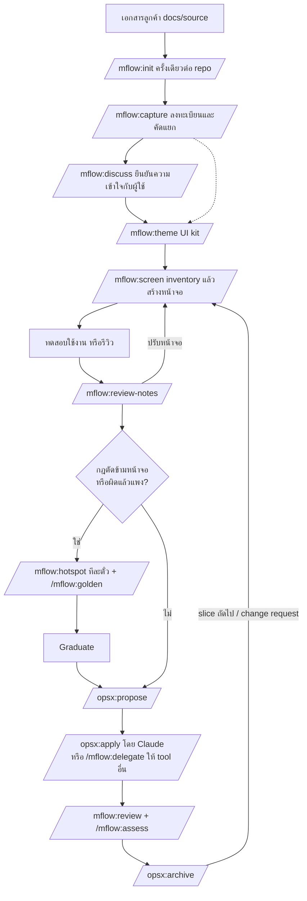

# mflow: Requirement

| รายการ | ค่า |
|---|---|
| เอกสาร | Requirement ของ plugin mflow |
| เวอร์ชันที่อธิบาย | 0.14.0 |
| ผู้ใช้เป้าหมาย | คนที่ต้องการทำระบบ: SA, PM หรือเจ้าของระบบ |
| ผู้ดูแล plugin | Mounchon |
| วันที่ | 2026-09-29 |
| สถานะ | ใช้งานได้ (pilot) |

---

## 1. ที่มาและปัญหา

การพัฒนาซอฟต์แวร์แบบเดิมคือ เก็บ requirement → เขียนเอกสารออกแบบ → dev เมื่อมี AI (Claude Code, Codex และตัวอื่น) ช่วยเขียนโค้ด การ dev เร็วขึ้นมาก ลำดับเดิมจึงไม่คุ้มอีกต่อไป แต่การวน "req → dev บางส่วน → req" เจอปัญหาสามข้อ:

1. **ลูกค้าไม่อ่านเอกสาร** แต่ชี้หน้าจอได้ requirement ที่ได้จากเอกสารจึงไม่ครบ
2. **โลจิกธุรกิจขนาดใหญ่** (คำนวณราคา, state machine, สต็อก, การอนุมัติ) ตัดผ่านหลายหน้าจอ ถ้าสร้างทีละส่วนโดยไม่เห็นกฎทั้งก้อน ต้องรื้อโครงสร้างกลางทาง
3. **AI จำไม่ได้ข้าม session** ไม่รู้ว่าก่อนหน้าทำอะไร จะทำอะไรต่อ และผลลัพธ์ที่ต้องการคืออะไร ยิ่งใช้ AI หลายตัวยิ่งหลุด

## 2. เป้าหมาย

mflow คือ plugin ของ Claude Code ที่ทำให้กระบวนการต่อไปนี้ทำซ้ำได้และตรวจสอบได้:

- **หน้าจอก่อน:** ทำ prototype ที่กดได้จริงให้ลูกค้าดู แทนการให้ลูกค้าอ่านเอกสาร
- **จับโลจิกใหญ่ก่อนสร้าง:** ทำให้กฎธุรกิจชัดในรูปที่ test ตรวจได้ ก่อนเขียนโค้ดจริง
- **ความจำของ AI อยู่ในไฟล์:** ทุก session ทุก tool เริ่มจากสถานะเดียวกัน
- **ใช้ AI หลายตัวอย่างมีการตรวจรับ:** งานจาก tool อื่นกลับมาในรูปที่ Claude ตรวจกับโค้ดจริงได้
- **ขอบเขตงานมีหลักฐาน:** เอกสารลูกค้า การรีวิว และ change request ถูกบันทึกจนใช้ประเมินราคาได้
- **ทำก่อน ทดสอบใช้งาน แล้วปรับเพิ่ม:** คำตอบของผู้ใช้เดินงานต่อได้ทันที ไม่รอลูกค้ายืนยันซ้ำ สิ่งที่ต้องแก้หลังทดสอบเป็นเอกสาร discuss ฉบับใหม่หรือ change ถัดไปของ OpenSpec

## 3. ผู้ใช้และสภาพแวดล้อม

| หัวข้อ | รายละเอียด |
|---|---|
| ผู้ใช้หลัก | คนที่ต้องการทำระบบ เช่น SA, PM หรือเจ้าของระบบ ใช้ AI ช่วยครบทั้งสาย: requirement, domain design, dev, deploy คำตอบและคำสั่งของผู้ใช้ถือเป็นคำสั่งของลูกค้าโดยตรง |
| AI หลัก | Claude Code (มี hook และคำสั่ง mflow) |
| AI เสริม | Codex, OpenCode, Gemini CLI, chat UI (ChatGPT/Gemini web) และ tool ใหม่ในอนาคต |
| เครื่องมือร่วม | OpenSpec (living spec), Backlog.md (บอร์ดงาน), git |
| Stack | เลือกตอน `/mflow:init`: a) ASP.NET Core MVC + Razor + Bootstrap 5 + HTMX, xUnit, Playwright (รองรับเต็ม, แนะนำเมื่อ repo ว่าง) b) React + Vite + ASP.NET Core Web API, xUnit + Vitest, Playwright c) stack อื่นที่ Claude เติมตาราง mapping ให้ยืนยัน (ยังไม่ทดสอบ) |
| ระบบปฏิบัติการ | Windows และ Linux |
| ภาษา | ข้อความถึงลูกค้าและ README เป็นภาษาไทย ไฟล์ที่ AI อ่าน (AGENTS.md, SKILL.md) เป็นภาษาอังกฤษ |

## 4. หลักการออกแบบ

| รหัส | หลักการ | เหตุผล |
|---|---|---|
| P1 | หนึ่งข้อเท็จจริงอยู่ที่เดียว ที่อื่นชี้มา | ข้อมูลซ้ำสองที่จะขัดกันภายในไม่กี่สัปดาห์ แล้ว AI เลือกเชื่อแบบสุ่ม |
| P2 | สถานะงานอยู่ในไฟล์ใน repo | AI ตัวไหน session ไหนก็ทำต่อได้ |
| P3 | งานที่ต้องได้ผลเหมือนกันทุกครั้งใช้ script | ไม่ให้ AI ทำด้วยมือในเรื่องที่ต้องแม่นยำ (สร้างไฟล์, ทะเบียน, สร้างคำสั่ง) |
| P4 | คนตัดสินใจ AI ลงมือ | คำสั่งที่เขียนลง repo หรือมีผลต่อขอบเขตต้องได้ yes ก่อน คำสั่งให้ทำจากผู้ใช้คือ yes ของเรื่องนั้น |
| P5 | Spec บอกสิ่งที่ "เป็นอยู่" change บอกสิ่งที่ "จะเป็น" | ตามโมเดลของ OpenSpec |
| P6 | Test คือหลักฐานว่าเสร็จ | "เสร็จ" ต้องพิสูจน์ด้วย test ที่ผ่าน ไม่ใช่คำบอกของ AI |
| P7 | ไม่ผูกกับ AI tool ตัวใด | brief และทะเบียน tool ทำให้เปลี่ยนหรือเพิ่ม tool ได้โดยไม่แก้ plugin |
| P8 | ไม่ทับงานของคน | ไฟล์ที่มีอยู่แล้วไม่ถูกเขียนทับ ข้อเสนอไปอยู่ที่ `.mflow/suggested/` |
| P9 | เพิ่มคำสั่งเมื่อทำเรื่องเดิมด้วยมือซ้ำ 2 ถึง 3 ครั้ง | กันการออกแบบเกินความจำเป็น |
| P10 | คำตอบหรือคำสั่งของผู้ใช้คือคำสั่งของลูกค้า: ทำก่อน ทดสอบใช้งาน แล้วปรับเพิ่ม | ผู้ใช้ (SA, PM หรือเจ้าของระบบ) พูดแทนลูกค้า การรอลูกค้ายืนยันซ้ำทำให้งานหยุด สิ่งที่ผิดเห็นเร็วที่สุดตอนใช้งานจริง และแก้เป็น change ถัดไปของ OpenSpec ได้ ความเห็นของ AI ตัวอื่นไม่มีน้ำหนักนี้ |

## 5. Workflow ภาพรวม



ตลอดทุกขั้น hook SessionStart ใส่ briefing ให้ AI และ hook Stop เตือนให้อัปเดต STATUS.md

## 6. Functional requirements

สถานะ: **มีแล้ว** = อยู่ใน v0.3 / **บางส่วน** = มีแต่ยังไม่ครบตาม requirement

### 6.1 ตั้งค่าโปรเจกต์ (`/mflow:init`)

| รหัส | Requirement | สถานะ |
|---|---|---|
| FR-01 | สำรวจ repo ก่อนถามผู้ใช้: solution, test project, Playwright, agent file เดิม, เอกสาร requirement, CLI ที่ติดตั้ง | มีแล้ว |
| FR-02 | สร้าง AGENTS.md, CLAUDE.md (`@AGENTS.md`), STATUS.md, docs/vision.md, docs/hotspots/INDEX.md, docs/source/README.md, docs/ai-inbox/README.md, docs/discuss/README.md, .mflow/config.json | มีแล้ว |
| FR-03 | ไม่เขียนทับไฟล์เดิม เขียน template ไว้ที่ `.mflow/suggested/` ให้ merge พร้อมแสดง diff | มีแล้ว |
| FR-04 | ต่อ OpenSpec (`openspec init --tools claude,codex` หรือ `openspec update`) และ Backlog.md (`backlog init … --agent-instructions agents`) หลังผู้ใช้ตอบ yes | มีแล้ว |
| FR-05 | เติม `context` และ `rules` ใน openspec/config.yaml: proposal ต้องลิงก์ hotspot และเอกสาร data model ที่อนุมัติ, requirement ต้องมี scenario, task ต้องจบด้วย test และ change ที่สร้าง aggregate ต้องเปลี่ยนส่วนนั้นของ `PrototypeData/README.md` เป็นบรรทัดชี้ไปที่ entity | มีแล้ว |
| FR-06 | เขียนคำสั่ง build/test ลง AGENTS.md เฉพาะที่รันผ่านจริง ที่รันไม่ได้ติด `(unverified)` | มีแล้ว |
| FR-07 | เรียกซ้ำได้อย่างปลอดภัยเพื่อรับ template ใหม่เมื่ออัปเกรด plugin | มีแล้ว |
| FR-08 | ถามเลือก stack หลังสำรวจ repo และก่อนเขียนไฟล์ใดๆ ถามทุกครั้งแม้เดาจาก repo ได้ (ตัวเลือก `a)` `b)` `c)` พร้อมคำแนะนำและหลักฐาน) บันทึกที่ `## Stack` ใน AGENTS.md ที่เดียว (profile + ตาราง seam → path/เทคโนโลยี) และ `theme` `screen` `golden` `review` อ่านจากตรงนั้น โปรเจกต์ที่ยังไม่มี section นี้ ให้ถามเมื่อคำสั่งเหล่านั้นต้องใช้ครั้งแรก | มีแล้ว |

### 6.2 ความจำข้าม session (hooks + ไฟล์)

| รหัส | Requirement | สถานะ |
|---|---|---|
| FR-10 | SessionStart (เริ่ม, resume, clear, compact) ใส่ briefing: ส่วน Now และ log ล่าสุดของ STATUS.md, OpenSpec change ที่ค้าง, Backlog task ที่ In Progress, hotspot ที่ active และจำนวนตั๋วที่หยิบได้ | มีแล้ว |
| FR-11 | Briefing แจ้งเอกสารลูกค้าที่ยังไม่ได้ประมวลผล และรายงานจาก AI อื่นที่ยังไม่ได้ assess | มีแล้ว |
| FR-12 | Stop hook ขอให้เขียน STATUS.md เมื่อมีไฟล์เปลี่ยนหลัง STATUS.md ถูกเขียนครั้งล่าสุด | มีแล้ว |
| FR-13 | Stop hook ไม่เตือนใน 10 นาทีแรก และเตือนซ้ำไม่เกินทุก 30 นาที ปรับได้ใน config | มีแล้ว |
| FR-14 | Hook ทำงานเฉพาะ repo ที่มี `.mflow/config.json` เงียบใน repo อื่น | มีแล้ว |
| FR-15 | AI ที่ไม่มี hook (Codex ฯลฯ) ทำตาม "Session ritual" ใน AGENTS.md | มีแล้ว |
| FR-16 | `/mflow:handoff` เขียน STATUS.md แบบละเอียดจากข้อเท็จจริง (git, openspec, backlog, ผล test) และสร้าง brief ให้ tool อื่นได้ | มีแล้ว |

### 6.3 เอกสารลูกค้า (`/mflow:capture`)

ชื่อเดิมคือ `/mflow:source` (ถึง 0.7) เปลี่ยนเฉพาะชื่อคำสั่ง โฟลเดอร์ `docs/source/`, `source-index.mjs` และ `sourceDir` คงเดิม เพื่อไม่ให้โปรเจกต์ที่ใช้อยู่พัง

| รหัส | Requirement | สถานะ |
|---|---|---|
| FR-20 | เก็บต้นฉบับใน `docs/source/` ไม่แก้ไข ฉบับใหม่เป็นไฟล์ใหม่ | มีแล้ว |
| FR-21 | ทะเบียนเอกสารด้วย hash: new / changed / unchanged / missing | มีแล้ว |
| FR-22 | อ่านเฉพาะไฟล์ที่ระบุ หรือไฟล์ที่เป็น new/changed ข้ามไฟล์ที่อ่านแล้ว | มีแล้ว |
| FR-23 | สถานะเอกสาร: active, superseded (พร้อมฉบับที่แทน), reference และบันทึกว่าถูกใช้กับ hotspot/change ไหน | มีแล้ว |
| FR-24 | เทียบฉบับใหม่กับฉบับเก่าทีละหัวข้อเมื่อมีการแทนที่ | มีแล้ว |
| FR-25 | คัดแยกทุกข้อความไปยังปลายทาง: AGENTS.md, vision.md, hotspot INDEX, change request, คำศัพท์ ข้อที่คลุมเครือถามผู้ใช้ในตารางเดียวกัน ข้อที่ยังตอบไม่ได้ไป open questions และให้ผู้ใช้ยืนยันก่อนเขียน | มีแล้ว |
| FR-26 | อ่าน PDF, MD, CSV โดยตรง, แปลง DOCX เป็น Markdown ใน `.mflow/cache/`, อ่าน XLSX ด้วย python | มีแล้ว |
| FR-27 | `docs/source/INDEX.md` สร้างอัตโนมัติจาก `.mflow/sources.json` | มีแล้ว |

### 6.4 UI kit (`/mflow:theme`)

| รหัส | Requirement | สถานะ |
|---|---|---|
| FR-30 | สร้าง UI kit ก่อนหน้าจอแรก ให้ทุกหน้าจอใช้สี input และ component ชุดเดียวกัน | มีแล้ว |
| FR-31 | Tokens (`tokens.css`) เป็นที่เดียวของสี ฟอนต์ radius ระยะห่าง พร้อม bridge ไปตัวแปร Bootstrap 5.3 และฟอนต์ไทยเป็นค่าเริ่มต้น | มีแล้ว |
| FR-32 | App shell: sidebar, top bar, page header, toast, prototype banner | มีแล้ว |
| FR-33 | Component ตามสัญญา: DataTable, FilterPanel, FormField, DatePicker, DateRangeField, PageHeader, Button, Card, Dialog, SidePanel, Alert, Tabs, Dropdown, Tooltip, Loading, DetailView, StatusBadge, EmptyState, ConfirmDialog (สร้างบน Dialog), Toast, SidebarMenu, PrototypeBanner ทุกตัวมี Input, สถานะ, พฤติกรรม และบรรทัด Narrow และสำหรับ `mvc-htmx` สร้างบน component ของ Bootstrap | มีแล้ว |
| FR-34 | DataTable: แบ่งหน้าที่ server ใน query ของ database (กรอง เรียง แล้ว skip/take และนับด้วยเงื่อนไขเดียวกัน), filter panel แยกอยู่เหนือตาราง, sort, เลือกจำนวนต่อหน้า, สถานะอยู่ใน URL | มีแล้ว |
| FR-35 | หน้า `/_styleguide` แสดงทุก component ทุกสถานะ ให้ผู้ใช้อนุมัติหน้าตาครั้งเดียว | มีแล้ว |
| FR-36 | กฎสำหรับ AI: `docs/ui/design-system.md` และ `.claude/rules/ui.md` (โหลดเฉพาะตอนเปิดไฟล์ UI) ห้าม hex และ inline style | มีแล้ว |
| FR-37 | `update <อะไร>` แก้ kit แล้วทุกหน้าจอเปลี่ยนตาม, `update access` สร้างหรือปรับชั้นสิทธิ์จากเอกสาร access-control ที่อนุมัติแล้ว | มีแล้ว |
| FR-38 | App shell มี `SidebarMenu` ที่สร้างจาก `MenuDefinition` และกรองตามสิทธิ์ของผู้ใช้ปัจจุบัน (`ICurrentUser.Can`) ใช้ permission key ชุดเดียวกับการตรวจที่ endpoint และปุ่ม | มีแล้ว |
| FR-39 | ปุ่มสลับ role ใน PrototypeBanner: เลือกผู้ใช้จำลองจาก `users.json`/`roles.json` (สร้างจากเอกสาร access-control ที่อนุมัติแล้ว) เพื่อให้ลูกค้าเห็นเมนู แถวข้อมูล field และปุ่มของแต่ละ role มีเฉพาะตอน `Prototype:UseFakeData` เป็น true | มีแล้ว |
| FR-145 | ถามอุปกรณ์ที่ต้องรองรับ (จอคอม / เพิ่มแท็บเล็ต / ทุกขนาดรวมมือถือ) และขนาดจอที่ลูกค้าตรวจรับในรอบเดียวกับแบรนด์ บันทึกใน `docs/ui/design-system.md` ถ้าขัดกับ AGENTS.md, vision หรือเอกสารลูกค้าต้องแจ้ง ห้ามแก้เงียบ | มีแล้ว |
| FR-146 | `AppShell` เต็มหน้าต่าง sidebar กับเนื้อหาเลื่อนแยกกัน top bar ติดด้านบน เมนูสามสถานะตามความกว้างจอ (เต็ม ≥ 1280 / ไอคอน 768–1279 / drawer < 768 ปรับให้ขนาดจอตรวจรับตกในสถานะที่ต้องการ) ปุ่ม ☰ ทุกขนาดจอและจำค่าที่เลือก drawer ปิดด้วย Esc แตะ backdrop หรือเปลี่ยนหน้า โฟกัสเข้าและกลับที่ ☰ ทุกเมนูต้องมีไอคอน | มีแล้ว |
| FR-147 | เนื้อหาจัดตัวเองตามความกว้างของพื้นที่เนื้อหา (container query): ตัวกรอง 4 → 3 → 2 → 1 คอลัมน์ ฟอร์ม 1 คอลัมน์และปุ่มเต็มความกว้างเมื่อแคบ ตารางเลื่อนแนวนอนในกล่องของตัวเอง หน้าจอห้ามมี media query หรือความกว้างตายตัว | มีแล้ว |
| FR-148 | style guide เปิดด้วยส่วนการตัดสินใจของ theme (พร้อมป้ายที่มา) และส่วนโครงหน้าและเมนู (ปุ่มบังคับสถานะเมนู + ตารางความกว้างจอ) theme, screen และ review ตรวจที่ขนาดจอตรวจรับ: ไม่เลื่อนแนวนอน เมนูเปิดได้ ไม่มีอะไรทับหรือถูกตัด ภาพหน้าจอทุก role ที่ขนาดใหญ่สุดและหนึ่ง role ที่ขนาดเล็กสุด `update responsive` เพิ่มส่วนนี้ให้ kit ก่อน 0.11 | มีแล้ว |
| FR-149 | `/mflow:theme preview` สร้าง kit เป็น static preview (HTML/CSS/JS ไม่มี build ไม่ใช้ npm) ใน `docs/ui/theme/` ใช้ CSS base เดียวกับ stack (Bootstrap จาก CDN สำหรับ `mvc-htmx`) มี style guide และหน้าตัวอย่าง เปิดด้วย `python -m http.server` README มีบรรทัดสถานะ `draft` → `approved <วันที่>` → `frozen <วันที่>, kit in <path>` ถ้ายังไม่มีโค้ดแอป `/mflow:theme` ถามก่อนว่าจะทำ preview หรือ scaffold แอปก่อน | มีแล้ว |
| FR-150 | kit มีที่อยู่เดียวในแต่ละช่วง: ก่อน port อยู่ใน preview (`update` แก้ที่ preview), หลัง port อยู่ใน stack และ preview ถูก freeze ห้ามแก้ `design-system.md` บอกที่อยู่ปัจจุบัน เมนูและผู้ใช้จำลองใน `shell.js` เป็นสำเนา ต้นทางคือ `PrototypeData/` และ `MenuDefinition` | มีแล้ว |
| FR-151 | `/mflow:theme port` ต้องมี preview ที่ `approved`, `## Stack` และโปรเจกต์แอปอยู่แล้ว (ไม่ scaffold แอปเอง ให้เสนอ `/opsx:propose` แทน) copy `tokens.css` `app.css` `assets/` ตรงๆ สร้าง shell, component และชั้นสิทธิ์ตามสัญญา (`shell.js` และ `datatable.js` เป็นแค่ตัวอย่างพฤติกรรม) เทียบ style guide กับ preview ทุกขนาดจอตรวจรับ แล้ว freeze preview | มีแล้ว |
| FR-152 | `/mflow:screen` ไม่สร้างหรือปรับหน้าจอขณะ kit อยู่แค่ใน preview (`draft` หรือ `approved`) และเสนอ `port` แต่ `inventory` ทำได้ตั้งแต่ช่วง preview preview ที่ไม่มีบรรทัดสถานะ (ก่อน 0.12) ไม่ถูกขวาง ความเห็นจากการทดสอบเรื่องหน้าตาหรือ layout ของ kit `review-notes` ส่งไปที่ `/mflow:theme update` | มีแล้ว |
| FR-156 | Pager ของ DataTable: ‹ › รอบเลขหน้า ไม่เกิน 7 หน้าแสดงทุกเลข เกินนั้นแสดงหน้าแรก หน้าสุดท้าย หน้าปัจจุบันและข้างละหนึ่ง ช่องว่างเป็น `…` (ช่องว่างหน้าเดียวแสดงเลขแทน) ‹ › ปิดที่หน้าแรก/สุดท้าย หน้าปัจจุบันมี `aria-current="page"` เปลี่ยนตัวกรอง sort หรือจำนวนต่อหน้ากลับไปหน้า 1 จอแคบย่อเป็น `‹ 5 / 20 ›` | มีแล้ว |
| FR-157 | Header search ในตารางไม่บังคับ: เปิดรายคอลัมน์ด้วย `searchable` (ค่าเริ่มต้นปิด) ถ้าไม่มีคอลัมน์ไหนเปิด แถวค้นหาไม่แสดงเลย | มีแล้ว |
| FR-158 | `DatePicker` ของ kit (แบบที่ใช้งานจริงในโปรเจกต์ก่อนหน้า): พิมพ์ตามรูปแบบวันที่ หรือเลือกจากปฏิทินภาษาอังกฤษคู่ไทย (หัวเดือนอังกฤษ + ปี เหนือเดือนไทย, วันในสัปดาห์อังกฤษเหนือไทย เริ่มวันอาทิตย์) สามมุมมอง วัน/เดือน/ปี (หน้าละ 12 ปี), ปุ่ม Today · วันนี้ และ Clear · ล้าง, คีย์บอร์ดครบ, ข้อความผิดพลาดสองภาษา, ส่งค่า ISO `YYYY-MM-DD` ผ่าน hidden input ห้ามใช้ `<input type="date">` และ `Intl` ภาษาไทยกับวันที่ เป็นสัญญา ไม่ใช่โค้ดตายตัว แต่ละ stack สร้างเอง รวมถึง ASP.NET Core MVC ที่ใช้ jQuery unobtrusive validation (bind เฉพาะ hidden ISO, ตรวจที่ช่องที่มองเห็น, ข้อความเดียวต่อช่อง, server ตรวจซ้ำ) | มีแล้ว |
| FR-159 | รูปแบบวันที่ตั้งครั้งเดียว (ถามใน theme ขั้น 1): `DD/MM/YYYY` (แนะนำ), `DD-MM-YYYY`, `DD.MM.YYYY`, `YYYY-MM-DD` และปี ค.ศ. (แนะนำ) หรือ พ.ศ. บันทึกใน design-system.md และ config เดียวใน format module ที่ช่องวันที่ ตาราง และทุกการแสดงวันที่อ่าน ค่าที่เก็บและส่งเป็น ค.ศ. เสมอ ตัวแปลงวันที่มีตารางตัวอย่างในสัญญาซึ่งแต่ละ stack ทำเป็น unit test | มีแล้ว |
| FR-160 | `DateRangeField` (To ก่อน From ไม่ได้ วันเดียวกันได้) และ FilterPanel ไม่ส่งค้นหาเมื่อมีช่องที่ผิดอยู่ โฟกัสไปช่องแรกที่ผิด | มีแล้ว |
| FR-161 | `/mflow:theme update components` เพิ่มสัญญาของ 0.14 ให้ kit เดิม และ `update date-picker` ถามรูปแบบวันที่แล้วสร้างเฉพาะส่วนวันที่ ทั้งสองเทียบก่อนและแสดงเฉพาะส่วนที่ขาด ปรับ `.claude/rules/ui.md` และ `design-system.md` ให้ด้วย และตั้ง `searchable` ให้คอลัมน์ที่มี header search อยู่แล้วก่อนเปลี่ยนค่าเริ่มต้น `/mflow:review` ตรวจว่าไม่มี `<input type="date">` และไม่มีการจัดรูปแบบวันที่ในหน้าจอ | มีแล้ว |

### 6.5 หน้าจอ prototype (`/mflow:screen`)

| รหัส | Requirement | สถานะ |
|---|---|---|
| FR-40 | `inventory` สร้างรายการหน้าจอจาก story map และเอกสาร active → `docs/ui/screens.md` และรายงานกลุ่มข้อมูลที่ยังไม่มีเอกสาร data model ที่อนุมัติ (เป็นข้อแนะนำ ไม่บังคับ) | มีแล้ว |
| FR-41 | สร้างหน้าจอใน stack จริง จาก kit เท่านั้น ข้อความไทยอยู่ใน ViewModel | มีแล้ว |
| FR-42 | ข้อมูลตัวอย่างจาก JSON กลาง (`PrototypeData/*.json`) ใช้ร่วมทุกหน้าจอ อ้างอิงกันด้วย id | มีแล้ว |
| FR-43 | Fake repository รับ query object เดียวกับ EF Core และแบ่งหน้าเอง สลับเป็นของจริงด้วย DI โดยหน้าจอไม่ต้องแก้ | มีแล้ว |
| FR-44 | การเปลี่ยน schema ของ JSON ต้องแสดงผลกระทบและได้ yes ก่อน | มีแล้ว |
| FR-45 | จุดคำนวณใส่ค่าคงที่พร้อม `// PROTOTYPE:` และเพิ่มแถวใน hotspot INDEX | มีแล้ว |
| FR-46 | ปรับหน้าจอได้ด้วยคำสั่งภาษาคน ถ้าสิ่งที่ขอเกิน kit ให้เสนอ `/mflow:theme update` แทน | มีแล้ว |
| FR-47 | ข้อมูลตัวอย่างสมจริง (≥200 แถวต่อ entity ในรายการ, ครบทุกสถานะ, edge case) และไม่มีข้อมูลส่วนบุคคลจริง | มีแล้ว |
| FR-48 | ทุกหน้าจอประกาศ permission ของการดูและแต่ละ action, fake repository ใช้ data scope ของผู้ใช้ก่อนแบ่งหน้า, ซ่อน field ใน ViewModel และข้อมูลกระจายหลายสาขา/เจ้าของจนแต่ละ role เห็นต่างกันจริง | มีแล้ว |
| FR-49 | ตรวจหน้าจอด้วยการสลับเป็นผู้ใช้ทุก role ที่เข้าได้ และหนึ่ง role ที่เข้าไม่ได้ (ไม่มีเมนู และเปิด URL ตรงได้ 403) ถ้ายังไม่มีเอกสาร access-control ที่อนุมัติ ให้ประกาศ permission ไว้ตามปกติ แล้วบันทึก `access not confirmed` ใน screens.md | มีแล้ว |

### 6.6 ทดสอบใช้งานและรีวิว (`/mflow:review-notes`)

| รหัส | Requirement | สถานะ |
|---|---|---|
| FR-50 | คัดแยกโน้ตหรือ transcript ทุกบรรทัดไปยังปลายทาง (task, hotspot, คำศัพท์, ลำดับความสำคัญ, out of scope, change request) คำถามถามผู้ใช้ในตาราง ข้อที่ยังตอบไม่ได้เป็น open question และติ๊กเกณฑ์ตรวจรับของ task ทดสอบใช้งานที่ผ่าน | มีแล้ว |
| FR-51 | ตรวจแต่ละรายการว่าอยู่ในขอบเขตที่ตกลงหรือไม่ | มีแล้ว |
| FR-52 | สรุปสิ่งที่ตกลงเป็นภาษาไทย นับเป็นขอบเขตที่ตกลงทันทีที่ผู้ใช้ยืนยันตาราง ไม่รอใครตอบกลับ ร่างอีเมลแจ้งผู้เกี่ยวข้องเมื่อผู้ใช้ต้องการ (แจ้งเพื่อทราบ ไม่ขอให้ยืนยัน) คำขอนอกขอบเขตเขียนเป็น "จะประเมินและเสนอแยก" | มีแล้ว |
| FR-53 | เรื่องสิทธิ์ เมนู และการมองเห็นข้อมูล: ตรงกับเอกสาร discuss ที่อนุมัติแล้วให้ใส่ในสรุป, ต่างจากเอกสารและยังไม่สร้างให้เปิดเอกสาร discuss ใหม่, สร้างแล้วใช้ change request, ยังไม่มีเอกสารให้เสนอหัวข้อ discuss เอกสาร discuss ที่อนุมัติแล้วนับเป็นขอบเขตที่ตกลง เพราะการอนุมัติของผู้ใช้คือของลูกค้า | มีแล้ว |
| FR-54 | สรุปมีหัวข้อ "สิทธิ์และข้อมูลที่แต่ละ role เห็น" และใช้เป็นหลักฐานของ change request | มีแล้ว |

### 6.7 โลจิกขนาดใหญ่ (`/mflow:hotspot`, `/mflow:golden`)

| รหัส | Requirement | สถานะ |
|---|---|---|
| FR-60 | Chart โลจิกใหญ่เป็นตั๋วตัดสินใจใน Backlog.md (label `decision`, `hs-<slug>`, ประเภท ask/examples/research/spike) | มีแล้ว |
| FR-61 | map.md เป็นสารบัญ: destination, sources, decisions so far, not yet specified (หมอก), out of scope | มีแล้ว |
| FR-62 | Frontier คำนวณจาก Backlog (`To Do` + `isReady`) แก้ครั้งละหนึ่งตั๋วต่อ session (ยกเว้น research) | มีแล้ว |
| FR-63 | ตั๋ว `ask` ถามผู้ใช้ตรงๆ เป็นภาษาไทย พร้อมทางเลือก ตัวอย่าง และคำแนะนำ คำตอบของผู้ใช้ปิดตั๋วได้ทันที AI ห้ามเลือกแทนผู้ใช้ ถ้าผู้ใช้อยากถามคนอื่นก่อน จึงร่างคำถามลง `questions-for-customer.md` และติด label `waiting-customer` | มีแล้ว |
| FR-64 | rules.md เก็บตาราง example, state machine, invariant พร้อม aggregate เจ้าของ, golden data | มีแล้ว |
| FR-65 | Readiness bar 6 ข้อ ผ่านแล้วจึง graduate เป็น OpenSpec change | มีแล้ว |
| FR-66 | อ่านเฉพาะไฟล์ที่ระบุด้วย `@` ผ่านทะเบียนเอกสาร และบันทึกว่าใช้ไฟล์ไหน | มีแล้ว |
| FR-67 | ถ้าเรื่องจบได้ใน session เดียว แนะนำให้ใช้ `/opsx:propose` แทน | มีแล้ว |
| FR-68 | `/mflow:golden` แปลง Excel ของลูกค้าเป็น golden JSON + data-driven unit test ตาม stack (xUnit `[MemberData]` สำหรับ .NET) ปิดบังข้อมูลส่วนบุคคล แยกแถวผิดปกติออก | มีแล้ว |
| FR-69 | เปิดตั๋วที่ตอบแล้วขึ้นใหม่เมื่อลูกค้าเปลี่ยนใจ และเปิด map ที่ graduate แล้วขึ้นใหม่ | ยังไม่มี (ใช้ตั๋ว supersede หรือ hotspot ใหม่แทน) |

### 6.8 เชื่อมกับ OpenSpec

| รหัส | Requirement | สถานะ |
|---|---|---|
| FR-70 | Graduate: แต่ละกฎเป็น Requirement, แต่ละแถวผลลัพธ์เป็น Scenario, invariant เป็น Requirement ของตัวเอง, golden data อ้างใน tasks | มีแล้ว |
| FR-71 | หลัง graduate: rules.md ถูก freeze และชี้ไปยัง `openspec/specs/` เป็นความจริงหลังจากนั้น | มีแล้ว |
| FR-72 | `openspec validate <change>` ต้องผ่านก่อนถือว่า graduate เสร็จ | มีแล้ว |
| FR-73 | เตือนให้เช็ก `git diff --stat openspec/specs` หลัง archive | มีแล้ว (ใน README) |

### 6.9 ขอบเขตและการเปลี่ยนแปลง (`/mflow:change-request`)

| รหัส | Requirement | สถานะ |
|---|---|---|
| FR-80 | จัดประเภทคำขอเป็น defect / clarification / new scope พร้อมอ้างหลักฐาน (spec ที่ archive, หน้าจอที่อนุมัติ, เอกสาร discuss ที่อนุมัติ, vision, เอกสาร active, สรุปรีวิว) | มีแล้ว |
| FR-81 | New scope: ไฟล์ CR พร้อมผลกระทบ ความเสี่ยง ประมาณการเป็นช่วงชั่วโมง ผลต่อวันส่งมอบ | มีแล้ว |
| FR-82 | ร่างคำตอบภาษาไทยเฉพาะเมื่อผู้ใช้ต้องการส่งให้คนอื่น (มีทางเลือก ทำเลย / เฟสถัดไป / ทำเล็กลง ถ้ายังไม่ได้เลือก) ไม่ขอการอนุมัติเป็นลายลักษณ์อักษร | มีแล้ว |
| FR-83 | คำสั่งให้ทำของผู้ใช้คือการอนุมัติ: บันทึก `Approved:` ในไฟล์ CR แล้วส่งต่อไป `/opsx:propose` หรือ task ทันที ถ้าผู้ใช้ขอแค่ประเมิน task ค้าง To Do จนกว่าผู้ใช้สั่ง ไม่มีขั้นรอลูกค้า | มีแล้ว |

### 6.10 ทำงานร่วมกับ AI ตัวอื่น (`/mflow:delegate`, `/mflow:assess`, `/mflow:review`)

| รหัส | Requirement | สถานะ |
|---|---|---|
| FR-90 | Brief เป็นไฟล์เดียวที่พอสำหรับ tool ที่ไม่เคยเห็นโปรเจกต์: เป้าหมาย, ไฟล์ที่ต้องอ่าน, ขอบเขต, ข้อห้าม, รูปแบบผลลัพธ์ | มีแล้ว |
| FR-91 | Subject รับได้ 5 แบบ: TASK-ID, OpenSpec change, hotspot slug, เอกสาร discuss (`discuss-NN-rN`), หัวข้ออิสระ (ต้องระบุไฟล์ใน Scope ให้ตรวจได้) | มีแล้ว |
| FR-92 | `--to` ไม่บังคับ ถ้าไม่ระบุได้ brief กลางและคำสั่งของทุก tool ในทะเบียน | มีแล้ว |
| FR-93 | ทะเบียน tool ค่าเริ่มต้น (codex, opencode, gemini, chat) และเพิ่ม/แก้ได้ใน `.mflow/config.json` tool ที่ไม่รู้จักให้ถามคำสั่งแล้วบันทึก | มีแล้ว |
| FR-94 | คำสั่งสร้างด้วย script ทั้ง PowerShell (ตั้ง UTF-8) และ Bash ใช้ path แบบ absolute และ `{tool}` ใน path ผลลัพธ์ทำให้หลาย tool ตอบ brief เดียวกันได้โดยไม่ทับกัน | มีแล้ว |
| FR-95 | ผลลัพธ์เป็นข้อความสุดท้ายของ tool บันทึกโดยคำสั่งลง `docs/ai-inbox/` tool ที่รันแบบ read-only ไม่ต้องเขียนไฟล์ | มีแล้ว |
| FR-96 | ทุกรายงานต้องมี `Understanding` และ `Files read` นำหน้า | มีแล้ว |
| FR-97 | Context pack รวมไฟล์เป็นไฟล์เดียวสำหรับ chat UI ข้าม binary เตือนเมื่อใหญ่เกิน | มีแล้ว |
| FR-98 | โหมด code ทำใน worktree และ branch `agent/<tool>/<id>` แยกจาก Claude | มีแล้ว |
| FR-99 | Assess: normalize ไฟล์ → ตรวจความเข้าใจและไฟล์ที่อ่าน → ตั้งระดับความน่าเชื่อถือ → ตรวจ finding ทีละข้อจากหลักฐานที่เปิดเอง → คำตัดสิน 5 แบบ → เสนอ action หลังได้ yes | มีแล้ว |
| FR-100 | Review: ตรวจ diff กับ scenario, test จริง, ตำแหน่ง domain rule, UI kit, data access, security พื้นฐาน (permission ที่ endpoint, data scope ใน query, การสลับผู้ใช้จำลองต้องไม่หลุดออกนอกโหมด prototype), entity ตรงกับ data dictionary และมี index ตามเอกสาร data model, `PROTOTYPE:` ที่ค้าง แล้วให้ approve / changes-requested | มีแล้ว |
| FR-101 | mflow ไม่รัน AI tool อื่นเอง ผู้ใช้เป็นคนรันคำสั่ง | มีแล้ว (ตั้งใจ) |

### 6.11 ช่วยเลือกคำสั่ง (`/mflow:help`)

| รหัส | Requirement | สถานะ |
|---|---|---|
| FR-110 | แนะนำคำสั่งที่เหมาะกับสถานการณ์ที่เล่า หรือแสดงตารางทั้งหมด | มีแล้ว |

### 6.12 ยืนยันความเข้าใจกับผู้ใช้ (`/mflow:discuss`)

ใช้หลัง `/mflow:capture` และก่อน `/mflow:screen inventory` กับเรื่องที่ตัดผ่านหลายหน้าจอและตีความได้หลายแบบ เช่น สิทธิ์ การผูกเมนูกับ role และข้อมูลที่เฉพาะบาง role เห็น

| รหัส | Requirement | สถานะ |
|---|---|---|
| FR-120 | เขียนความเข้าใจหรือแบบที่เสนอของหนึ่งหัวข้อเป็น `docs/discuss/NN-<slug>.md` ภาษาไทย เลขเอกสารและไฟล์สร้างด้วย script และไม่ทับไฟล์เดิม | มีแล้ว |
| FR-121 | ทุกข้อความติดป้ายที่มา `[ที่มา: ไฟล์ §หัวข้อ]` `[ยืนยัน]` (ผู้ใช้บอกหรือยืนยัน) `[อนุมาน]` `[เสนอ]` และมีตัวอย่างสถานการณ์ด้วยชื่อสมมติ อย่างน้อยหนึ่งเรื่องเป็นกรณีขอบ | มีแล้ว |
| FR-122 | ทุกเรื่องที่เอกสารไม่ได้บอกเป็นข้อตัดสินใจให้ผู้ใช้ตอบแทนลูกค้า (ทางเลือก ข้อดีข้อเสีย และคำแนะนำของ Claude) ไม่มีหมวดคำถามที่ต้องรอลูกค้า ทางเลือกใช้ป้าย `a)` `b)` `c)` `d)` (ไม่ใช่ ก ข ค) เพื่อให้ตอบได้โดยไม่ต้องสลับภาษาแป้นพิมพ์ เอกสารเก่าที่ใช้ ก ข ค อ่านคำตอบตามลำดับ และเปลี่ยนป้ายเฉพาะข้อที่ยังเปิดอยู่ | มีแล้ว |
| FR-123 | ผู้ใช้ตอบได้ทั้งในไฟล์ (`**เลือก:**`, บรรทัด `> ความเห็น:`) และในแชต ทุกรอบเพิ่ม revision และบันทึกว่าแก้อะไรเพราะอะไร เอกสารก่อน 0.13 ที่ใช้ `**พี่ปูเลือก:**` และ `> พี่ปู:` ยังอ่านได้ และรอบแก้ถัดไปเปลี่ยนเฉพาะบรรทัดคำตอบที่ยังเปิด | มีแล้ว |
| FR-124 | ถ้าคำตอบของผู้ใช้ขัดกับเอกสารลูกค้า เอกสาร discuss ที่อนุมัติแล้ว หรือ spec ที่ archive แล้ว ให้ทำตามผู้ใช้ (เป็นคำสั่งล่าสุดของลูกค้า) แจ้งครั้งเดียวพร้อมอ้างอิงและบันทึกใน revision log ห้ามแก้เงียบ และไม่ถามซ้ำ ส่วนความเห็นของ AI อื่นที่ขัดกับเอกสารลูกค้า ให้คงข้อความจากเอกสาร | มีแล้ว |
| FR-125 | อนุมัติได้เมื่อไม่มีข้อตัดสินใจค้าง ไม่มี note ค้าง และไม่มีช่องว่างจาก template (ตรวจด้วย script) แล้วแสดงตารางปลายทางให้ yes ก่อนเขียน | มีแล้ว |
| FR-126 | หลังอนุมัติ แต่ละข้อไปอยู่ปลายทางเดิมของ flow (vision, AGENTS.md, hotspot, Backlog decision/task, task ทดสอบใช้งาน, change request) และเอกสารถูก freeze ถ้าเปลี่ยนใจภายหลัง ให้เปิดเอกสารใหม่ (ฉบับเก่าเป็น superseded) หรือใช้ change request ถ้าสร้างแล้ว | มีแล้ว |
| FR-127 | การอนุมัติของผู้ใช้คือการยืนยันของลูกค้า ไม่มีขั้นรอลูกค้ายืนยันซ้ำ หัวข้อ 5 ของเอกสารเป็น "สิ่งที่จะดูตอนทดสอบใช้งาน" (ไม่เกินห้าข้อ) ตอนอนุมัติกลายเป็น Backlog task `ทดสอบใช้งาน: <ชื่อเอกสาร>` (label `prototype`) ที่แต่ละข้อเป็นเกณฑ์ตรวจรับ | มีแล้ว |
| FR-128 | Checklist ของหัวข้อที่มักตีความได้หลายแบบ (access control, org structure, numbering, notifications, audit …) พร้อมรูปตารางที่แนะนำ | มีแล้ว |
| FR-129 | Briefing ตอนเริ่ม session แจ้งเอกสาร discuss ที่รอผู้ใช้อ่าน, `/mflow:capture` เสนอหัวข้อที่ควรคุย, `/mflow:screen inventory` ใช้ role และเมนูจากเอกสารที่อนุมัติแล้ว | มีแล้ว |
| FR-130 | `consult` สร้าง brief หนึ่งฉบับ (subject `discuss-NN-rN`, สัญญาผลลัพธ์แบบ discuss) และคำสั่งของแต่ละ AI tool ที่ผู้ใช้รันเอง ผลของแต่ละ tool ลงไฟล์แยก (`{tool}` ใน path) | มีแล้ว |
| FR-131 | Brief ให้ tool อ่านเอกสารลูกค้าก่อนเอกสาร discuss, ตรวจทุกข้อที่เป็น [อนุมาน]/[เสนอ], เลือกเองในทุกข้อตัดสินใจที่ยังเปิด, ตรวจ checklist ของหัวข้อที่แปะมาใน brief และห้ามเปิด `docs/ai-inbox/` เพื่อให้ความเห็นแต่ละตัวเป็นอิสระ | มีแล้ว |
| FR-132 | รวมรายงานทุกตัวในรอบเดียว: ตรวจความเข้าใจและหลักฐานตาม assess, แสดงตัวเลือกของแต่ละ tool ในข้อตัดสินใจ, เรื่องที่เห็นต่างกลายเป็นข้อตัดสินใจใหม่, ทุกข้ออยู่ในตารางหัวข้อ 8 รวมข้อที่ไม่ใช้พร้อมเหตุผล | มีแล้ว |
| FR-133 | ความเห็นของ AI ไม่นับเป็นของผู้ใช้: ห้ามเติม `**เลือก:**` แทน ห้ามเขียนเป็น `> ความเห็น:` ห้ามติดป้าย `[ยืนยัน]` ข้อเสนอที่ใช้ติดป้าย `[เสนอ: <tool>]` และ Claude ตัดข้อเสนอได้เฉพาะเมื่อมีหลักฐาน | มีแล้ว |
| FR-134 | รายงานที่ยังไม่ได้รวมเข้าเอกสารทำให้อนุมัติไม่ได้ และ briefing ส่งรายงานเหล่านี้ไปที่ `/mflow:discuss NN` ไม่ใช่ `/mflow:assess` รวมถึงรายงานของเอกสารที่อนุมัติแล้วหรือไม่มีอยู่ | มีแล้ว |
| FR-135 | ก่อน consult เตรียมเอกสารลูกค้าเป็นข้อความใน `.mflow/cache/` (docx, xlsx รายชีต, pdf) ให้ tool อ่านได้ทั้งแบบเข้า repo และแบบ context pack ไฟล์ที่แปลงไม่ได้ต้องระบุใน brief | มีแล้ว |
| FR-136 | หัวข้อ data-model: หนึ่งเอกสารต่อหนึ่ง aggregate มี checklist (ตาราง, column, type ตามฐานข้อมูลใน AGENTS.md, key, ความสัมพันธ์, column มาตรฐาน, soft delete, ประวัติ, สถานะ, เงิน/วันที่, snapshot, ไฟล์แนบ, PDPA, ปริมาณข้อมูล) และรูปตาราง: รายการตาราง, ER diagram, data dictionary, หน้าจอกับ index แถว dictionary ไม่นับในเพดาน ~200 บรรทัด | มีแล้ว |
| FR-137 | ข้อมูลของ column มีที่เดียวในแต่ละช่วง: ก่อนอนุมัติอยู่ในเอกสาร discuss, หลังอนุมัติอยู่ใน `PrototypeData/README.md` (data dictionary ของ prototype เขียนทันทีตอนอนุมัติ), หลังสร้างจริงอยู่ใน entity และ migration | มีแล้ว |
| FR-138 | เปลี่ยนระดับ field หลังอนุมัติ (เพิ่ม/ลบ/เปลี่ยนชื่อ column, ความยาว, required) ทำผ่านกฎ schema-change ไม่ต้องเปิดเอกสารใหม่ ส่วนระดับโครงสร้าง (aggregate, key, ความสัมพันธ์, วิธีจัดเก็บ) ต้องเปิดเอกสาร discuss ใหม่หรือ change request | มีแล้ว |
| FR-139 | JSON ของ prototype ใช้ชื่อ field เดียวกับ property ในอนาคต (camelCase) และซ้อนตารางลูกไว้ใน root เสมอ ส่วน README ระบุตารางลูกและ FK | มีแล้ว |
| FR-140 | เอกสาร discuss มีภาพประกอบ: หัวข้อ 3 เริ่มด้วยภาพรวมอย่างน้อยหนึ่งภาพ (mermaid, wireframe หรือภาพหน้าจอจริง) หรือบอกเหตุผลที่ไม่มี ข้อตัดสินใจที่ทางเลือกหน้าตา/flow ต่างกันมีภาพต่อทางเลือก และแต่ละหัวข้อใน topics.md มีภาพที่แนะนำ | มีแล้ว |
| FR-141 | ข้อความเป็นความจริงหลัก ภาพห้ามมีข้อมูลที่ข้อความไม่มี ส่วนที่อนุมาน/เสนอเขียนไว้ใน label ของภาพ (flowchart ใช้เส้นประเพิ่ม) และมีบรรทัดอธิบายใต้ภาพ ภาพและ code block ไม่นับในเพดาน ~200 บรรทัด | มีแล้ว |
| FR-142 | ใช้ภาพหน้าจอจริงจาก `docs/ui/screens/` เมื่อมีแล้ว wireframe ตัวอักษรใช้เฉพาะก่อนมีหน้าจอ | มีแล้ว |
| FR-143 | `check` นับภาพ (mermaid, wireframe, ภาพหน้าจอ) และเตือน label ของ flowchart ที่จะทำให้ภาพพัง โดยไม่ขวางการอนุมัติ แต่ code block ที่ไม่ปิดขวางการอนุมัติ | มีแล้ว |
| FR-144 | ตอนอนุมัติ ภาพไปกับข้อเท็จจริง: ER diagram ไปที่ `PrototypeData/README.md`, state diagram ไปที่ `rules.md` ของ hotspot และ AI ที่ consult แย้งภาพได้ด้วย finding แบบ challenge | มีแล้ว |

### 6.13 ผู้ใช้และการตัดสินใจ

| รหัส | Requirement | สถานะ |
|---|---|---|
| FR-153 | plugin ไม่ระบุชื่อบุคคลเป็นผู้ใช้ skill และ template ภาษาอังกฤษเรียก "the user" (SA, PM หรือเจ้าของระบบ) ข้อความภาษาไทยที่ผู้ใช้อ่านเรียก "คุณ" | มีแล้ว |
| FR-154 | คำตอบหรือคำสั่งของผู้ใช้นับเป็นคำสั่งของลูกค้าโดยตรงในทุกคำสั่ง (discuss, hotspot, review-notes, change-request, capture, assess, theme, screen) ไม่มีขั้นใดรอลูกค้ายืนยันซ้ำ และคำสั่งให้ทำคือ yes ของเรื่องนั้น | มีแล้ว |
| FR-155 | หลัก "ทำก่อน ทดสอบใช้งาน แล้วปรับเพิ่ม" อยู่ในหัวข้อ `## Who decides` ของ AGENTS.md (template) และใน `context` ของ `openspec/config.yaml` ที่ `/mflow:init` เติมให้ เพื่อให้ AI ทุกตัวและ OpenSpec proposal ทำตาม | มีแล้ว |

## 7. Non-functional requirements

| รหัส | Requirement |
|---|---|
| NFR-01 | Script ทั้งหมดเป็น Node ล้วน ไม่มี dependency ทำงานได้ทั้ง Windows และ Linux (Node 20+) |
| NFR-02 | Hook ต้องไม่ทำให้ session ล้ม: ทุกคำสั่งภายนอกมี timeout และจับ error เงียบ |
| NFR-03 | Briefing จำกัดขนาด (~9,000 ตัวอักษร) เพื่อไม่กิน context |
| NFR-04 | ทุก skill เป็นแบบเรียกด้วยมือ (`disable-model-invocation: true`) ไม่กิน context ทุก turn |
| NFR-05 | กฎ UI เป็น path-scoped rule โหลดเฉพาะตอนเปิดไฟล์ UI |
| NFR-06 | ไฟล์ Backlog แก้ผ่าน CLI เท่านั้น, `openspec/specs/` แก้ผ่าน change + archive เท่านั้น |
| NFR-07 | ข้อความภาษาไทยต้องผ่าน pipe และไฟล์โดยไม่เพี้ยน (UTF-8) |
| NFR-08 | สถานะชั่วคราวของ session เก็บใน temp ของ OS ไม่ต้อง gitignore |
| NFR-09 | ไม่เก็บข้อมูลส่วนบุคคลจริงใน prototype data และ golden data (ปิดบังก่อน) |
| NFR-10 | `claude plugin validate` ต้องผ่านทั้ง plugin และ marketplace |

## 8. โครงสร้างไฟล์ในโปรเจกต์ที่ใช้ mflow

```
repo/
├─ AGENTS.md                 ← วิธีทำงาน, สถาปัตยกรรม, คำศัพท์โดเมน, ข้อห้าม (ทุก AI อ่าน)
├─ CLAUDE.md                 ← @AGENTS.md + ของเฉพาะ Claude Code
├─ STATUS.md                 ← Now + log ล่าสุด 10 รายการ
├─ .claude/rules/ui.md       ← กฎ UI (โหลดเฉพาะไฟล์ UI)
├─ .mflow/
│   ├─ config.json           ← marker + ตั้งค่า + ทะเบียน tool เพิ่มเติม
│   ├─ sources.json          ← ทะเบียนเอกสาร (เครื่องอ่าน)
│   ├─ briefs/               ← brief และ context pack สำหรับ AI อื่น
│   ├─ cache/                ← DOCX ที่แปลงเป็น Markdown
│   └─ suggested/            ← template ที่รอ merge (ชั่วคราว)
├─ docs/
│   ├─ vision.md             ← เป้าหมาย, story map, ขอบเขต, open questions
│   ├─ source/               ← ต้นฉบับลูกค้า + INDEX.md (สร้างอัตโนมัติ)
│   ├─ discuss/              ← NN-<slug>.md เอกสารยืนยันความเข้าใจกับผู้ใช้
│   ├─ ui/                   ← design-system.md, screens.md, ภาพหน้าจอ, theme/ (static preview ของ kit ถ้าใช้)
│   ├─ hotspots/             ← INDEX.md + <slug>/map.md, rules.md, questions-for-customer.md (เมื่อผู้ใช้จะถามคนอื่นก่อน)
│   ├─ reviews/              ← สรุปผลทดสอบ/รีวิว + code review
│   ├─ change-requests/      ← CR-<nnn>-<slug>.md
│   └─ ai-inbox/             ← รายงานจาก AI อื่น + .assessment.md
├─ openspec/                 ← specs/ (ความจริงปัจจุบัน), changes/ (สิ่งที่จะเปลี่ยน)
├─ backlog/                  ← task, decision, milestone
├─ src/<App>.Web/PrototypeData/*.json   ← รวม users.json, roles.json สำหรับปุ่มสลับ role
└─ tests/<Context>.Domain.Tests/Golden/*.json
```

## 9. โครงสร้าง plugin

```
mflow-marketplace/
├─ .claude-plugin/marketplace.json
└─ plugins/mflow/
    ├─ .claude-plugin/plugin.json
    ├─ hooks/hooks.json              ← SessionStart, Stop
    ├─ scripts/
    │   ├─ lib.mjs                   ← config + ทะเบียน tool ค่าเริ่มต้น
    │   ├─ scaffold.mjs              ← สร้างไฟล์จาก template ไม่ทับของเดิม
    │   ├─ session-start.mjs         ← briefing
    │   ├─ stop-guard.mjs            ← เตือน STATUS.md
    │   ├─ source-index.mjs          ← ทะเบียนเอกสาร
    │   ├─ discuss.mjs               ← เลขเอกสาร discuss + ตรวจข้อค้างก่อนอนุมัติ
    │   ├─ delegate-cmd.mjs          ← คำสั่งของแต่ละ tool
    │   ├─ inbox-normalize.mjs       ← เตรียมรายงานก่อน assess
    │   └─ context-pack.mjs          ← รวมไฟล์ให้ chat UI
    ├─ skills/<14 คำสั่ง>/SKILL.md   (+ references/, assets/)
    ├─ templates/                    ← ไฟล์ที่ init วางลงโปรเจกต์
    └─ README.md
```

## 10. สรุปคำสั่ง

| คำสั่ง | ใช้เมื่อ |
|---|---|
| `/mflow:init [ชื่อ]` | ครั้งแรกของ repo หรือหลังอัปเกรด plugin |
| `/mflow:help [สถานการณ์]` | ไม่แน่ใจว่าใช้คำสั่งไหน |
| `/mflow:capture [@ไฟล์] [--replaces @เก่า]` | ลูกค้าส่งเอกสารหรือฉบับใหม่ |
| `/mflow:discuss [<หัวข้อ> [@ไฟล์] \| <NN> [สิ่งที่อยากแก้] \| <NN> approve \| <NN> drop]` | ยืนยันว่าความเข้าใจหรือแบบที่เสนอตรงกับที่ผู้ใช้คิด ก่อนสร้างหน้าจอ |
| `/mflow:theme [แบรนด์]` / `update <อะไร>` | ก่อนหน้าจอแรก / เปลี่ยนหน้าตาทั้งระบบ |
| `/mflow:screen inventory` | ทำรายการหน้าจอของ release |
| `/mflow:screen <ชื่อ> <สิ่งที่ต้องการ>` | สร้างหรือปรับหน้าจอ |
| `/mflow:review-notes @โน้ต` | หลังทดสอบใช้งานหรือประชุมรีวิว |
| `/mflow:hotspot [<ไอเดีย> [@ไฟล์] \| <slug> [TASK]]` | กฎที่ตัดข้ามหน้าจอหรือผิดแล้วแพง |
| `/mflow:golden @xlsx <slug>` | ใช้ Excel จริงของลูกค้าพิสูจน์กฎ |
| `/mflow:change-request <คำขอ>` | ขอเปลี่ยนสิ่งที่อนุมัติหรือสร้างแล้ว |
| `/mflow:delegate <subject> --mode analyze\|review\|code [--to <tool>]` | ส่งงานให้ AI ตัวอื่น |
| `/mflow:assess @docs/ai-inbox/<ไฟล์>` | ผลจาก AI ตัวอื่นกลับมา |
| `/mflow:review [branch \| --uncommitted \| change \| TASK]` | ตรวจโค้ดก่อน merge |
| `/mflow:handoff [--for <tool>]` | จบวัน หรือก่อนสลับ tool |

คำสั่ง OpenSpec ที่ใช้ร่วม: `/opsx:explore`, `/opsx:propose`, `/opsx:apply`, `/opsx:archive`

## 11. การตั้งค่า (`.mflow/config.json`)

```json
{
  "version": 1,
  "hotspotsDir": "docs/hotspots",
  "sourceDir": "docs/source",
  "inboxDir": "docs/ai-inbox",
  "discussDir": "docs/discuss",
  "statusLogEntriesInContext": 2,
  "stopGuard": { "enabled": true, "graceMinutes": 10, "repeatMinutes": 30 },
  "tools": {
    "<ชื่อ tool>": {
      "verified": false,
      "notes": "…",
      "analyze": { "bash": "… {brief} … {out}", "pwsh": "…" },
      "review":  { "bash": "…", "pwsh": "…" },
      "code":    { "bash": "… {worktree} …", "pwsh": "…" }
    }
  }
}
```

`{brief}` `{out}` `{worktree}` ถูกแทนด้วย path แบบ absolute ที่ใส่เครื่องหมายคำพูดแล้ว

## 12. เวอร์ชันของเครื่องมือที่ใช้ทดสอบ

| เครื่องมือ | เวอร์ชัน |
|---|---|
| Claude Code | 2.1.282 |
| OpenSpec | 1.13.2 |
| Backlog.md | 1.53.0 |
| Node.js | 22 |

## 13. นอกขอบเขต

- mflow ไม่รัน AI tool อื่นให้ และไม่ merge หรือ push โค้ดเอง
- คำสั่ง `/mflow:*` ใช้ได้เฉพาะใน Claude Code (tool อื่นทำงานผ่าน brief และ AGENTS.md)
- ไม่มีฐานข้อมูลกลางหรือบริการ cloud สถานะทั้งหมดอยู่ใน repo
- ไม่ติดตั้ง OpenSpec หรือ Backlog.md เอง (แสดงคำสั่งให้ผู้ใช้รัน)
- ไม่สร้างโค้ด production แทน OpenSpec workflow (`/mflow:screen` สร้าง prototype, ของจริงผ่าน `/opsx:apply`)

## 14. ข้อจำกัดและความเสี่ยงที่รู้แล้ว

| รหัส | เรื่อง | ผลกระทบ | ทางแก้ตอนนี้ |
|---|---|---|---|
| R-01 | OpenSpec เคยมีกรณี archive แล้ว `openspec/specs/` ไม่ถูก merge | spec หลักเก่าโดยไม่มี error | เช็ก `git diff --stat openspec/specs` ทุกครั้ง |
| R-02 | คำสั่งของ opencode และ gemini ยังไม่ได้รันกับตัวจริง | flag อาจเปลี่ยนตามเวอร์ชัน | ทะเบียนเป็น `verified: false` ให้เช็ก `--help` |
| R-03 | Skill ทั้ง 14 ตัวยังไม่ได้รันใน Claude Code session จริง (ทดสอบแค่ script และ validate) | ขั้นตอนอาจต้องปรับ | ใช้ครั้งแรกแบบนั่งดูทีละขั้น |
| R-04 | Stop hook ทำงานทุกครั้งที่ AI ตอบจบ ไม่ใช่แค่ตอนจบ session | อาจเตือนระหว่างทำงาน | throttle ตาม config |
| R-05 | ยังไม่รองรับการเปิดตั๋วที่ตอบแล้วหรือ map ที่ graduate แล้วขึ้นใหม่ (FR-69) | ต้องทำด้วยมือ | สร้างตั๋ว supersede หรือ hotspot ใหม่ |
| R-06 | Windows PowerShell 5.1 เปลี่ยนภาษาไทยเป็น `?` ถ้าไม่ตั้ง encoding | brief เพี้ยน | คำสั่งที่สร้างให้ตั้ง UTF-8 ไว้แล้ว แนะนำ PowerShell 7 |
| R-07 | รายงานจาก AI อื่นอาจอ้างไฟล์ที่ไม่ได้อ่าน | finding ผิดแต่ดูน่าเชื่อ | assess ตรวจ Files read และความเข้าใจก่อน |
| R-08 | ลูกค้าเข้าใจว่า prototype คือระบบเกือบเสร็จ | ความคาดหวังผิด | PrototypeBanner ทุกหน้า + แจ้งก่อนส่งลิงก์ |
| R-10 | ปุ่มสลับผู้ใช้จำลองหลุดไปถึง production | ใครก็สวมสิทธิ์คนอื่นได้ | ลงทะเบียน `FakeCurrentUser` และ `/_prototype/*` เฉพาะใต้สวิตช์โหมด prototype ของ stack (`Prototype:UseFakeData` สำหรับ .NET) และ `/mflow:review` ตรวจเป็น blocker ทุก profile ต้องระบุวิธีนี้ในตาราง `## Stack` |
| R-11 | stack แบบ `c)` ยังไม่เคยทดสอบ และ skill เขียนชื่อแบบ `mvc-htmx` ให้ Claude แปลงเอง | หน้าจอหรือ test อาจไม่ตรงกับ contract | ยืนยันตาราง `## Stack` ก่อน `/mflow:theme` แถวที่เติมไม่ได้เขียน `TODO: <เหตุผล>` ห้ามเดา และนั่งดูรอบแรกทีละขั้น |
| R-12 | ผู้ใช้ตอบแทนลูกค้าแล้วลูกค้าจริงเห็นต่างทีหลัง | ต้องแก้ของที่สร้างแล้ว | ตั้งใจยอมรับตามหลัก P10: ทำ slice เล็ก ทดสอบใช้งานเร็ว (task ทดสอบใช้งานจากหัวข้อ 5 ของเอกสาร discuss) แล้วแก้เป็น change ถัดไป change request บันทึกผลกระทบไว้ |
| R-09 | จำนวนคำสั่ง (14) มากกว่าที่ต้องใช้ช่วงแรก | เสียเวลาเรียนรู้ | เริ่มจาก init → source → theme → screen |

## 15. ผลการทดสอบ (v0.3 ถึง v0.14)

| รายการ | ผล |
|---|---|
| `claude plugin validate` (plugin + marketplace) | ผ่าน |
| Scaffold ใน repo ใหม่ และ repo ที่มี AGENTS.md เดิม (ไป suggested) | ผ่าน |
| SessionStart: repo ไม่มี marker เงียบ, briefing ครบทุกส่วน, หา root จากโฟลเดอร์ย่อย | ผ่าน |
| Stop guard: ไม่มีการแก้, มีการแก้, grace, repeat, `stop_hook_active`, config แบบ boolean เดิม | ผ่าน |
| ทะเบียนเอกสาร: new → mark → superseded → แก้ไฟล์แล้วเป็น changed | ผ่าน |
| delegate-cmd: ระบุ tool, ไม่ระบุ, tool ไม่รู้จัก, tool จาก config | ผ่าน |
| คำสั่งแบบ stdin กับข้อความภาษาไทย (Bash) | ผ่าน |
| inbox-normalize: แกะ fence, เติม frontmatter, ตรวจสองหัวข้อบังคับ | ผ่าน |
| context-pack: รวมไฟล์, ข้าม binary, เตือนขนาด | ผ่าน |
| discuss.mjs: new (เลขถัดไป, slug ซ้ำ, slug ไม่ใช่ ASCII), check กับไฟล์ CRLF ภาษาไทย, ข้าม marker ใน comment และ code block, ตรวจ placeholder, briefing แสดงเฉพาะ draft | ผ่าน |
| discuss.mjs ภาพ: นับ mermaid/wireframe/ภาพหน้าจอ, เตือน label ที่ไม่ใส่ quote แต่มีวงเล็บ `;` `#` (ไม่เตือน label ที่ใส่ quote, ข้อความบนเส้น, `style`/`classDef`, comment), `<...>` ใน wireframe ไม่นับเป็น placeholder, code block ที่ไม่ปิดขวางการอนุมัติ | ผ่าน |
| รายงาน AI ของ discuss: จับคู่จาก brief id และชื่อไฟล์ (`01` ไม่ปนกับ `010`), ไม่มี frontmatter, CRLF, ไม่นับที่ assess แล้วและ `.assessment.md`, gate อนุมัติ, briefing แยกจาก `/mflow:assess` และแสดงรายงานของเอกสารที่ไม่ใช่ draft; delegate-cmd แทน `{tool}` ต่อ tool รวม chat; context pack ใส่ไฟล์แปลงใน `.mflow/cache/` และข้าม xlsx | ผ่าน |
| ต่อ OpenSpec + Backlog.md จริง (init, list --json, milestone, dependency, `isReady`) | ผ่าน |
| Stack (0.10): scaffold ใน repo ว่างได้ AGENTS.md ที่มี `## Stack` (Profile + 11 แถว TODO) และ Commands เป็น TODO, repo ที่มี AGENTS.md เดิมไป suggested; context-pack รวม `.vue` `.php` และข้าม `.png` | ผ่าน |
| ขั้นถาม stack ใน `/mflow:init` และการถามครั้งแรกใน `theme`/`screen`/`golden`/`review` ของโปรเจกต์ก่อน 0.10 | ยังไม่ได้รันใน session จริง (R-03) |
| Responsive (0.11): สร้าง kit ที่มี `AppShell` เมนูสามสถานะ ☰ และการตรวจตามขนาดจอผ่าน `/mflow:theme` | ยังไม่ได้รันใน session จริง (R-03) แบบที่ใช้มาจากโปรเจกต์ที่ทำด้วยมือ |
| Static preview (0.12): `/mflow:theme preview`, การอนุมัติ, `port` และการ freeze | ยังไม่ได้รันใน session จริง (R-03) แบบที่ใช้มาจากโปรเจกต์ที่ทำด้วยมือ |
| discuss.mjs marker (0.13): `**เลือก:**` และ `> ความเห็น:` นับเป็นคำตอบและ note, marker เดิม `**พี่ปูเลือก:**` และ `> พี่ปู:` ยังนับ, บรรทัด `**codex เลือก:**` ไม่นับเป็นคำตอบ, marker ใน comment และ code block ไม่นับ | ผ่าน |
| การทำงานตามหลัก P10 ใน skill (discuss, hotspot, review-notes, change-request) | ยังไม่ได้รันใน session จริง (R-03) |
| Component ของ 0.14 (pager, header search แบบเลือกคอลัมน์, DatePicker, DateRangeField, Button, Card, Dialog, SidePanel, Alert, Tabs, Dropdown, Tooltip, Loading, DetailView) ผ่าน `/mflow:theme` | ยังไม่ได้รันใน session จริง (R-03) DatePicker มาจากแบบที่ใช้งานจริงในโปรเจกต์ Next.js |
| คำสั่ง PowerShell บน Windows จริง | ยังไม่ได้ทดสอบ |

## 16. เกณฑ์ความสำเร็จของช่วง pilot

ใช้กับโปรเจกต์จริงหนึ่งตัวอย่างน้อยสองสัปดาห์ แล้ววัด:

1. เปิด session ใหม่แล้วทำงานต่อได้โดยไม่ต้องอธิบายซ้ำ (นับครั้งที่ต้องอธิบายซ้ำต่อสัปดาห์)
2. หน้าจอทุกหน้าผ่าน `/mflow:review` ในหัวข้อ UI kit โดยไม่มี finding
3. อย่างน้อยหนึ่ง hotspot graduate เป็น OpenSpec change และมี golden test ผ่าน
4. อย่างน้อยหนึ่งงานที่ delegate ให้ tool อื่นถูก assess และมีข้อที่ accept
5. ไม่มีงานค้างเพราะรอลูกค้ายืนยัน: ทุกข้อตัดสินใจปิดด้วยคำตอบของผู้ใช้ และแต่ละ slice วน ทำ → ทดสอบใช้งาน → ปรับ ได้ภายในหนึ่งสัปดาห์
6. คำขอเปลี่ยนสิ่งที่สร้างแล้วทุกรายการมีไฟล์ CR บันทึกผลกระทบ

คำสั่งที่ไม่ได้ใช้เลยในหนึ่งเดือนให้พิจารณาตัดออก

## 17. มูลค่าทางธุรกิจ

- **ขาย Discovery + Prototype เป็นแพ็กเกจแยก:** ลูกค้าเห็นหน้าจอจริงก่อนตัดสินใจก้อนใหญ่ ส่วนผู้พัฒนาได้เงินในช่วงเก็บ requirement ที่เดิมมักทำฟรี
- **หลักฐานขอบเขต:** ทะเบียนเอกสาร สรุปรีวิวที่ผู้ใช้ยืนยัน และ change request ทำให้คุยเรื่องงานเพิ่มด้วยเอกสาร ไม่ใช่ความจำ
- **ส่งมอบต่อได้:** spec ที่มีชีวิต test และ AGENTS.md ทำให้ทีมของลูกค้าหรือผู้พัฒนาคนอื่นรับช่วงได้

## 18. งานถัดไปที่เป็นไปได้ (ยังไม่อนุมัติ)

| ลำดับ | เรื่อง | ทำเมื่อ |
|---|---|---|
| 1 | FR-69: เปิดตั๋วที่ตอบแล้ว/map ที่ graduate ขึ้นใหม่ | เจอกรณีลูกค้าเปลี่ยนใจจริง 2 ถึง 3 ครั้ง |
| 2 | ติดตั้ง skill บางตัวลง `.agents/skills/` ให้ Codex และ tool อื่นใช้ได้ | ใช้ tool อื่นทำงานประจำ |
| 3 | ตรวจ `openspec/specs/` หลัง archive อัตโนมัติ | เจอ R-01 จริง |
| 4 | ยืนยันคำสั่ง opencode/gemini แล้วเปลี่ยนเป็น `verified: true` | ใช้ tool นั้นจริง |
| 5 | ทดสอบคำสั่ง PowerShell บน Windows จริง | ก่อนใช้ delegate บน Windows ครั้งแรก |
