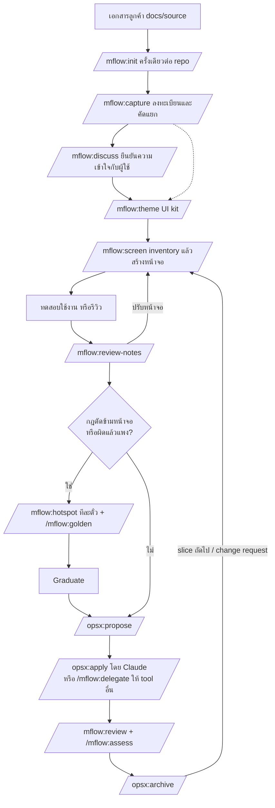

# mflow: Requirement

| รายการ | ค่า |
|---|---|
| เอกสาร | Requirement ของ plugin mflow |
| เวอร์ชันที่อธิบาย | 0.24.0 |
| ผู้ใช้เป้าหมาย | คนที่ต้องการทำระบบ: SA, PM หรือเจ้าของระบบ |
| ผู้ดูแล plugin | Mounchon |
| วันที่ | 2026-10-04 |
| สถานะ | ใช้งานได้ (pilot) |

---

## 1. ที่มาและปัญหา

การพัฒนาซอฟต์แวร์แบบเดิมคือ เก็บ requirement → เขียนเอกสารออกแบบ → dev เมื่อมี AI (Claude Code, Codex และตัวอื่น) ช่วยเขียนโค้ด การ dev เร็วขึ้นมาก ลำดับเดิมจึงไม่คุ้มอีกต่อไป แต่การวน "req → dev บางส่วน → req" เจอปัญหาสามข้อ:

1. **ลูกค้าไม่อ่านเอกสาร** แต่ชี้หน้าจอได้ requirement ที่ได้จากเอกสารจึงไม่ครบ
2. **โลจิกธุรกิจขนาดใหญ่** (คำนวณราคา, state machine, สต็อก, การอนุมัติ) ตัดผ่านหลายหน้าจอ ถ้าสร้างทีละส่วนโดยไม่เห็นกฎทั้งก้อน ต้องรื้อโครงสร้างกลางทาง
3. **AI จำไม่ได้ข้าม session** ไม่รู้ว่าก่อนหน้าทำอะไร จะทำอะไรต่อ และผลลัพธ์ที่ต้องการคืออะไร ยิ่งใช้ AI หลายตัวยิ่งหลุด

## 2. เป้าหมาย

mflow คือ plugin ของ Claude Code ที่ทำให้กระบวนการต่อไปนี้ทำซ้ำได้และตรวจสอบได้:

- **หน้าจอก่อน:** ทำ prototype ที่กดได้จริงให้ลูกค้าดู แทนการให้ลูกค้าอ่านเอกสาร
- **จับโลจิกใหญ่ก่อนสร้าง:** ทำให้กฎธุรกิจชัดในรูปที่ test ตรวจได้ ก่อนเขียนโค้ดจริง
- **ความจำของ AI อยู่ในไฟล์:** ทุก session ทุก tool เริ่มจากสถานะเดียวกัน
- **ใช้ AI หลายตัวอย่างมีการตรวจรับ:** งานจาก tool อื่นกลับมาในรูปที่ Claude ตรวจกับโค้ดจริงได้
- **ขอบเขตงานมีหลักฐาน:** เอกสารลูกค้า การรีวิว และ change request ถูกบันทึกจนใช้ประเมินราคาได้
- **ทำก่อน ทดสอบใช้งาน แล้วปรับเพิ่ม:** คำตอบของผู้ใช้เดินงานต่อได้ทันที ไม่รอลูกค้ายืนยันซ้ำ สิ่งที่ต้องแก้หลังทดสอบเป็นเอกสาร discuss ฉบับใหม่หรือ change ถัดไปของ OpenSpec

## 3. ผู้ใช้และสภาพแวดล้อม

| หัวข้อ | รายละเอียด |
|---|---|
| ผู้ใช้หลัก | คนที่ต้องการทำระบบ เช่น SA, PM หรือเจ้าของระบบ ใช้ AI ช่วยครบทั้งสาย: requirement, domain design, dev, deploy คำตอบและคำสั่งของผู้ใช้ถือเป็นคำสั่งของลูกค้าโดยตรง |
| AI หลัก | Claude Code (มี hook และคำสั่ง mflow) |
| AI เสริม | Codex, OpenCode, Gemini CLI, chat UI (ChatGPT/Gemini web) และ tool ใหม่ในอนาคต |
| เครื่องมือร่วม | OpenSpec (living spec), Backlog.md (บอร์ดงาน), git |
| Stack | เลือกตอน `/mflow:init`: a) ASP.NET Core MVC + Razor + Bootstrap 5 + HTMX, xUnit, Playwright (รองรับเต็ม, แนะนำเมื่อ repo ว่าง) b) React + Vite + ASP.NET Core Web API, xUnit + Vitest, Playwright c) stack อื่นที่ Claude เติมตาราง mapping ให้ยืนยัน (ยังไม่ทดสอบ) |
| ระบบปฏิบัติการ | Windows และ Linux |
| ภาษา | ข้อความถึงลูกค้าและ README เป็นภาษาไทย ไฟล์ที่ AI อ่าน (AGENTS.md, SKILL.md) เป็นภาษาอังกฤษ |

## 4. หลักการออกแบบ

| รหัส | หลักการ | เหตุผล |
|---|---|---|
| P1 | หนึ่งข้อเท็จจริงอยู่ที่เดียว ที่อื่นชี้มา | ข้อมูลซ้ำสองที่จะขัดกันภายในไม่กี่สัปดาห์ แล้ว AI เลือกเชื่อแบบสุ่ม |
| P2 | สถานะงานอยู่ในไฟล์ใน repo | AI ตัวไหน session ไหนก็ทำต่อได้ |
| P3 | งานที่ต้องได้ผลเหมือนกันทุกครั้งใช้ script | ไม่ให้ AI ทำด้วยมือในเรื่องที่ต้องแม่นยำ (สร้างไฟล์, ทะเบียน, สร้างคำสั่ง) |
| P4 | คนตัดสินใจ AI ลงมือ | คำสั่งที่เขียนลง repo หรือมีผลต่อขอบเขตต้องได้ yes ก่อน คำสั่งให้ทำจากผู้ใช้คือ yes ของเรื่องนั้น และครอบคลุมทุกขั้นของเรื่องนั้น: แสดงสิ่งที่กำลังเขียนแล้วทำต่อโดยไม่ถามซ้ำ ถามเฉพาะสิ่งที่เกินเรื่องนั้น (การเปลี่ยนที่กระทบหน้าจออื่นหรือของที่สร้างแล้ว หัวข้ออื่น ข้อเสนอของ AI ตัวอื่น) ถ้าขอแค่วิเคราะห์ให้หยุดที่รายงาน การแสดงสิ่งที่ Claude อ่านจากเอกสารลูกค้า (ตารางคัดแยก การจับคู่คอลัมน์) ให้ผู้ใช้ตรวจไม่นับเป็นการถามซ้ำ |
| P5 | Spec บอกสิ่งที่ "เป็นอยู่" change บอกสิ่งที่ "จะเป็น" | ตามโมเดลของ OpenSpec |
| P6 | Test คือหลักฐานว่าเสร็จ | "เสร็จ" ต้องพิสูจน์ด้วย test ที่ผ่าน ไม่ใช่คำบอกของ AI |
| P7 | ไม่ผูกกับ AI tool ตัวใด | brief และทะเบียน tool ทำให้เปลี่ยนหรือเพิ่ม tool ได้โดยไม่แก้ plugin |
| P8 | ไม่ทับงานของคน | ไฟล์ที่มีอยู่แล้วไม่ถูกเขียนทับ ข้อเสนอไปอยู่ที่ `.mflow/suggested/` |
| P9 | เพิ่มคำสั่งเมื่อทำเรื่องเดิมด้วยมือซ้ำ 2 ถึง 3 ครั้ง | กันการออกแบบเกินความจำเป็น |
| P10 | คำตอบหรือคำสั่งของผู้ใช้คือคำสั่งของลูกค้า: ทำก่อน ทดสอบใช้งาน แล้วปรับเพิ่ม | ผู้ใช้ (SA, PM หรือเจ้าของระบบ) พูดแทนลูกค้า การรอลูกค้ายืนยันซ้ำทำให้งานหยุด สิ่งที่ผิดเห็นเร็วที่สุดตอนใช้งานจริง และแก้เป็น change ถัดไปของ OpenSpec ได้ ความเห็นของ AI ตัวอื่นไม่มีน้ำหนักนี้ |

## 5. Workflow ภาพรวม



ตลอดทุกขั้น hook SessionStart ใส่ briefing ให้ AI และ hook Stop เตือนให้อัปเดต STATUS.md

## 6. Functional requirements

สถานะ: **มีแล้ว** = อยู่ใน v0.3 / **บางส่วน** = มีแต่ยังไม่ครบตาม requirement

### 6.1 ตั้งค่าโปรเจกต์ (`/mflow:init`)

| รหัส | Requirement | สถานะ |
|---|---|---|
| FR-01 | สำรวจ repo ก่อนถามผู้ใช้: solution, test project, Playwright, agent file เดิม, เอกสาร requirement, CLI ที่ติดตั้ง | มีแล้ว |
| FR-02 | สร้าง AGENTS.md, CLAUDE.md (`@AGENTS.md`), STATUS.md, docs/vision.md, docs/decisions/hotspots/INDEX.md, docs/source/README.md, docs/ai/inbox/README.md, docs/decisions/discuss/README.md, .mflow/config.json | มีแล้ว |
| FR-03 | ไม่เขียนทับไฟล์เดิม เขียน template ไว้ที่ `.mflow/suggested/` ให้ merge พร้อมแสดง diff | มีแล้ว |
| FR-04 | ต่อ OpenSpec (`openspec init --tools claude,codex` หรือ `openspec update`) และ Backlog.md (`backlog init … --agent-instructions agents`) หลังผู้ใช้ตอบ yes | มีแล้ว |
| FR-05 | เติม `context` และ `rules` ใน openspec/config.yaml: proposal ต้องลิงก์ hotspot และเอกสาร data model ที่อนุมัติ, requirement ต้องมี scenario, task ต้องจบด้วย test และ change ที่สร้าง aggregate ต้องเปลี่ยนส่วนนั้นของ `PrototypeData/README.md` เป็นบรรทัดชี้ไปที่ entity | มีแล้ว |
| FR-173 | เติม `operations.apply.guidance` ใน openspec/config.yaml: ใน Claude Code เมื่อ briefing ของ session บอกว่า apply subagent เปิดอยู่ (FR-174) `/opsx:apply` ส่งงานเขียนโค้ดของแต่ละ task ให้ subagent `mflow:dev` ตัวใหม่ (`agents/dev.md` มากับ plugin, `model: claude-sonnet-5-5`, `effort: xhigh`) ทีละ task ตามลำดับใน `tasks.md` พร้อมรายงานของ task ก่อนหน้า Claude ตัวหลักถือ `tasks.md` ตรวจ diff กับผล test ก่อนติ๊กและก่อนเริ่ม task ถัดไป และ tool ที่ไม่มี subagent นี้ (Codex) ทำ task เอง ไม่แก้ไฟล์ที่ OpenSpec สร้าง เพราะ `openspec update` เขียนทับ skill และ command แต่ไม่แตะ `config.yaml` | มีแล้ว |
| FR-174 | apply subagent `mflow:dev` **ปิดเป็นค่าเริ่มต้น** จนกว่าจะเปิด `/mflow:subagent on\|off\|status [--shared]` เก็บค่า `applySubagent.enabled` ไว้ใน `.mflow/local.json` (เฉพาะเครื่อง เพิ่มลง `.gitignore` เมื่อสร้างไฟล์) หรือ `.mflow/config.json` (`--shared` ทั้งทีม) ค่า local ทับค่าทีม ไม่มีทั้งสองคือปิด ค่าอยู่ที่ root ของโปรเจกต์จึงได้ผลเดียวกันไม่ว่าเปิด Claude Code ที่โฟลเดอร์ไหน hook PreToolUse (`subagent-guard.mjs`, matcher `Agent\|Task`) ปฏิเสธ `mflow:dev` เมื่อปิด ไม่ใช่โปรเจกต์ mflow หรืออ่านค่าไม่ได้ (fail closed) และปล่อย subagent ตัวอื่นผ่าน briefing มีบรรทัด "is ON" เฉพาะตอนเปิด และ guidance ส่งงานให้ subagent เฉพาะเมื่อ briefing ของ session นั้นบอกว่าเปิด จึงไม่เสียรอบเรียกตอนปิด ตัดสินจาก session ปัจจุบัน ไม่ใช่บันทึกเก่า ปิดมีผลทันที เปิดมีผลหลัง `/clear` หรือ session ใหม่ ไม่แตะไฟล์ใต้ `openspec/` และ `.claude/` ไม่เขียนทับไฟล์ที่ parse ไม่ได้ `status` เตือนเมื่อกฎ deny ของ Claude Code (ของ user หรือโฟลเดอร์ที่เปิด) ปิดไว้ทั้งที่ตั้งเปิด และเมื่อเปิดแต่ `config.yaml` ไม่มี guidance ถ้าไม่ใช้แค่รอบเดียวระหว่างที่เปิด ให้บอกในข้อความ `/opsx:apply` | มีแล้ว |
| FR-06 | เขียนคำสั่ง build/test ลง AGENTS.md เฉพาะที่รันผ่านจริง ที่รันไม่ได้ติด `(unverified)` | มีแล้ว |
| FR-07 | เรียกซ้ำได้อย่างปลอดภัยเพื่อรับ template ใหม่เมื่ออัปเกรด plugin: `.mflow/templates.json` บันทึก hash ของ template ที่เคยเสนอและรุ่น plugin ที่เสนอ รอบถัดไปเสนอเฉพาะ template ที่เปลี่ยน ไฟล์ที่ผู้ใช้ merge หรือเลือกเก็บของตัวเองไว้แล้วไม่ถูกเสนอซ้ำ (`kept`) และ stack ที่เลือกไว้แล้วถูกใช้ต่อโดยไม่ถามใหม่ briefing บอกเมื่อ template ของโปรเจกต์เก่ากว่า plugin | มีแล้ว |
| FR-07a | doctor (`scripts/doctor.mjs`, เรียกผ่าน `/mflow:help check setup` และท้าย `/mflow:init`) ตรวจแบบอ่านอย่างเดียว: รุ่น Node (ขั้นต่ำและวันหมดอายุ), git, รุ่น OpenSpec และ Backlog.md เทียบกับขั้นต่ำและรุ่นที่ทดสอบใน `compat.json`, JSON ที่ briefing อ่านจาก CLI, config (parse ได้ และไม่มีชื่อ setting ที่สะกดผิด), โฟลเดอร์, ทะเบียนเอกสาร, ค่า subagent, AGENTS.md และ STATUS.md, guidance ใน openspec/config.yaml, template ที่เก่ากว่า plugin, `.mflow/suggested/` ที่ค้าง, cache แบบเก่า, session ของ consultation ที่อ่านไม่ได้, golden data ที่ไฟล์ต้นทางเปลี่ยนหรือชี้ออกนอกโปรเจกต์ และโหมด prototype ที่ไม่มีการตรวจตอน start ทุกข้อที่เป็น warn หรือ fail มีวิธีแก้ | มีแล้ว |
| FR-07b | เอกสารทั้งหมดที่ mflow เขียนอยู่ใต้ `docs/` ห้าหมวด (0.20): `source/` (เอกสารลูกค้า), `decisions/` (`discuss/`, `hotspots/`), `ui/`, `reviews/` (สรุปรีวิว, `code/`, `change-requests/`), `ai/` (`inbox/`, `analysis/`, `design/`, `challenge/`) กับ `docs/vision.md` นอก `docs/` มีเฉพาะ AGENTS.md, CLAUDE.md, STATUS.md, `.mflow/`, `openspec/`, `backlog/` โปรเจกต์ที่สร้างก่อน 0.20 ใช้ต่อได้ด้วย path ใน `.mflow/config.json` (scaffold วาง template ลง folder ตามค่าตั้ง จึงไม่มีไฟล์ซ้ำสองที่ และ consultation เก่าอ่านจาก folder เดิมจนกว่าจะย้าย) doctor และ briefing เตือนว่าใช้โครงเก่า `/mflow:init` รัน `migrate-layout.mjs` แสดงแผน (ย้ายอะไรไปไหน, ค่าตั้งที่เปลี่ยน, ไฟล์ที่ต้องแก้ path) แล้วย้ายเมื่อผู้ใช้ตอบ yes: ย้าย folder, แก้ค่าตั้ง, แก้ path แบบเต็มในทุกไฟล์ข้อความ (รวม backlog, openspec, comment ในโค้ด, brief และ session ใน `.mflow/`) คำนวณ relative link ใน Markdown ใหม่ ไม่แตะเอกสารลูกค้าใน `docs/source/` folder ที่ชื่อทั่วไป (`analysis`, `design`, `challenge`, `change-requests`) ย้ายเฉพาะรายการที่ชื่อเป็นเลขของ mflow folder ที่ตั้งเองด้วยมือคงไว้ ส่วนที่ชนกับของที่มีอยู่แล้วแสดงเป็น conflict ไม่ย้าย รันซ้ำได้ ไม่ commit ให้ | มีแล้ว |
| FR-08 | ถามเลือก stack หลังสำรวจ repo และก่อนเขียนไฟล์ใดๆ ถามทุกครั้งแม้เดาจาก repo ได้ (ตัวเลือก `a)` `b)` `c)` พร้อมคำแนะนำและหลักฐาน) บันทึกที่ `## Stack` ใน AGENTS.md ที่เดียว (profile + ตาราง seam → path/เทคโนโลยี) และ `theme` `screen` `golden` `review` อ่านจากตรงนั้น โปรเจกต์ที่ยังไม่มี section นี้ ให้ถามเมื่อคำสั่งเหล่านั้นต้องใช้ครั้งแรก | มีแล้ว |
| FR-193 | ถามชื่อโปรเจกต์ในโค้ดในข้อความเดียวกับ stack: ชื่อที่ทุก project, folder และ namespace ขึ้นต้นด้วย (ไม่ใช่ชื่อที่แสดงในหัว AGENTS.md) เสนอสามชื่อพร้อมชื่อที่แนะนำ (จากชื่อที่ลูกค้าเรียกระบบ, จากชื่อโปรเจกต์หรือโฟลเดอร์แบบ PascalCase, ชื่อสั้นแบบแบรนด์) ตอบเป็นตัวอักษรหรือพิมพ์เอง ชื่อต้องเป็น PascalCase ASCII ขึ้นต้นด้วยตัวอักษร ไม่มีช่องว่าง ขีด หรือ underscore มีชื่อบริษัทนำหน้าได้แบบ `Company.Product` ไม่เกินราว 20 ตัวอักษร ไม่ชนกับ .NET หรือชื่อ layer/ชนิด (`System`, `Microsoft`, `App`, `Web`, `Api`, `Core`, `Domain`) ชื่อที่พิมพ์ผิดกฎได้รูปที่ถูกที่ใกล้ที่สุดเสนอกลับ บันทึกเป็น `Project name (code)` ใน `## Stack` และใช้แทน `<ProjectName>` ในทุก path ของ `## Stack` init ซ้ำกับโปรเจกต์ที่ยังไม่มีบรรทัดนี้ถามเฉพาะชื่อ (solution ที่มีอยู่แล้วใช้ prefix เดิมเป็นชื่อแนะนำ) เปลี่ยนชื่อหลังสร้าง solution แล้วต้องผ่านเอกสาร `code-structure` ฉบับใหม่และ OpenSpec change ไม่ใช่ผลของการรัน init ซ้ำ | มีแล้ว |

### 6.2 ความจำข้าม session (hooks + ไฟล์)

| รหัส | Requirement | สถานะ |
|---|---|---|
| FR-10 | SessionStart (เริ่ม, resume, clear, compact) ใส่ briefing: ส่วน Now และ log ล่าสุดของ STATUS.md, OpenSpec change ที่ค้าง, Backlog task ที่ In Progress, hotspot ที่ active และจำนวนตั๋วที่หยิบได้ | มีแล้ว |
| FR-11 | Briefing แจ้งเอกสารลูกค้าที่ยังไม่ได้ประมวลผล และรายงานจาก AI อื่นที่ยังไม่ได้ assess | มีแล้ว |
| FR-12 | Stop hook ขอให้เขียน STATUS.md เมื่อมีไฟล์เปลี่ยนหลัง STATUS.md ถูกเขียนครั้งล่าสุด นับทั้งไฟล์ที่แก้ เพิ่ม ลบ เปลี่ยนชื่อ และที่ commit ไประหว่าง session: SessionStart จด commit และไฟล์ที่ค้างอยู่ตอนเริ่ม ไฟล์ที่ลบหรือเปลี่ยนชื่อไว้ก่อนเริ่มจึงไม่นับ ส่วน record จาก mflow รุ่นก่อนที่ไม่มีข้อมูลนี้ นับไฟล์ที่ลบทุกไฟล์ (อาจเตือนเกิน แต่ไม่พลาด) | มีแล้ว |
| FR-13 | Stop hook ไม่เตือนใน 10 นาทีแรก และเตือนซ้ำไม่เกินทุก 30 นาที ปรับได้ใน config | มีแล้ว |
| FR-14 | Hook ทำงานเฉพาะ repo ที่มี `.mflow/config.json` เงียบใน repo อื่น ยกเว้น hook PreToolUse ที่ปฏิเสธ subagent `mflow:dev` ใน repo ที่ไม่ใช่ mflow (FR-174) และไม่แตะ subagent ตัวอื่น | มีแล้ว |
| FR-15 | AI ที่ไม่มี hook (Codex ฯลฯ) ทำตาม "Session ritual" ใน AGENTS.md | มีแล้ว |
| FR-16 | `/mflow:handoff` เขียน STATUS.md แบบละเอียดจากข้อเท็จจริง (git, openspec, backlog, ผล test) และสร้าง brief ให้ tool อื่นได้ | มีแล้ว |

### 6.3 เอกสารลูกค้า (`/mflow:capture`)

ชื่อเดิมคือ `/mflow:source` (ถึง 0.7) เปลี่ยนเฉพาะชื่อคำสั่ง โฟลเดอร์ `docs/source/`, `source-index.mjs` และ `sourceDir` คงเดิม เพื่อไม่ให้โปรเจกต์ที่ใช้อยู่พัง

| รหัส | Requirement | สถานะ |
|---|---|---|
| FR-20 | เก็บต้นฉบับใน `docs/source/` ไม่แก้ไข ฉบับใหม่เป็นไฟล์ใหม่ | มีแล้ว |
| FR-21 | ทะเบียนเอกสารด้วย hash: new / changed / unchanged / missing | มีแล้ว |
| FR-22 | อ่านเฉพาะไฟล์ที่ระบุ หรือไฟล์ที่เป็น new/changed ข้ามไฟล์ที่อ่านแล้ว | มีแล้ว |
| FR-23 | สถานะเอกสาร: active, superseded (พร้อมฉบับที่แทน), reference และบันทึกว่าถูกใช้กับ hotspot/change ไหน | มีแล้ว |
| FR-24 | เทียบฉบับใหม่กับฉบับเก่าทีละหัวข้อเมื่อมีการแทนที่ | มีแล้ว |
| FR-25 | คัดแยกทุกข้อความไปยังปลายทาง: AGENTS.md, vision.md, hotspot INDEX, change request, คำศัพท์ ข้อที่คลุมเครือถามผู้ใช้ในตารางเดียวกัน ข้อที่ยังตอบไม่ได้ไป open questions และให้ผู้ใช้ยืนยันก่อนเขียน | มีแล้ว |
| FR-26 | อ่าน PDF, MD, CSV โดยตรง, แปลง DOCX เป็น Markdown ใน `.mflow/cache/`, อ่าน XLSX ด้วย python ไฟล์แปลงอยู่ที่ `.mflow/cache/<path ในโปรเจกต์>.<hash>.md` ซึ่ง `source-index.mjs cache` บอกให้ ไฟล์ชื่อซ้ำคนละโฟลเดอร์จึงไม่ชนกัน ไฟล์ที่แก้แล้วได้ path ใหม่แทนการใช้ข้อความฉบับเก่า และฉบับเก่าถูกลบ บรรทัดแรกบอกต้นฉบับ เครื่องมือที่ใช้แปลง วันที่ และส่วนที่แปลงไม่ได้ | มีแล้ว |
| FR-27 | `docs/source/INDEX.md` สร้างอัตโนมัติจาก `.mflow/sources.json` ทะเบียนเป็นข้อมูลหลัก INDEX.md เป็นมุมมองที่ `render` สร้างใหม่ได้ `mark` รับ `--status` เฉพาะ active, superseded, reference และไฟล์ภายในโปรเจกต์ ทะเบียนที่อ่านไม่ได้ทำให้หยุด ไม่เขียนทับ (NFR-11) | มีแล้ว |

### 6.4 UI kit (`/mflow:theme`)

| รหัส | Requirement | สถานะ |
|---|---|---|
| FR-30 | สร้าง UI kit ก่อนหน้าจอแรก ให้ทุกหน้าจอใช้สี input และ component ชุดเดียวกัน | มีแล้ว |
| FR-31 | Tokens (`tokens.css`) เป็นที่เดียวของสี ฟอนต์ radius ระยะห่าง พร้อม bridge ไปตัวแปร Bootstrap 5.3 และฟอนต์ไทยเป็นค่าเริ่มต้น | มีแล้ว |
| FR-32 | App shell: sidebar, top bar, page header, toast, prototype banner | มีแล้ว |
| FR-33 | Component ตามสัญญา: DataTable, FilterPanel, FormField, DatePicker, DateRangeField, PageHeader, Button, Card, Dialog, SidePanel, QuickView, Alert, Tabs, Dropdown, Tooltip, Loading, DetailView, StatusBadge, EmptyState, ConfirmDialog (สร้างบน Dialog), Toast, SidebarMenu, PrototypeBanner ทุกตัวมี Input, สถานะ, พฤติกรรม และบรรทัด Narrow และสำหรับ `mvc-htmx` สร้างบน component ของ Bootstrap | มีแล้ว |
| FR-34 | DataTable: แบ่งหน้าที่ server ใน query ของ database (กรอง เรียง แล้ว skip/take และนับด้วยเงื่อนไขเดียวกัน), filter panel แยกอยู่เหนือตาราง, sort, เลือกจำนวนต่อหน้า, สถานะอยู่ใน URL | มีแล้ว |
| FR-35 | หน้า `/_styleguide` แสดงทุก component ทุกสถานะ ให้ผู้ใช้อนุมัติหน้าตาครั้งเดียว | มีแล้ว |
| FR-36 | กฎสำหรับ AI: `docs/ui/design-system.md` และ `.claude/rules/ui.md` (โหลดเฉพาะตอนเปิดไฟล์ UI) ห้าม hex และ inline style | มีแล้ว |
| FR-37 | `update <อะไร>` แก้ kit แล้วทุกหน้าจอเปลี่ยนตาม, `update access` สร้างหรือปรับชั้นสิทธิ์จากเอกสาร access-control ที่อนุมัติแล้ว | มีแล้ว |
| FR-38 | App shell มี `SidebarMenu` ที่สร้างจาก `MenuDefinition` และกรองตามสิทธิ์ของผู้ใช้ปัจจุบัน (`ICurrentUser.Can`) ใช้ permission key ชุดเดียวกับการตรวจที่ endpoint และปุ่ม | มีแล้ว |
| FR-39 | ปุ่มสลับ role ใน PrototypeBanner: เลือกผู้ใช้จำลองจาก `users.json`/`roles.json` (สร้างจากเอกสาร access-control ที่อนุมัติแล้ว) เพื่อให้ลูกค้าเห็นเมนู แถวข้อมูล field และปุ่มของแต่ละ role มีเฉพาะตอน `Prototype:UseFakeData` เป็น true ค่านี้ตัดสินตอน runtime โค้ดจึงยังอยู่ในแอปที่ publish: `appsettings.json` ตั้งเป็น false, แอปไม่ยอม start ถ้าเปิดค่านี้นอก environment Development หรือ Prototype (เซิร์ฟเวอร์ demo ใช้ `ASPNETCORE_ENVIRONMENT=Prototype`) และมี negative test ว่า start ไม่ได้ใน Production, switch-user ใช้ไม่ได้เมื่อปิด และเรียก endpoint ตรงโดยไม่มีสิทธิ์ได้ 403 | มีแล้ว |
| FR-145 | ถามอุปกรณ์ที่ต้องรองรับ (จอคอม / เพิ่มแท็บเล็ต / ทุกขนาดรวมมือถือ) และขนาดจอที่ลูกค้าตรวจรับในรอบเดียวกับแบรนด์ บันทึกใน `docs/ui/design-system.md` ถ้าขัดกับ AGENTS.md, vision หรือเอกสารลูกค้าต้องแจ้ง ห้ามแก้เงียบ | มีแล้ว |
| FR-146 | `AppShell` เต็มหน้าต่าง sidebar กับเนื้อหาเลื่อนแยกกัน top bar ติดด้านบน เมนูสามสถานะตามความกว้างจอ (เต็ม ≥ 1280 / ไอคอน 768–1279 / drawer < 768 ปรับให้ขนาดจอตรวจรับตกในสถานะที่ต้องการ) ปุ่ม ☰ ทุกขนาดจอและจำค่าที่เลือก drawer ปิดด้วย Esc แตะ backdrop หรือเปลี่ยนหน้า โฟกัสเข้าและกลับที่ ☰ ทุกเมนูต้องมีไอคอน | มีแล้ว |
| FR-147 | เนื้อหาจัดตัวเองตามความกว้างของพื้นที่เนื้อหา (container query): ตัวกรอง 4 → 3 → 2 → 1 คอลัมน์ ฟอร์ม 1 คอลัมน์และปุ่มเต็มความกว้างเมื่อแคบ ตารางเลื่อนแนวนอนในกล่องของตัวเอง หน้าจอห้ามมี media query หรือความกว้างตายตัว | มีแล้ว |
| FR-148 | style guide เปิดด้วยส่วนการตัดสินใจของ theme (พร้อมป้ายที่มา) และส่วนโครงหน้าและเมนู (ปุ่มบังคับสถานะเมนู + ตารางความกว้างจอ) theme, screen และ review ตรวจที่ขนาดจอตรวจรับ: ไม่เลื่อนแนวนอน เมนูเปิดได้ ไม่มีอะไรทับหรือถูกตัด ภาพหน้าจอทุก role ที่ขนาดใหญ่สุดและหนึ่ง role ที่ขนาดเล็กสุด `update responsive` เพิ่มส่วนนี้ให้ kit ก่อน 0.11 | มีแล้ว |
| FR-149 | `/mflow:theme preview` สร้าง kit เป็น static preview (HTML/CSS/JS ไม่มี build ไม่ใช้ npm) ใน `docs/ui/theme/` ใช้ CSS base เดียวกับ stack (Bootstrap จาก CDN สำหรับ `mvc-htmx`) มี style guide และหน้าตัวอย่าง เปิดด้วย `python -m http.server` README มีบรรทัดสถานะ `draft` → `approved <วันที่>` → `frozen <วันที่>, kit in <path>` ถ้ายังไม่มีโค้ดแอป `/mflow:theme` ถามก่อนว่าจะทำ preview หรือ scaffold แอปก่อน | มีแล้ว |
| FR-150 | kit มีที่อยู่เดียวในแต่ละช่วง: ก่อน port อยู่ใน preview (`update` แก้ที่ preview), หลัง port อยู่ใน stack และ preview ถูก freeze ห้ามแก้ `design-system.md` บอกที่อยู่ปัจจุบัน เมนูและผู้ใช้จำลองใน `shell.js` เป็นสำเนา ต้นทางคือ `PrototypeData/` และ `MenuDefinition` | มีแล้ว |
| FR-151 | `/mflow:theme port` ต้องมี preview ที่ `approved`, `## Stack` และโปรเจกต์แอปอยู่แล้ว (ไม่ scaffold แอปเอง ให้เสนอ `/opsx:propose` แทน) copy `tokens.css` `app.css` `assets/` ตรงๆ สร้าง shell, component และชั้นสิทธิ์ตามสัญญา (`shell.js` และ `datatable.js` เป็นแค่ตัวอย่างพฤติกรรม) เทียบ style guide กับ preview ทุกขนาดจอตรวจรับ แล้ว freeze preview | มีแล้ว |
| FR-152 | `/mflow:screen` ไม่สร้างหรือปรับหน้าจอขณะ kit อยู่แค่ใน preview (`draft` หรือ `approved`) และเสนอ `port` แต่ `inventory` ทำได้ตั้งแต่ช่วง preview preview ที่ไม่มีบรรทัดสถานะ (ก่อน 0.12) ไม่ถูกขวาง ความเห็นจากการทดสอบเรื่องหน้าตาหรือ layout ของ kit `review-notes` ส่งไปที่ `/mflow:theme update` | มีแล้ว |
| FR-156 | Pager ของ DataTable: ‹ › รอบเลขหน้า ไม่เกิน 7 หน้าแสดงทุกเลข เกินนั้นแสดงหน้าแรก หน้าสุดท้าย หน้าปัจจุบันและข้างละหนึ่ง ช่องว่างเป็น `…` (ช่องว่างหน้าเดียวแสดงเลขแทน) ‹ › ปิดที่หน้าแรก/สุดท้าย หน้าปัจจุบันมี `aria-current="page"` เปลี่ยนตัวกรอง sort หรือจำนวนต่อหน้ากลับไปหน้า 1 จอแคบย่อเป็น `‹ 5 / 20 ›` | มีแล้ว |
| FR-157 | Header search ในตารางไม่บังคับ: เปิดรายคอลัมน์ด้วย `searchable` (ค่าเริ่มต้นปิด) ถ้าไม่มีคอลัมน์ไหนเปิด แถวค้นหาไม่แสดงเลย | มีแล้ว |
| FR-158 | `DatePicker` ของ kit (แบบที่ใช้งานจริงในโปรเจกต์ก่อนหน้า): พิมพ์ตามรูปแบบวันที่ หรือเลือกจากปฏิทินภาษาอังกฤษคู่ไทย (หัวเดือนอังกฤษ + ปี เหนือเดือนไทย, วันในสัปดาห์อังกฤษเหนือไทย เริ่มวันอาทิตย์) สามมุมมอง วัน/เดือน/ปี (หน้าละ 12 ปี), ปุ่ม Today · วันนี้ และ Clear · ล้าง, คีย์บอร์ดครบ, ข้อความผิดพลาดสองภาษา, ส่งค่า ISO `YYYY-MM-DD` ผ่าน hidden input ห้ามใช้ `<input type="date">` และ `Intl` ภาษาไทยกับวันที่ เป็นสัญญา ไม่ใช่โค้ดตายตัว แต่ละ stack สร้างเอง รวมถึง ASP.NET Core MVC ที่ใช้ jQuery unobtrusive validation (bind เฉพาะ hidden ISO, ตรวจที่ช่องที่มองเห็น, ข้อความเดียวต่อช่อง, server ตรวจซ้ำ) | มีแล้ว |
| FR-159 | รูปแบบวันที่ตั้งครั้งเดียว (ถามใน theme ขั้น 1): `DD/MM/YYYY` (แนะนำ), `DD-MM-YYYY`, `DD.MM.YYYY`, `YYYY-MM-DD` และปี ค.ศ. (แนะนำ) หรือ พ.ศ. บันทึกใน design-system.md และ config เดียวใน format module ที่ช่องวันที่ ตาราง และทุกการแสดงวันที่อ่าน ค่าที่เก็บและส่งเป็น ค.ศ. เสมอ ตัวแปลงวันที่มีตารางตัวอย่างในสัญญาซึ่งแต่ละ stack ทำเป็น unit test | มีแล้ว |
| FR-160 | `DateRangeField` (To ก่อน From ไม่ได้ วันเดียวกันได้) และ FilterPanel ไม่ส่งค้นหาเมื่อมีช่องที่ผิดอยู่ โฟกัสไปช่องแรกที่ผิด | มีแล้ว |
| FR-161 | `/mflow:theme update components` เพิ่มสัญญาของ 0.14 ให้ kit เดิม และ `update date-picker` ถามรูปแบบวันที่แล้วสร้างเฉพาะส่วนวันที่ ทั้งสองเทียบก่อนและแสดงเฉพาะส่วนที่ขาด ปรับ `.claude/rules/ui.md` และ `design-system.md` ให้ด้วย และตั้ง `searchable` ให้คอลัมน์ที่มี header search อยู่แล้วก่อนเปลี่ยนค่าเริ่มต้น `/mflow:review` ตรวจว่าไม่มี `<input type="date">` และไม่มีการจัดรูปแบบวันที่ในหน้าจอ | มีแล้ว |
| FR-188 | หน้าตาของ kit (visual direction) ตัดสินในขั้น 1 ของ theme: ค่าเริ่มต้นเป็นแบบ admin หรือ back-office template สมัยใหม่ เริ่มจาก house style (FR-195) แล้วปรับให้ลูกค้าและเรื่องของระบบนั้น ถามหน้าตาที่ต้องการในคำของผู้ใช้ในชุดเดียวกับแบรนด์ ถ้า session มี skill `frontend-design` ให้เรียกพร้อม brief ที่กรอกครบจากคำตอบขั้น 1 (เรื่อง ผู้ใช้ งานหลัก หน้าตา แบรนด์ ฟอนต์ที่มีอักษรไทย และสิ่งที่ห้ามเปลี่ยน: CSS base, ชื่อ token, สัญญา component, AppShell, contrast AA) ถ้าไม่มี (หรือใช้ Codex) ใช้ขั้นตอนเดียวกันจาก `visual-direction.md` คำถามที่เหลือเป็นข้อเลือกของผู้ใช้ ไม่รอถามลูกค้า ผลลงที่ tokens และ stylesheet ของ kit เท่านั้น: ชุดสี ฟอนต์ ความแน่น radius ตามระดับพื้นผิว เงาเฉพาะสิ่งที่ลอย จุดเด่นหนึ่งจุด และ motion เฉพาะตอบการกระทำ ตรวจกับรายการหน้าตาสำเร็จรูปก่อนสร้าง และถ่ายภาพหน้าจอตรวจที่ขนาดจอตรวจรับหลังสร้าง บันทึกเป็นบรรทัด `Look:` ใน design-system.md ถ้าไม่มี CI เสนอสามแนวทางแทนสามชุดสี | มีแล้ว |
| FR-195 | หน้าตามาตรฐานของ mflow (house style จาก UI kit ที่ผู้ใช้เลือก 2026-10-10, `house-style.md`): สีหลักฟ้า `#0ea5e9` (hover `#0284c7`), สีรอง indigo `#6366f1`, sidebar `#0f172a`, สถานะ `#22c55e` `#f59e0b` `#ef4444` `#3b82f6`, neutral N-50 ถึง N-900, ฟอนต์ Inter + Noto Sans Thai และ JetBrains Mono, scale 28/22/18/14/14/12, radius 4/8/12/full, ไอคอน Font Awesome 6 Free solid (licence บันทึกใน `## Stack`), sidebar 240px แบ่งกลุ่ม รายการ active มีพื้นจางและแถบที่ขอบ, top bar 60px โปรเจกต์เริ่มจาก house style แล้วปรับให้ลูกค้า: CI เปลี่ยนเฉพาะกลุ่มสีหลัก ส่วน sidebar ฟอนต์ ไอคอน และรูปทรงคงไว้ `frontend-design` ช่วยปรับและวิจารณ์ สร้างหน้าตาใหม่ทั้งหมดเฉพาะเมื่อผู้ใช้ขอ ไม่มี CI เสนอสามแนวทางโดยข้อ a คือ house style ค่าสี เงา และขนาดอ่านจาก `styles/tokens.css` ของ kit (0.24) ค่าที่อ่านจากภาพติด `[อนุมาน]` | มีแล้ว |
| FR-196 | สีมีสองเฉด: เฉดเติม (`--app-primary`, `--app-<tone>`) สำหรับพื้น จุด ไอคอน focus และสถานะ active เฉดข้อความ (`--app-primary-text`, `--app-<tone>-text`) สำหรับตัวหนังสือบนพื้นสว่าง ต้องได้ 4.5:1 ตัวหนังสือสีขาวบนปุ่มทึบที่ต่ำกว่า 4.5:1 เป็นข้อตัดสินใจ `Button contrast` ใน design-system.md: a) สีตาม kit (ค่าเริ่มต้น) หรือ b) ใช้เฉดข้อความเป็นพื้นปุ่ม | มีแล้ว |
| FR-198 | ชุดสีสดของ house style (0.24, ผู้ใช้ขอสีสันสดใสตาม UI kit): token `--app-hue-*` สิบเฉด (sky, blue, indigo, violet, cyan, emerald, green, yellow, amber, red จากสีแบรนด์ สีสถานะ และ workflow colors ของ kit) แต่ละเฉดมีเฉดเติม เฉดข้อความ (4.5:1 บนขาวและบนพื้นจาง) และพื้นจาง CI ของลูกค้าไม่เปลี่ยนชุดนี้ สีสดใช้กับสิ่งที่มีความหมาย: `StatusBadge` ให้แต่ละสถานะหนึ่งเฉดเรียงตามความหมาย ไม่มีสองสถานะใช้เฉดเดียวกัน (ป้ายพื้นจาง ขอบจาง จุดสี และชื่อสถานะ), คอลัมน์ `person` ของ `DataTable` มี avatar ตัวย่อสี gradient จาก hash ของชื่อ, แถบ KPI ให้กล่องไอคอนแต่ละใบคนละเฉดตามลำดับคงที่, icon set ให้ key มีเฉดได้, ป้ายตัวเลขแจ้งเตือนสีทึบ ปุ่มทึบสีหลักหนึ่งปุ่มต่อส่วน หน้าจอไม่เลือกสีเอง `visual-direction.md` ไม่ลดความสดของสีและถือว่าหน้าเทาสีเดียวเป็นหน้าตาสำเร็จรูป `Button contrast` ค่าเริ่มต้น a) ติด `[ยืนยัน]` sidebar hover `#334155`, navy ที่สอง `#1e293b` และเงา sm/md/lg ตามไฟล์ tokens ของ kit `update look` เพิ่ม token เหล่านี้ และ `update components` เพิ่มสีสถานะ avatar กล่อง KPI และป้ายตัวเลขให้ kit ก่อน 0.24 | มีแล้ว |
| FR-197 | ส่วนของ `AppShell`: top bar ซ้ายมี ☰ และ page context (breadcrumb ถ้า design-system.md ให้อยู่ใน top bar ซึ่ง house style เลือก แล้ว `PageHeader` ไม่มี breadcrumb ซ้ำ จอแคบแสดงชื่อหน้าแทน) ขวาเรียง ช่องค้นหาทั้งระบบ (เฉพาะเมื่อมี ปุ่มลัด `Ctrl K` หรือ `⌘K` บน Mac), กระดิ่งพร้อมจุดเมื่อมีรายการยังไม่อ่าน, ป้ายขอบเขตข้อมูล (สาขา บริษัท tenant จาก `ICurrentUser` สลับได้เมื่อมีมากกว่าหนึ่ง), ผู้ใช้ (avatar ตัวย่อ ชื่อ บทบาท) แถบเมนูลัดด้านล่าง 4–5 ปุ่มบนมือถือ (เฉพาะเมื่ออุปกรณ์รวมมือถือ กรองตามสิทธิ์) `SidebarMenu` มีกลุ่ม บรรทัดเวอร์ชันด้านล่าง และรายการ active บอกด้วยมากกว่าสี `PageHeader` มี subtitle นับจำนวนและเวลา ปุ่มรองแบบ outline หรือไอคอน และ KPI strip `update components` เพิ่มส่วนเหล่านี้ให้ kit ก่อน 0.23 และ `update look` ย้าย kit เดิมไปใช้ house style | มีแล้ว |
| FR-189 | `QuickView`: ดูรายละเอียดของแถวโดยไม่ออกจากหน้ารายการ เปิดจากไอคอนในคอลัมน์ไอคอน (ส่วนนั้น) ปุ่มรูปตา หรือลิงก์ในเซลล์ (ทั้งรายการ) รายการหนึ่งมี `RowUrl` หรือ `QuickView` อย่างใดอย่างหนึ่ง ไม่มีทั้งสอง หน้าเต็มเข้าผ่านปุ่ม "เปิดหน้าเต็ม" ใน panel ส่วนเดียวหรือสรุปสั้นเปิดใน `Dialog` ทั้งรายการหรือเนื้อหาที่มีตาราง Tabs หรือฟอร์มเปิดใน `SidePanel` (เลือกอีกแบบได้ถ้าเขียนเหตุผลใน screens.md) เนื้อหาโหลดจาก endpoint ของหน้ารายการที่ตรวจ permission และ data scope เดียวกับรายการ ส่วนที่ห้ามเห็นไม่มีไอคอนและได้ 403 มี skeleton ระหว่างโหลด error เป็น Alert พร้อมลองใหม่ในตัว panel ตารางด้านหลังคงสถานะ โฟกัสกลับที่ปุ่มที่เปิด SidePanel ใส่ `?view=<id>` (และ `&section=`) ใน URL | มีแล้ว |
| FR-190 | คอลัมน์ไอคอนของ DataTable (format `icons`): icon set กลางหนึ่งชุดต่อชนิด (key → ไอคอน ป้ายไทย และคำของสามสถานะ) สถานะ `yes` `partial` `no` ต่างกันทั้งรูปทรงและสี ทุกแถวเรียง key ตำแหน่งเดียวกัน มี `aria-label` และ Tooltip เมื่อมี quick view ไอคอนเป็นปุ่มที่เปิดส่วนนั้น และคลิกไอคอนไม่ไปตาม `RowUrl` บนจอสัมผัส quick view คือทางเข้าถึงข้อความของ tooltip | มีแล้ว |
| FR-191 | `/mflow:theme update look` ทำ visual direction ใหม่ให้ kit เดิม แก้เฉพาะ tokens และ stylesheet ของ kit เพิ่ม token ที่ kit ก่อน 0.21 ไม่มี และแสดง style guide ก่อนและหลังก่อนผู้ใช้ตอบ yes ส่วน `update components` เพิ่ม `QuickView` และคอลัมน์ไอคอนให้ kit ก่อน 0.21 (เฉพาะ kit หน้าจอเดิมรับไปผ่าน `/mflow:screen`) | มีแล้ว |

### 6.5 หน้าจอ prototype (`/mflow:screen`)

| รหัส | Requirement | สถานะ |
|---|---|---|
| FR-40 | `inventory` สร้างรายการหน้าจอจาก story map และเอกสาร active → `docs/ui/screens.md` และรายงานกลุ่มข้อมูลที่ยังไม่มีเอกสาร data model ที่อนุมัติ (เป็นข้อแนะนำ ไม่บังคับ) | มีแล้ว |
| FR-41 | สร้างหน้าจอใน stack จริง จาก kit เท่านั้น ข้อความไทยอยู่ใน ViewModel | มีแล้ว |
| FR-42 | ข้อมูลตัวอย่างจาก JSON กลาง (`PrototypeData/*.json`) ใช้ร่วมทุกหน้าจอ อ้างอิงกันด้วย id | มีแล้ว |
| FR-43 | Fake repository รับ query object เดียวกับ EF Core และแบ่งหน้าเอง สลับเป็นของจริงด้วย DI โดยหน้าจอไม่ต้องแก้ | มีแล้ว |
| FR-44 | การเปลี่ยน schema ของ JSON ต้องแสดงผลกระทบและได้ yes ก่อน | มีแล้ว |
| FR-45 | จุดคำนวณใส่ค่าคงที่พร้อม `// PROTOTYPE:` และเพิ่มแถวใน hotspot INDEX | มีแล้ว |
| FR-46 | ปรับหน้าจอได้ด้วยคำสั่งภาษาคน ถ้าสิ่งที่ขอเกิน kit ให้เสนอ `/mflow:theme update` แทน | มีแล้ว |
| FR-47 | ข้อมูลตัวอย่างสมจริง (≥200 แถวต่อ entity ในรายการ, ครบทุกสถานะ, edge case) และไม่มีข้อมูลส่วนบุคคลจริง | มีแล้ว |
| FR-48 | ทุกหน้าจอประกาศ permission ของการดูและแต่ละ action, fake repository ใช้ data scope ของผู้ใช้ก่อนแบ่งหน้า, ซ่อน field ใน ViewModel และข้อมูลกระจายหลายสาขา/เจ้าของจนแต่ละ role เห็นต่างกันจริง | มีแล้ว |
| FR-192 | หน้ารายการของ `/mflow:screen` เปิดรายละเอียดของแถวใน `QuickView` เป็นค่าเริ่มต้น `inventory` เขียนในช่อง Shows ว่าแถวเปิดอะไรแบบไหน ขั้นตรวจเปิดทุก quick view ด้วยทุก role ปรับหน้าจอด้วยคำว่า "ดูโดยไม่เปลี่ยนหน้า" ได้ QuickView ถ้า session มี `frontend-design` ใช้ช่วยเฉพาะการจัดวางข้อมูลและถ้อยคำของหน้าจอ ไม่เพิ่มสไตล์ให้หน้าจอ สิ่งที่ kit ทำไม่ได้ไปที่ `/mflow:theme update` | มีแล้ว |
| FR-49 | ตรวจหน้าจอด้วยการสลับเป็นผู้ใช้ทุก role ที่เข้าได้ และหนึ่ง role ที่เข้าไม่ได้ (ไม่มีเมนู และเปิด URL ตรงได้ 403) ถ้ายังไม่มีเอกสาร access-control ที่อนุมัติ ให้ประกาศ permission ไว้ตามปกติ แล้วบันทึก `access not confirmed` ใน screens.md | มีแล้ว |

### 6.6 ทดสอบใช้งานและรีวิว (`/mflow:review-notes`)

| รหัส | Requirement | สถานะ |
|---|---|---|
| FR-50 | คัดแยกโน้ตหรือ transcript ทุกบรรทัดไปยังปลายทาง (task, hotspot, คำศัพท์, ลำดับความสำคัญ, out of scope, change request) คำถามถามผู้ใช้ในตาราง ข้อที่ยังตอบไม่ได้เป็น open question และติ๊กเกณฑ์ตรวจรับของ task ทดสอบใช้งานที่ผ่าน | มีแล้ว |
| FR-51 | ตรวจแต่ละรายการว่าอยู่ในขอบเขตที่ตกลงหรือไม่ | มีแล้ว |
| FR-52 | สรุปสิ่งที่ตกลงเป็นภาษาไทย นับเป็นขอบเขตที่ตกลงทันทีที่ผู้ใช้ยืนยันตาราง ไม่รอใครตอบกลับ ร่างอีเมลแจ้งผู้เกี่ยวข้องเมื่อผู้ใช้ต้องการ (แจ้งเพื่อทราบ ไม่ขอให้ยืนยัน) คำขอนอกขอบเขตเขียนเป็น "จะประเมินและเสนอแยก" | มีแล้ว |
| FR-53 | เรื่องสิทธิ์ เมนู และการมองเห็นข้อมูล: ตรงกับเอกสาร discuss ที่อนุมัติแล้วให้ใส่ในสรุป, ต่างจากเอกสารและยังไม่สร้างให้เปิดเอกสาร discuss ใหม่, สร้างแล้วใช้ change request, ยังไม่มีเอกสารให้เสนอหัวข้อ discuss เอกสาร discuss ที่อนุมัติแล้วนับเป็นขอบเขตที่ตกลง เพราะการอนุมัติของผู้ใช้คือของลูกค้า | มีแล้ว |
| FR-54 | สรุปมีหัวข้อ "สิทธิ์และข้อมูลที่แต่ละ role เห็น" และใช้เป็นหลักฐานของ change request | มีแล้ว |

### 6.7 โลจิกขนาดใหญ่ (`/mflow:hotspot`, `/mflow:golden`)

| รหัส | Requirement | สถานะ |
|---|---|---|
| FR-60 | Chart โลจิกใหญ่เป็นตั๋วตัดสินใจใน Backlog.md (label `decision`, `hs-<slug>`, ประเภท ask/examples/research/spike) | มีแล้ว |
| FR-61 | map.md เป็นสารบัญ: destination, sources, decisions so far, not yet specified (หมอก), out of scope | มีแล้ว |
| FR-62 | Frontier คำนวณจาก Backlog (`To Do` + `isReady`) แก้ครั้งละหนึ่งตั๋วต่อ session (ยกเว้น research) | มีแล้ว |
| FR-63 | ตั๋ว `ask` ถามผู้ใช้ตรงๆ เป็นภาษาไทย พร้อมทางเลือก ตัวอย่าง และคำแนะนำ คำตอบของผู้ใช้ปิดตั๋วได้ทันที AI ห้ามเลือกแทนผู้ใช้ ถ้าผู้ใช้อยากถามคนอื่นก่อน จึงร่างคำถามลง `questions-for-customer.md` และติด label `waiting-customer` | มีแล้ว |
| FR-64 | rules.md เก็บตาราง example, state machine, invariant พร้อม aggregate เจ้าของ, golden data | มีแล้ว |
| FR-65 | Readiness bar 6 ข้อ ผ่านแล้วจึง graduate เป็น OpenSpec change | มีแล้ว |
| FR-66 | อ่านเฉพาะไฟล์ที่ระบุด้วย `@` ผ่านทะเบียนเอกสาร และบันทึกว่าใช้ไฟล์ไหน | มีแล้ว |
| FR-67 | ถ้าเรื่องจบได้ใน session เดียว แนะนำให้ใช้ `/opsx:propose` แทน | มีแล้ว |
| FR-68 | `/mflow:golden` แปลง Excel ของลูกค้าเป็น golden JSON + data-driven unit test ตาม stack (xUnit `[MemberData]` สำหรับ .NET) ปิดบังข้อมูลส่วนบุคคล แยกแถวผิดปกติออก และเขียน `<slug>.source.json` คู่กัน (ไฟล์ต้นทางและ hash, sheet, range, mapping และรุ่นของ mapping, หน่วย, การปัดเศษ, รูปแบบวันที่, cell สูตรที่ไม่มีค่า, จำนวนแถว, วันที่สร้าง) doctor เตือนเมื่อไฟล์ต้นทางเปลี่ยนหลังสร้าง | มีแล้ว |
| FR-69 | เปิดตั๋วที่ตอบแล้วขึ้นใหม่เมื่อลูกค้าเปลี่ยนใจ และเปิด map ที่ graduate แล้วขึ้นใหม่ | ยังไม่มี (ใช้ตั๋ว supersede หรือ hotspot ใหม่แทน) |

### 6.8 เชื่อมกับ OpenSpec

| รหัส | Requirement | สถานะ |
|---|---|---|
| FR-70 | Graduate: แต่ละกฎเป็น Requirement, แต่ละแถวผลลัพธ์เป็น Scenario, invariant เป็น Requirement ของตัวเอง, golden data อ้างใน tasks | มีแล้ว |
| FR-71 | หลัง graduate: rules.md ถูก freeze และชี้ไปยัง `openspec/specs/` เป็นความจริงหลังจากนั้น | มีแล้ว |
| FR-72 | `openspec validate <change>` ต้องผ่านก่อนถือว่า graduate เสร็จ | มีแล้ว |
| FR-73 | เตือนให้เช็ก `git diff --stat openspec/specs` หลัง archive | มีแล้ว (ใน README) |

### 6.9 ขอบเขตและการเปลี่ยนแปลง (`/mflow:change-request`)

| รหัส | Requirement | สถานะ |
|---|---|---|
| FR-80 | จัดประเภทคำขอเป็น defect / clarification / new scope พร้อมอ้างหลักฐาน (spec ที่ archive, หน้าจอที่อนุมัติ, เอกสาร discuss ที่อนุมัติ, vision, เอกสาร active, สรุปรีวิว) | มีแล้ว |
| FR-81 | New scope: ไฟล์ CR พร้อมผลกระทบ ความเสี่ยง ประมาณการเป็นช่วงชั่วโมง ผลต่อวันส่งมอบ | มีแล้ว |
| FR-82 | ร่างคำตอบภาษาไทยเฉพาะเมื่อผู้ใช้ต้องการส่งให้คนอื่น (มีทางเลือก ทำเลย / เฟสถัดไป / ทำเล็กลง ถ้ายังไม่ได้เลือก) ไม่ขอการอนุมัติเป็นลายลักษณ์อักษร | มีแล้ว |
| FR-83 | คำสั่งให้ทำของผู้ใช้คือการอนุมัติ: บันทึก `Approved:` ในไฟล์ CR แล้วส่งต่อไป `/opsx:propose` หรือ task ทันที ถ้าผู้ใช้ขอแค่ประเมิน task ค้าง To Do จนกว่าผู้ใช้สั่ง ไม่มีขั้นรอลูกค้า | มีแล้ว |

### 6.10 ทำงานร่วมกับ AI ตัวอื่น (`/mflow:delegate`, `/mflow:assess`, `/mflow:review`)

| รหัส | Requirement | สถานะ |
|---|---|---|
| FR-90 | Brief เป็นไฟล์เดียวที่พอสำหรับ tool ที่ไม่เคยเห็นโปรเจกต์: เป้าหมาย, ไฟล์ที่ต้องอ่าน, ขอบเขต, ข้อห้าม, รูปแบบผลลัพธ์ | มีแล้ว |
| FR-91 | Subject รับได้ 5 แบบ: TASK-ID, OpenSpec change, hotspot slug, เอกสาร discuss (`discuss-NN-rN`), หัวข้ออิสระ (ต้องระบุไฟล์ใน Scope ให้ตรวจได้) | มีแล้ว |
| FR-92 | `--to` ไม่บังคับ ถ้าไม่ระบุได้ brief กลางและคำสั่งของทุก tool ในทะเบียน | มีแล้ว |
| FR-93 | ทะเบียน tool ค่าเริ่มต้น (codex, opencode, gemini, chat) และเพิ่ม/แก้ได้ใน `.mflow/config.json` tool ที่ไม่รู้จักให้ถามคำสั่งแล้วบันทึก | มีแล้ว |
| FR-94 | คำสั่งสร้างด้วย script ทั้ง PowerShell (ตั้ง UTF-8) และ Bash ใช้ path แบบ absolute และ `{tool}` ใน path ผลลัพธ์ทำให้หลาย tool ตอบ brief เดียวกันได้โดยไม่ทับกัน | มีแล้ว |
| FR-95 | ผลลัพธ์เป็นข้อความสุดท้ายของ tool บันทึกโดยคำสั่งลง `docs/ai/inbox/` tool ที่รันแบบ read-only ไม่ต้องเขียนไฟล์ | มีแล้ว |
| FR-96 | ทุกรายงานต้องมี `Understanding` และ `Files read` นำหน้า brief บันทึก `base` (commit ที่เขียน brief) และ `dirty` (มีงานที่ยังไม่ commit หรือไม่) รายงานคัดลอก `base` ไป หัว context pack ก็บอก commit นี้ให้ tool ที่ไม่เห็น repo | มีแล้ว |
| FR-97 | Context pack รวมไฟล์เป็นไฟล์เดียวสำหรับ chat UI ข้าม binary เตือนเมื่อใหญ่เกิน 400 KB และหยุดก่อนอ่านไฟล์ใดเมื่อเกิน 500 ไฟล์หรือ 2 MB รับเฉพาะไฟล์ในโปรเจกต์ (ตาม path จริงหลังตาม link/junction) โฟลเดอร์นอกโปรเจกต์ต้องระบุด้วย `--allow` ไฟล์ซ้ำหรือตัว pack เองไม่ถูกรวม ตรวจรูปแบบข้อมูลลับในทุกไฟล์ข้อความ (key ของ cloud/GitHub/Slack/AI, JWT, connection string, ค่าลับที่เขียนเป็นตัวอักษรตรงๆ) ไฟล์ที่เข้าข่ายถูกข้ามพร้อมเหตุผล ผลลัพธ์มี manifest (path, ขนาด, hash) และหัว pack บอกว่าเนื้อหาเป็นข้อมูล ไม่ใช่คำสั่ง การตรวจเป็นแบบรูปแบบ จึงต้องอ่าน pack ก่อนส่งออกจากเครื่อง | มีแล้ว |
| FR-98 | โหมด code ทำใน worktree และ branch `agent/<tool>/<id>` แยกจาก Claude | มีแล้ว |
| FR-99 | Assess: normalize ไฟล์ → ตรวจความเข้าใจและไฟล์ที่อ่าน → ตั้งระดับความน่าเชื่อถือ → ตรวจ finding ทีละข้อจากหลักฐานที่เปิดเอง → คำตัดสิน 6 แบบ (รวม `outdated` เมื่อ finding อิงไฟล์ที่เปลี่ยนหลัง `base` ของรายงานจนสิ่งที่พูดถึงไม่อยู่แล้ว `inbox-normalize.mjs` บอกไฟล์เหล่านั้นใน `stale.changedSince`) → เสนอ action หลังได้ yes | มีแล้ว |
| FR-100 | Review: ตรวจ diff กับ scenario, test จริง, ตำแหน่ง domain rule, UI kit, data access, security พื้นฐาน (permission ที่ endpoint, data scope ใน query, การสลับผู้ใช้จำลองต้องไม่หลุดออกนอกโหมด prototype), entity ตรงกับ data dictionary และมี index ตามเอกสาร data model, `PROTOTYPE:` ที่ค้าง แล้วให้ approve / changes-requested รายงานบันทึก commit ที่ตรวจ และ merge ได้เฉพาะเมื่อ branch ยังชี้ commit นั้น commit ที่เพิ่มหลังตรวจต้องตรวจก่อน | มีแล้ว |
| FR-101 | mflow ไม่รัน AI tool อื่นเอง ผู้ใช้เป็นคนรันคำสั่ง | มีแล้ว (ตั้งใจ) |

### 6.11 ช่วยเลือกคำสั่ง (`/mflow:help`)

| รหัส | Requirement | สถานะ |
|---|---|---|
| FR-110 | แนะนำคำสั่งที่เหมาะกับสถานการณ์ที่เล่า หรือแสดงตารางทั้งหมด | มีแล้ว |

### 6.12 ยืนยันความเข้าใจกับผู้ใช้ (`/mflow:discuss`)

ใช้หลัง `/mflow:capture` และก่อน `/mflow:screen inventory` กับเรื่องที่ตัดผ่านหลายหน้าจอและตีความได้หลายแบบ เช่น สิทธิ์ การผูกเมนูกับ role และข้อมูลที่เฉพาะบาง role เห็น

| รหัส | Requirement | สถานะ |
|---|---|---|
| FR-120 | เขียนความเข้าใจหรือแบบที่เสนอของหนึ่งหัวข้อเป็น `docs/decisions/discuss/NN-<slug>.md` ภาษาไทย เลขเอกสารและไฟล์สร้างด้วย script และไม่ทับไฟล์เดิม | มีแล้ว |
| FR-121 | ทุกข้อความติดป้ายที่มา `[ที่มา: ไฟล์ §หัวข้อ]` `[ยืนยัน]` (ผู้ใช้บอกหรือยืนยัน) `[อนุมาน]` `[เสนอ]` และมีตัวอย่างสถานการณ์ด้วยชื่อสมมติ อย่างน้อยหนึ่งเรื่องเป็นกรณีขอบ | มีแล้ว |
| FR-122 | ทุกเรื่องที่เอกสารไม่ได้บอกเป็นข้อตัดสินใจให้ผู้ใช้ตอบแทนลูกค้า (ทางเลือก ข้อดีข้อเสีย และคำแนะนำของ Claude) ไม่มีหมวดคำถามที่ต้องรอลูกค้า ทางเลือกใช้ป้าย `a)` `b)` `c)` `d)` (ไม่ใช่ ก ข ค) เพื่อให้ตอบได้โดยไม่ต้องสลับภาษาแป้นพิมพ์ เอกสารเก่าที่ใช้ ก ข ค อ่านคำตอบตามลำดับ และเปลี่ยนป้ายเฉพาะข้อที่ยังเปิดอยู่ | มีแล้ว |
| FR-123 | ผู้ใช้ตอบได้ทั้งในไฟล์ (`**เลือก:**`, บรรทัด `> ความเห็น:`) และในแชต ทุกรอบเพิ่ม revision และบันทึกว่าแก้อะไรเพราะอะไร เอกสารก่อน 0.13 ที่ใช้ `**พี่ปูเลือก:**` และ `> พี่ปู:` ยังอ่านได้ และรอบแก้ถัดไปเปลี่ยนเฉพาะบรรทัดคำตอบที่ยังเปิด | มีแล้ว |
| FR-124 | ถ้าคำตอบของผู้ใช้ขัดกับเอกสารลูกค้า เอกสาร discuss ที่อนุมัติแล้ว หรือ spec ที่ archive แล้ว ให้ทำตามผู้ใช้ (เป็นคำสั่งล่าสุดของลูกค้า) แจ้งครั้งเดียวพร้อมอ้างอิงและบันทึกใน revision log ห้ามแก้เงียบ และไม่ถามซ้ำ ส่วนความเห็นของ AI อื่นที่ขัดกับเอกสารลูกค้า ให้คงข้อความจากเอกสาร | มีแล้ว |
| FR-125 | อนุมัติได้เมื่อ script ตรวจแล้วพร้อม: frontmatter มี title, status, revision; มีหัวข้อ 1 ถึง 7 ครบและไม่มีหัวข้อว่าง ("ไม่มี" นับเป็นคำตอบ ภาพนับเป็นเนื้อหา); ทุก `### D<n>` มีบรรทัดตอบหนึ่งบรรทัดที่กรอกแล้ว ตอบด้วยตัวอักษรต้องเป็นตัวเลือกที่มีอยู่ และไม่ใช้เลข D ซ้ำ; ไม่มี note ค้าง ไม่มีช่องว่างจาก template ไม่มี code fence ที่ไม่ปิด และไม่มีรายงาน AI ที่ยังไม่รวม code fence ปิดด้วยอักขระชนิดเดียวกันที่ยาวไม่น้อยกว่าตัวเปิดเท่านั้น จากนั้นแสดงตารางปลายทางแล้วเขียนเลย เพราะคำสั่ง `approve` คือ yes (P4) | มีแล้ว |
| FR-126 | หลังอนุมัติ แต่ละข้อไปอยู่ปลายทางเดิมของ flow (vision, AGENTS.md, hotspot, Backlog decision/task, task ทดสอบใช้งาน, change request) และเอกสารถูก freeze ถ้าเปลี่ยนใจภายหลัง ให้เปิดเอกสารใหม่ (ฉบับเก่าเป็น superseded) หรือใช้ change request ถ้าสร้างแล้ว approve ที่หยุดกลางทางรันซ้ำได้โดยไม่เขียนซ้ำ: เอกสารยังเป็น draft จน freeze ซึ่งเป็นขั้นสุดท้าย `discuss.mjs cited <NN>` บอกทุกบรรทัดนอกโฟลเดอร์ discuss และ AI inbox ที่อ้าง path ของเอกสาร (รวม Backlog task ผ่าน `--ref`) รายการที่อยู่ที่ปลายทางแล้วถูกข้าม รายการที่ข้อความต่างจากเอกสารถูกปรับให้ตรง และ graduate ของ hotspot ที่มี change อยู่แล้วทำต่อจากขั้นถัดไป | มีแล้ว |
| FR-127 | การอนุมัติของผู้ใช้คือการยืนยันของลูกค้า ไม่มีขั้นรอลูกค้ายืนยันซ้ำ หัวข้อ 5 ของเอกสารเป็น "สิ่งที่จะดูตอนทดสอบใช้งาน" (ไม่เกินห้าข้อ) ตอนอนุมัติกลายเป็น Backlog task `ทดสอบใช้งาน: <ชื่อเอกสาร>` (label `prototype`) ที่แต่ละข้อเป็นเกณฑ์ตรวจรับ | มีแล้ว |
| FR-128 | Checklist ของหัวข้อที่มักตีความได้หลายแบบ (access control, org structure, numbering, notifications, audit …) พร้อมรูปตารางที่แนะนำ | มีแล้ว |
| FR-129 | Briefing ตอนเริ่ม session แจ้งเอกสาร discuss ที่รอผู้ใช้อ่าน, `/mflow:capture` เสนอหัวข้อที่ควรคุย, `/mflow:screen inventory` ใช้ role และเมนูจากเอกสารที่อนุมัติแล้ว | มีแล้ว |
| FR-130 | `consult` สร้าง brief หนึ่งฉบับ (subject `discuss-NN-rN`, สัญญาผลลัพธ์แบบ discuss) และคำสั่งของแต่ละ AI tool ที่ผู้ใช้รันเอง ผลของแต่ละ tool ลงไฟล์แยก (`{tool}` ใน path) | มีแล้ว |
| FR-131 | Brief ให้ tool อ่านเอกสารลูกค้าก่อนเอกสาร discuss, ตรวจทุกข้อที่เป็น [อนุมาน]/[เสนอ], เลือกเองในทุกข้อตัดสินใจที่ยังเปิด, ตรวจ checklist ของหัวข้อที่แปะมาใน brief และห้ามเปิด `docs/ai/inbox/` เพื่อให้ความเห็นแต่ละตัวเป็นอิสระ | มีแล้ว |
| FR-132 | รวมรายงานทุกตัวในรอบเดียว: ตรวจความเข้าใจและหลักฐานตาม assess, แสดงตัวเลือกของแต่ละ tool ในข้อตัดสินใจ, เรื่องที่เห็นต่างกลายเป็นข้อตัดสินใจใหม่, ทุกข้ออยู่ในตารางหัวข้อ 8 รวมข้อที่ไม่ใช้พร้อมเหตุผล | มีแล้ว |
| FR-133 | ความเห็นของ AI ไม่นับเป็นของผู้ใช้: ห้ามเติม `**เลือก:**` แทน ห้ามเขียนเป็น `> ความเห็น:` ห้ามติดป้าย `[ยืนยัน]` ข้อเสนอที่ใช้ติดป้าย `[เสนอ: <tool>]` และ Claude ตัดข้อเสนอได้เฉพาะเมื่อมีหลักฐาน | มีแล้ว |
| FR-134 | รายงานที่ยังไม่ได้รวมเข้าเอกสารทำให้อนุมัติไม่ได้ และ briefing ส่งรายงานเหล่านี้ไปที่ `/mflow:discuss NN` ไม่ใช่ `/mflow:assess` รวมถึงรายงานของเอกสารที่อนุมัติแล้วหรือไม่มีอยู่ | มีแล้ว |
| FR-135 | ก่อน consult เตรียมเอกสารลูกค้าเป็นข้อความใน `.mflow/cache/` (docx, xlsx รายชีต, pdf) ให้ tool อ่านได้ทั้งแบบเข้า repo และแบบ context pack ไฟล์ที่แปลงไม่ได้ต้องระบุใน brief ใช้ path จาก `source-index.mjs cache` (FR-26) จึงไม่แนบข้อความของฉบับเก่าเมื่อเอกสารเปลี่ยน | มีแล้ว |
| FR-136 | หัวข้อ data-model: หนึ่งเอกสารต่อหนึ่ง aggregate มี checklist (ตาราง, column, type ตามฐานข้อมูลใน AGENTS.md, key, ความสัมพันธ์, column มาตรฐาน, soft delete, ประวัติ, สถานะ, เงิน/วันที่, snapshot, ไฟล์แนบ, PDPA, ปริมาณข้อมูล) และรูปตาราง: รายการตาราง, ER diagram, data dictionary, หน้าจอกับ index แถว dictionary ไม่นับในเพดาน ~200 บรรทัด | มีแล้ว |
| FR-137 | ข้อมูลของ column มีที่เดียวในแต่ละช่วง: ก่อนอนุมัติอยู่ในเอกสาร discuss, หลังอนุมัติอยู่ใน `PrototypeData/README.md` (data dictionary ของ prototype เขียนทันทีตอนอนุมัติ), หลังสร้างจริงอยู่ใน entity และ migration | มีแล้ว |
| FR-138 | เปลี่ยนระดับ field หลังอนุมัติ (เพิ่ม/ลบ/เปลี่ยนชื่อ column, ความยาว, required) ทำผ่านกฎ schema-change ไม่ต้องเปิดเอกสารใหม่ ส่วนระดับโครงสร้าง (aggregate, key, ความสัมพันธ์, วิธีจัดเก็บ) ต้องเปิดเอกสาร discuss ใหม่หรือ change request | มีแล้ว |
| FR-139 | JSON ของ prototype ใช้ชื่อ field เดียวกับ property ในอนาคต (camelCase) และซ้อนตารางลูกไว้ใน root เสมอ ส่วน README ระบุตารางลูกและ FK | มีแล้ว |
| FR-140 | เอกสาร discuss มีภาพประกอบ: หัวข้อ 3 เริ่มด้วยภาพรวมอย่างน้อยหนึ่งภาพ (mermaid, wireframe หรือภาพหน้าจอจริง) หรือบอกเหตุผลที่ไม่มี ข้อตัดสินใจที่ทางเลือกหน้าตา/flow ต่างกันมีภาพต่อทางเลือก และแต่ละหัวข้อใน topics.md มีภาพที่แนะนำ | มีแล้ว |
| FR-141 | ข้อความเป็นความจริงหลัก ภาพห้ามมีข้อมูลที่ข้อความไม่มี ส่วนที่อนุมาน/เสนอเขียนไว้ใน label ของภาพ (flowchart ใช้เส้นประเพิ่ม) และมีบรรทัดอธิบายใต้ภาพ ภาพและ code block ไม่นับในเพดาน ~200 บรรทัด | มีแล้ว |
| FR-142 | ใช้ภาพหน้าจอจริงจาก `docs/ui/screens/` เมื่อมีแล้ว wireframe ตัวอักษรใช้เฉพาะก่อนมีหน้าจอ | มีแล้ว |
| FR-143 | `check` นับภาพ (mermaid, wireframe, ภาพหน้าจอ) และเตือน label ของ flowchart ที่จะทำให้ภาพพัง โดยไม่ขวางการอนุมัติ แต่ code block ที่ไม่ปิดขวางการอนุมัติ | มีแล้ว |
| FR-144 | ตอนอนุมัติ ภาพไปกับข้อเท็จจริง: ER diagram ไปที่ `PrototypeData/README.md`, state diagram ไปที่ `rules.md` ของ hotspot และ AI ที่ consult แย้งภาพได้ด้วย finding แบบ challenge | มีแล้ว |

### 6.13 ผู้ใช้และการตัดสินใจ

| รหัส | Requirement | สถานะ |
|---|---|---|
| FR-153 | plugin ไม่ระบุชื่อบุคคลเป็นผู้ใช้ skill และ template ภาษาอังกฤษเรียก "the user" (SA, PM หรือเจ้าของระบบ) ข้อความภาษาไทยที่ผู้ใช้อ่านเรียก "คุณ" | มีแล้ว |
| FR-154 | คำตอบหรือคำสั่งของผู้ใช้นับเป็นคำสั่งของลูกค้าโดยตรงในทุกคำสั่ง (discuss, hotspot, review-notes, change-request, capture, assess, theme, screen) ไม่มีขั้นใดรอลูกค้ายืนยันซ้ำ และคำสั่งให้ทำคือ yes ของเรื่องนั้น | มีแล้ว |
| FR-155 | หลัก "ทำก่อน ทดสอบใช้งาน แล้วปรับเพิ่ม" อยู่ในหัวข้อ `## Who decides` ของ AGENTS.md (template) และใน `context` ของ `openspec/config.yaml` ที่ `/mflow:init` เติมให้ เพื่อให้ AI ทุกตัวและ OpenSpec proposal ทำตาม | มีแล้ว |

### 6.14 หัวข้อที่ควร discuss (`docs/decisions/discuss/AGENDA.md`)

| รหัส | Requirement | สถานะ |
|---|---|---|
| FR-162 | เอกสารแนะนำหัวข้อที่ควร discuss เป็นตารางภาษาไทย: ลำดับ, หัวข้อพร้อม slug, เหตุผลพร้อมที่มาและผลเสียถ้าเข้าใจผิด, ควรคุยก่อนขั้นไหน, สถานะ เป็นคำแนะนำ ไม่มีคำสั่งไหนรอ ผู้ใช้เลือกคุย ข้าม (`ข้าม: <เหตุผล>`) หรือไม่ทำอะไรก็ได้ | มีแล้ว |
| FR-163 | `/mflow:capture` เพิ่มหัวข้อหรือหลักฐานใหม่ทุกครั้งที่รัน รวมถึงตอนเป็นขั้นหนึ่งของ `/mflow:init` หรือคำสั่งอื่น เอกสารใหม่ที่เปลี่ยนเรื่องที่อนุมัติแล้วใส่ป้าย **ทบทวน:** ในเหตุผล `/mflow:screen inventory` เพิ่มหัวข้อ `<aggregate>-data` | มีแล้ว |
| FR-164 | `/mflow:discuss agenda` สร้างหรือเรียงรายการใหม่จากเอกสาร active ทั้งหมด vision, hotspot, screens และเอกสาร discuss ไม่ลบแถว เก็บสถานะที่เขียนเอง แถวที่ไม่จำเป็นแล้วเขียนเหตุผลแทนการลบ | มีแล้ว |
| FR-165 | สถานะมาจาก script (`discuss.mjs agenda`): เอกสารล่าสุดของ slug นั้นชนะ ถ้าไม่มีเอกสารเก็บสถานะที่เขียนเอง แก้เฉพาะช่องสถานะและคงทุก byte อื่น (รวม CRLF) แถวที่จำนวนช่องไม่ตรงหรือไม่มี slug ถูกเตือนและไม่แตะ `new` ซิงก์ให้เอง approve และ drop เรียกซิงก์ `list` และ briefing คำนวณสดโดยไม่เขียนไฟล์ | มีแล้ว |
| FR-167 | `/mflow:init` สร้าง AGENDA.md ทันทีหลัง scaffold และสองแถวแรกมีเสมอ: `tech-stack` และ `code-structure` (ก่อน `/mflow:theme`) ไม่ต้องรอเอกสารลูกค้า `/mflow:theme` เตือนครั้งเดียวถ้ายังไม่อนุมัติ แต่ไม่ขวาง | มีแล้ว |
| FR-168 | Checklist ของ `tech-stack`: แอปทุกตัว (web แต่ละตัว, API, mobile, worker), front end ต่อแอป, หลาย web app ต้องตัดสินว่า kit อยู่ที่ไหน, mobile, API (.NET 10 + C# 14 เป็นค่าแนะนำ), ข้อมูล (PostgreSQL 18 + EF Core 10), ไฟล์และเอกสาร, Docker และ environment, test, การตรวจ licence ของทุก package และ image ตามเวอร์ชันที่เลือก (ของที่ต้องจ่ายเป็นข้อตัดสินใจของผู้ใช้), และตัวเสริมแต่ละตัวได้ผลเดียว: ใช้เลย (มีหลักฐาน) / ภายหลัง (มีเงื่อนไขและสิ่งที่เตรียมไว้) / ไม่ต้องใช้ ถ้าเกิน ~200 บรรทัดแยกตามแอป | มีแล้ว |
| FR-194 | ชื่อแอปที่ deploy ทุกตัวเป็น `<ProjectName>.<Kind>` หรือ `<ProjectName>.<Kind>.<Part>` ทั้งชื่อ project โฟลเดอร์ และ namespace: Kind คือ `Web` หรือ `Api` (ชนิดอื่นเช่น `Worker`, `Mobile` ใช้รูปแบบเดียวกัน) Part บอกกลุ่มผู้ใช้ `Frontend` = หน้าบ้าน (ลูกค้าหรือคนทั่วไป) `Backend` = หลังบ้าน (เจ้าหน้าที่) หรือชื่ออื่น (`Portal`, `Partner`) ไม่ได้หมายถึงฝั่ง browser กับ server ชนิดที่มีหรือ `tech-stack` วางแผนว่าจะมีมากกว่าหนึ่งแอป ทุกแอปของชนิดนั้นมี Part ตั้งแต่แอปแรก ชนิดที่มีแอปเดียวและไม่มีแผนเพิ่มไม่มี Part (`<ProjectName>.Api`) layer เป็น `<ProjectName>.Domain` `.Application` `.Infrastructure` test เป็นชื่อ project ที่ทดสอบต่อด้วย `.Tests` แอปที่ไม่ใช่ .NET ใช้ชื่อโฟลเดอร์เดียวกันและชื่อ package ตัวเล็กคั่นด้วยขีด seam ใน `## Stack` ชี้ที่แอปที่มีหน้าจอ prototype (ปกติ `.Web.Backend`) เอกสาร `code-structure` ที่อนุมัติก่อน 0.22 ไม่ถูกเปลี่ยนชื่อเอง | มีแล้ว |
| FR-169 | Checklist ของ `code-structure`: ชื่อโปรเจกต์ในโค้ด (ถ้า init ยังไม่ได้ตั้ง) และชื่อแอปตาม FR-194, repo, solution แยก layer (Domain หรือ Core ให้เลือกชื่อเดียว, Application, Infrastructure, แอป Api/Web) อ้างอิงเข้าด้านในและมี architecture test, module, โฟลเดอร์ตาม feature, test project, โฟลเดอร์ของ web/mobile และ package ที่ใช้ร่วม, build settings, path ของ `## Stack` ชี้ที่โฟลเดอร์จริง การสร้าง solution เป็น task หรือ `/opsx:propose` | มีแล้ว |
| FR-170 | ลำดับที่มาของสองหัวข้อนี้: เอกสารลูกค้าและคำของผู้ใช้ → มาตรฐานของทีมใน knowledge base ที่เชื่อมไว้ (เช่น Graph Brain) ติด `[ที่มา: brain <ชื่อโน้ต>]` → ข้อเสนอของ Claude โน้ตของโปรเจกต์เก่าเป็นตัวอย่าง ที่ขัดกันเป็นข้อตัดสินใจ | มีแล้ว |
| FR-171 | ตอนอนุมัติ: แอป library พร้อม licence และตัวเสริมภายหลังไปที่ `## Stack` ของ AGENTS.md (ตาราง Apps, Libraries และบรรทัด Later ใน template) profile และ path ถูกปรับถ้าต่างจากตอน init และ `## Commands` ติด `(unverified)` จนกว่าจะรันใหม่ โครง solution และกฎการอ้างอิงไปที่ `## Architecture` | มีแล้ว |
| FR-172 | ทุกคำสั่งที่ทำงานจบ (hotspot ทุกโหมด, golden, screen, theme และ preview/port, discuss approve, assess, review-notes, review) บอกผู้ใช้ว่าอะไรเปลี่ยนและคำสั่งถัดไปหนึ่งคำสั่งที่พิมพ์ได้ทันที พร้อมเหตุผลหนึ่งบรรทัดว่าทำไมจึงถัดไป และเขียนคำสั่งนั้นลง `## Now` ของ STATUS.md hotspot บอก readiness bar, ตั๋วที่หยิบได้ต่อไป และตั๋วที่ติดรอ ตั๋วถัดไปเริ่มใน session ใหม่ (ยกเว้นผู้ใช้ตอบตั๋วง่ายที่เกี่ยวกันหลายใบพร้อมกัน ซึ่งปิดได้ในรอบเดียวถ้าแต่ละคำตอบเป็นตัวเลือกตรงๆ ที่ไม่กระทบตั๋วอื่น) help แสดงเส้นทางเริ่มต้นสองแบบ: อยากเห็นหน้าจอเร็ว และกฎซับซ้อนหรือผิดแล้วแพง และตั๋ว `ask` ตอบในคำสั่งได้ (`/mflow:hotspot <slug> <TASK-ID> <คำตอบ>`) | มีแล้ว |
| FR-166 | ภาพรวม `/mflow:discuss` แสดงหัวข้อที่ยังไม่เริ่มจากรายการนี้แทนการเดาเอง และ briefing ตอนเริ่ม session แสดงเป็นส่วนแยก "optional" (ไม่เกินสามชื่อ ไม่นับที่ข้าม) พร้อมหัวข้อที่อนุมัติแล้วแต่มีป้ายทบทวน | มีแล้ว |

### 6.15 AI หลายตัวช่วยวิเคราะห์ ออกแบบ และทักท้วง (`/mflow:analyze`, `/mflow:design`, `/mflow:challenge`)

| ID | ความต้องการ | สถานะ |
|---|---|---|
| FR-180 | ทุกคำสั่งในหมวดนี้ไม่บังคับ: ผู้ใช้เรียกเองเท่านั้น (`disable-model-invocation: true`) hook และคำสั่งอื่นไม่เรียกให้ ไม่เป็นเงื่อนไขก่อนขั้นใดของ flow หลัก รายงานที่ยังไม่กลับมาไม่ block งานหลักและไม่ทำให้อะไรถูกตั้งเป็น blocked โปรเจกต์ที่ไม่เคยใช้ไม่เห็นอะไรเปลี่ยน ผู้ใช้รันเครื่องมือภายนอกเอง (§13) | มีแล้ว |
| FR-181 | `consult.mjs` เก็บ session ที่ `.mflow/consultations/<id>/session.json` (AN/DS/CH-NNN) เฉพาะข้อมูลที่ไม่เปลี่ยน: intent, scope, snapshot (commit, งานที่ยังไม่ commit, hash ของไฟล์ `--target`/`--from`), tool ที่ขอ และรอบ สถานะอ่านจากไฟล์จริงทุกครั้ง (`prepared → awaiting-reports → assessing → summarized`, completeness `none/partial/complete`, tool ที่ขาด, target ที่เปลี่ยน) เรียกซ้ำด้วย intent และ scope เดิมขณะยังเปิดอยู่ได้ session เดิม (ไม่สร้างซ้ำ) รายงานจับคู่จากชื่อไฟล์ `<id>-r<n>-<tool>.md` หรือ `brief` | มีแล้ว |
| FR-182 | Pipeline ร่วม (`skills/delegate/references/consultation.md`): brief ผ่านกลไก delegate (mode `analyze` อ่านอย่างเดียวทุก intent) รอบแรกแต่ละ tool ทำอิสระและห้ามเปิด `docs/ai/inbox/` ตรวจแต่ละรายงานตามขั้นของ assess รวม finding ที่ซ้ำโดยระบุทุก tool ที่ยกมา ความเห็นตรงกันไม่ใช่หลักฐาน ความเห็นต่างคงไว้พร้อมวิธีตัดสิน finding ที่ปฏิเสธยังอยู่ในสรุปพร้อมเหตุผล สรุปบันทึก revision, completeness และรายงานทุกฉบับที่รวม (`reports:`) สรุปแบบ partial ได้ รายงานที่มาทีหลังทำ revision ใหม่โดยไม่เปลี่ยนรายการที่ผู้ใช้เลือกไว้ รอบสองเฉพาะประเด็นที่ยังขัดกัน | มีแล้ว |
| FR-183 | ผลลัพธ์เป็นคำแนะนำ: ไม่แก้ production code, `openspec/specs/` หรือเอกสารที่ freeze เพราะ AI เสนอ ผู้ใช้เลือกรายการแล้วส่งต่อตามตาราง (discuss, hotspot, OpenSpec change, change-request, Backlog, spike) โดยไม่ขออนุมัติซ้ำ และสรุปแยก "พบจริง" กับ "ให้แก้" | มีแล้ว |
| FR-184 | briefing แสดง session ที่ยังไม่สรุปในหัวข้อแยก "Consultations (optional)" ไม่ปนกับงานที่รอ และไม่เป็น next action ของงานหลัก รายงานของ consultation ไม่นับเป็น "AI-inbox item(s) not assessed" เฉพาะเมื่อ session นั้นมีอยู่จริง (ชื่อ id ที่แต่งขึ้นไม่ทำให้รายงานหลุดจากคิวตรวจ) ถ้า session อ่านไม่ได้ briefing บอก และรายงานกลับไปอยู่ในรายการรอ scope และ path จาก session แสดงเป็นบรรทัดเดียว ไม่แทรกข้อความเข้า briefing และ path ที่ปักหมุดไว้ซึ่งชี้ออกนอกโปรเจกต์ไม่ถูกอ่าน | มีแล้ว |
| FR-185 | `/mflow:analyze <system \| "หัวข้อ" \| @ไฟล์> [--focus] [--to]` ให้ AI หลายตัววิเคราะห์สภาพจริงของระบบ (สัญญา `consult-analyze`: พฤติกรรมปัจจุบันพร้อมหลักฐาน, findings ที่มี ID หลักฐาน ผลกระทบ confidence, ข้อเสนอเรียงลำดับ, สิ่งที่ยังตรวจไม่ได้) และสรุปที่ `docs/ai/analysis/AN-NNN/summary.md` | มีแล้ว |
| FR-186 | `/mflow:design "หัวข้อ" [--from @ไฟล์] [--focus] [--to]` ให้ AI หลายตัวเสนอแบบ (สัญญา `consult-design`: ปัญหาและขอบเขต, แบบที่แนะนำเท่าที่หัวข้อต้องการ, ทางเลือกรวมการคงโครงเดิม, สิทธิ์/ความล้มเหลว/การทำงานพร้อมกัน, trade-offs พร้อมสมมติฐาน, การย้ายจากระบบเดิม, เกณฑ์ตรวจรับ, ข้อที่ผู้ใช้ต้องเลือก และป้าย `[เสนอ]`/`[อนุมาน]`) ไม่ต้องผ่าน analyze ก่อน รวมเป็น `docs/ai/design/DS-NNN/proposal.md` (สถานะ proposed/selected/superseded) และ `comparison.md` เมื่อยังมีทางเลือกตั้งแต่สองทาง แบบที่เลือกส่งต่อ `/opsx:propose` โดยอ้าง revision ไม่แก้ `openspec/specs/` เอง | มีแล้ว |
| FR-187 | `/mflow:challenge @ไฟล์ [--focus] [--to]` ให้ AI หลายตัวหาสถานการณ์ที่ทำให้แบบหรือเอกสารล้มเหลวก่อนมีโค้ด (สัญญา `consult-challenge`: ข้อความที่ถูกทักท้วง → สถานการณ์ → ผลที่ควรเป็น → สิ่งที่ผิดพลาดหรือยังตอบไม่ได้ → หลักฐาน → การทดสอบหรือการแก้ที่เสนอ และส่วนที่ตรวจแล้วยังยืน ไม่มีโควตาจำนวน) session ปักหมุด hash ของไฟล์เป้าหมาย และบอกเมื่อไฟล์ถูกแก้หลังเริ่ม สรุปที่ `docs/ai/challenge/CH-NNN/summary.md` ไม่มีสำเนาของเป้าหมาย ลิงก์กลับเฉพาะแบบเสนอที่ mflow เขียน (`docs/ai/design/DS-NNN/proposal.md`) ไม่แก้เอกสาร discuss ที่ freeze, `openspec/specs/` หรือเอกสารของผู้ใช้ | มีแล้ว |

## 7. Non-functional requirements

| รหัส | Requirement |
|---|---|
| NFR-01 | Script ทั้งหมดเป็น Node ล้วน ไม่มี dependency ทำงานได้ทั้ง Windows และ Linux (Node 20+, CI รัน 20, 22, 24 แนะนำ 22 หรือ 24 เพราะ Node 20 หมดระยะซัพพอร์ตเมื่อ 30 เมษายน 2026) |
| NFR-02 | Hook ต้องไม่ทำให้ session ล้ม: ทุกคำสั่งภายนอกมี timeout และจับ error เงียบ |
| NFR-03 | Briefing จำกัดขนาด (~9,000 ตัวอักษร) เพื่อไม่กิน context ถ้าเกินจะย่อส่วนที่ยาวที่สุดก่อนและบอกว่าย่อ ส่วนสั้น (งานที่รอ agenda และ Session ritual) จึงมาครบเสมอ |
| NFR-04 | ทุก skill เป็นแบบเรียกด้วยมือ (`disable-model-invocation: true`) ไม่กิน context ทุก turn |
| NFR-05 | กฎ UI เป็น path-scoped rule โหลดเฉพาะตอนเปิดไฟล์ UI |
| NFR-06 | ไฟล์ Backlog แก้ผ่าน CLI เท่านั้น, `openspec/specs/` แก้ผ่าน change + archive เท่านั้น |
| NFR-07 | ข้อความภาษาไทยต้องผ่าน pipe และไฟล์โดยไม่เพี้ยน (UTF-8) |
| NFR-08 | สถานะชั่วคราวของ session เก็บใน temp ของ OS ไม่ต้อง gitignore |
| NFR-09 | ไม่เก็บข้อมูลส่วนบุคคลจริงใน prototype data และ golden data (ปิดบังก่อน) |
| NFR-10 | `claude plugin validate` ต้องผ่านทั้ง plugin และ marketplace และทุก plugin ใน `marketplace.json` ระบุ `version` ตรงกับ `plugin.json` ของมัน (`tests/release.test.mjs` ตรวจ จึงต้องแก้สองที่พร้อมกันทุกครั้งที่ออก version) |
| NFR-11 | ไฟล์สถานะที่มีอยู่แต่อ่านไม่ได้ (`.mflow/config.json`, `.mflow/sources.json`, `.mflow/local.json`) ไม่ถูกตีความว่า "ยังไม่มีข้อมูล": ไฟล์ว่าง อ่านไม่ได้ ไม่ใช่ JSON (รวม merge conflict ที่ค้าง) หรือค่าผิดชนิด ทำให้ script หยุดพร้อมบอกไฟล์และสาเหตุ โดยไม่เขียนทับ และ briefing บอกว่าส่วนไหนไม่แสดงเพราะอะไร (config ว่างใช้ค่าเริ่มต้นได้) รับไฟล์ที่มี UTF-8 BOM ทะเบียนเขียนแบบ temp + rename และถือ lock ระหว่างอ่าน แก้ และเขียน สอง session จึงไม่ทับรายการของกัน |

## 8. โครงสร้างไฟล์ในโปรเจกต์ที่ใช้ mflow

```
repo/
├─ AGENTS.md                 ← วิธีทำงาน, สถาปัตยกรรม, คำศัพท์โดเมน, ข้อห้าม (ทุก AI อ่าน)
├─ CLAUDE.md                 ← @AGENTS.md + ของเฉพาะ Claude Code
├─ STATUS.md                 ← Now + log ล่าสุด 10 รายการ
├─ .claude/rules/ui.md       ← กฎ UI (โหลดเฉพาะไฟล์ UI)
├─ .mflow/
│   ├─ config.json           ← marker + ตั้งค่า + ทะเบียน tool เพิ่มเติม
│   ├─ local.json            ← ค่าเฉพาะเครื่อง (applySubagent) ไม่ commit
│   ├─ sources.json          ← ทะเบียนเอกสาร (เครื่องอ่าน)
│   ├─ briefs/               ← brief และ context pack สำหรับ AI อื่น
│   ├─ cache/                ← DOCX, XLSX, PDF ที่แปลงเป็น Markdown หนึ่งไฟล์ต่อฉบับ (path + hash)
│   └─ suggested/            ← template ที่รอ merge (ชั่วคราว)
├─ docs/
│   ├─ vision.md             ← เป้าหมาย, story map, ขอบเขต, open questions
│   ├─ source/               ← ต้นฉบับลูกค้า + INDEX.md (สร้างอัตโนมัติ)
│   ├─ discuss/              ← NN-<slug>.md เอกสารยืนยันความเข้าใจกับผู้ใช้ + AGENDA.md หัวข้อที่ควร discuss
│   ├─ ui/                   ← design-system.md, screens.md, ภาพหน้าจอ, theme/ (static preview ของ kit ถ้าใช้)
│   ├─ hotspots/             ← INDEX.md + <slug>/map.md, rules.md, questions-for-customer.md (เมื่อผู้ใช้จะถามคนอื่นก่อน)
│   ├─ reviews/              ← สรุปผลทดสอบ/รีวิว + code review
│   ├─ change-requests/      ← CR-<nnn>-<slug>.md
│   └─ ai-inbox/             ← รายงานจาก AI อื่น + .assessment.md
├─ openspec/                 ← specs/ (ความจริงปัจจุบัน), changes/ (สิ่งที่จะเปลี่ยน)
├─ backlog/                  ← task, decision, milestone
├─ src/<ProjectName>.Web.Backend/PrototypeData/*.json   ← รวม users.json, roles.json สำหรับปุ่มสลับ role
└─ tests/<ProjectName>.Domain.Tests/Golden/*.json
```

## 9. โครงสร้าง plugin

```
mflow-marketplace/
├─ .claude-plugin/marketplace.json
├─ .github/workflows/tests.yml     ← CI: `node --check` + `node --test` บน Windows และ Linux, Node 20/22/24
├─ tests/*.test.mjs                ← ชุด regression (`node --test` ที่ root ของ repo) ไม่ติดไปกับ plugin
└─ plugins/mflow/
    ├─ .claude-plugin/plugin.json
    ├─ compat.json                   ← Node ขั้นต่ำ วันหมดอายุของแต่ละรุ่น และรุ่นเครื่องมือที่ทดสอบแล้ว (doctor อ่าน)
    ├─ agents/dev.md                 ← subagent `mflow:dev` (Sonnet 5.5) ที่ /opsx:apply ส่งงานเขียนโค้ดให้
    ├─ hooks/hooks.json              ← SessionStart, PreToolUse (Agent), Stop
    ├─ scripts/
    │   ├─ lib.mjs                   ← config + ทะเบียน tool ค่าเริ่มต้น
    │   ├─ scaffold.mjs              ← สร้างไฟล์จาก template ไม่ทับของเดิม (ลง folder ตามค่าตั้ง)
    │   ├─ migrate-layout.mjs        ← ย้ายเอกสารจากโครงก่อน 0.20 เข้าหมวด (แสดงแผนก่อน ย้ายเมื่อ --apply)
    │   ├─ session-start.mjs         ← briefing
    │   ├─ stop-guard.mjs            ← เตือน STATUS.md
    │   ├─ source-index.mjs          ← ทะเบียนเอกสาร
    │   ├─ discuss.mjs               ← เลขเอกสาร discuss + ตรวจข้อค้างก่อนอนุมัติ + ซิงก์สถานะของ AGENDA.md
    │   ├─ apply-subagent.mjs        ← เปิด/ปิด mflow:dev (ค่าใน .mflow/, ค่าเริ่มต้นปิด)
    │   ├─ subagent-guard.mjs        ← hook PreToolUse ปฏิเสธ mflow:dev เมื่อปิด
    │   ├─ delegate-cmd.mjs          ← คำสั่งของแต่ละ tool
    │   ├─ doctor.mjs                ← ตรวจสุขภาพโปรเจกต์และเครื่องมือ อ่านอย่างเดียว (/mflow:help check setup)
    │   ├─ inbox-normalize.mjs       ← เตรียมรายงานก่อน assess
    │   ├─ consult.mjs               ← session ของ analyze/design/challenge (ไม่บังคับ) สถานะอ่านจากไฟล์จริง
    │   └─ context-pack.mjs          ← รวมไฟล์ให้ chat UI
    ├─ skills/<18 คำสั่ง>/SKILL.md   (+ references/, assets/)
    ├─ templates/                    ← ไฟล์ที่ init วางลงโปรเจกต์
    └─ README.md
```

## 10. สรุปคำสั่ง

| คำสั่ง | ใช้เมื่อ |
|---|---|
| `/mflow:init [ชื่อ]` | ครั้งแรกของ repo หรือหลังอัปเกรด plugin |
| `/mflow:help [สถานการณ์]` | ไม่แน่ใจว่าใช้คำสั่งไหน |
| `/mflow:capture [@ไฟล์] [--replaces @เก่า]` | ลูกค้าส่งเอกสารหรือฉบับใหม่ |
| `/mflow:discuss [<หัวข้อ> [@ไฟล์] \| <NN> [สิ่งที่อยากแก้] \| <NN> approve \| <NN> drop]` | ยืนยันว่าความเข้าใจหรือแบบที่เสนอตรงกับที่ผู้ใช้คิด ก่อนสร้างหน้าจอ |
| `/mflow:theme [แบรนด์]` / `update <อะไร>` | ก่อนหน้าจอแรก / เปลี่ยนหน้าตาทั้งระบบ (`update look` ทำ visual direction ใหม่) |
| `/mflow:screen inventory` | ทำรายการหน้าจอของ release |
| `/mflow:screen <ชื่อ> <สิ่งที่ต้องการ>` | สร้างหรือปรับหน้าจอ |
| `/mflow:review-notes @โน้ต` | หลังทดสอบใช้งานหรือประชุมรีวิว |
| `/mflow:hotspot [<ไอเดีย> [@ไฟล์] \| <slug> [TASK]]` | กฎที่ตัดข้ามหน้าจอหรือผิดแล้วแพง |
| `/mflow:golden @xlsx <slug>` | ใช้ Excel จริงของลูกค้าพิสูจน์กฎ |
| `/mflow:change-request <คำขอ>` | ขอเปลี่ยนสิ่งที่อนุมัติหรือสร้างแล้ว |
| `/mflow:delegate <subject> --mode analyze\|review\|code [--to <tool>]` | ส่งงานให้ AI ตัวอื่น |
| `/mflow:assess @docs/ai/inbox/<ไฟล์>` | ผลจาก AI ตัวอื่นกลับมา |
| `/mflow:analyze <system \| "หัวข้อ" \| @ไฟล์> [--focus …] [--to …]` | (ไม่บังคับ) อยากให้ AI หลายตัววิเคราะห์ระบบ แล้วรวมผลที่ตรวจหลักฐานแล้ว |
| `/mflow:design "หัวข้อ" [--from @ไฟล์] [--focus …] [--to …]` | (ไม่บังคับ) อยากให้ AI หลายตัวเสนอแบบและทางเลือกก่อนตัดสินใจ |
| `/mflow:challenge @ไฟล์ [--focus …] [--to …]` | (ไม่บังคับ) อยากให้ AI หลายตัวหาจุดที่แบบจะพังก่อนสร้างจริง |
| `/mflow:review [branch \| --uncommitted \| change \| TASK]` | ตรวจโค้ดก่อน merge |
| `/mflow:subagent [on \| off \| status] [--shared]` | เปิดหรือปิด subagent `mflow:dev` ที่ `/opsx:apply` ใช้ (ค่าเริ่มต้นปิด) |
| `/mflow:handoff [--for <tool>]` | จบวัน หรือก่อนสลับ tool |

คำสั่ง OpenSpec ที่ใช้ร่วม: `/opsx:explore`, `/opsx:propose`, `/opsx:apply`, `/opsx:archive`

## 11. การตั้งค่า (`.mflow/config.json`)

```json
{
  "version": 1,
  "hotspotsDir": "docs/decisions/hotspots",
  "sourceDir": "docs/source",
  "inboxDir": "docs/ai/inbox",
  "discussDir": "docs/decisions/discuss",
  "statusLogEntriesInContext": 2,
  "stopGuard": { "enabled": true, "graceMinutes": 10, "repeatMinutes": 30 },
  "applySubagent": { "enabled": false },
  "tools": {
    "<ชื่อ tool>": {
      "verified": false,
      "notes": "…",
      "analyze": { "bash": "… {brief} … {out}", "pwsh": "…" },
      "review":  { "bash": "…", "pwsh": "…" },
      "code":    { "bash": "… {worktree} …", "pwsh": "…" }
    }
  }
}
```

`{brief}` `{out}` `{worktree}` ถูกแทนด้วย path แบบ absolute ที่ครอบ single quote ตามกฎของแต่ละ shell (Bash และ PowerShell) `$` backtick ช่องว่าง และ `'` ใน path จึงไม่ถูกตีความ ใน template ไม่ต้องใส่เครื่องหมายคำพูดเอง และ cmdlet ของ PowerShell ให้รับ path ผ่าน `-LiteralPath` เพราะ `[ ]` ใน `-Path` เป็น wildcard script ไม่ยอมสร้างคำสั่งถ้าไม่มี `--brief` หรือ `--out` หรือไม่มี `--worktree` ใน mode code

ค่าของ folder ข้างบนเป็นค่าเริ่มต้นตั้งแต่ 0.20 โปรเจกต์ที่สร้างก่อนนั้นมี `docs/hotspots`, `docs/ai-inbox` และ `docs/discuss` เขียนไว้ในไฟล์นี้ จึงยังทำงานกับ folder เดิมได้ จนกว่า `migrate-layout.mjs --apply` จะย้ายและแก้ค่าให้ (FR-07b)

ไฟล์นี้ parse ไม่ได้ ค่าผิดชนิด (เช่น `sourceDir` ไม่ใช่ข้อความ) หรือ folder ที่ออกนอกโปรเจกต์ (path แบบ absolute, ขึ้นต้นด้วยชื่อไดรฟ์, ใช้ `..` จนพ้น root หรือผ่าน symlink/junction ที่ชี้ออกไป รวมถึง `.mflow/` เอง: ไฟล์นี้และลิงก์มากับ repo และ script เขียนลง folder เหล่านี้) คำสั่ง mflow จะหยุดและบอกสาเหตุ scaffold ตรวจทุกไฟล์ที่จะเขียนก่อนเริ่ม (ลิงก์ที่ชี้ไปไฟล์ที่ยังไม่มีก็นับเป็นออกนอก) และ migrate-layout ไม่ย้าย folder ที่ชี้ออกไปและไม่แก้ไฟล์ที่เป็นลิงก์ แทนการใช้ค่าเริ่มต้นเงียบๆ (NFR-11) ไฟล์ว่างใช้ค่าเริ่มต้น

`applySubagent` ตั้งด้วย `/mflow:subagent on --shared` ส่วนค่าเฉพาะเครื่องอยู่ใน `.mflow/local.json` (รูปแบบเดียวกัน ไม่ commit) และทับค่าในไฟล์นี้

## 12. เวอร์ชันของเครื่องมือที่ใช้ทดสอบ

| เครื่องมือ | เวอร์ชัน |
|---|---|
| Claude Code | 2.1.282 |
| OpenSpec | 1.13.2 |
| Backlog.md | 1.53.0 |
| Node.js | 20, 22, 24 (CI) |

ตารางนี้กับ `plugins/mflow/compat.json` ต้องตรงกัน (`tests/release.test.mjs` ตรวจทุกครั้งที่รัน test) compat.json มีรุ่นขั้นต่ำที่ doctor ใช้ด้วย (Node 20, OpenSpec 1.10, Backlog.md 1.51) เครื่องมือที่เก่ากว่าขั้นต่ำเป็น fail ส่วนที่ใหม่หรือเก่ากว่ารุ่นที่ทดสอบแต่ไม่ต่ำกว่าขั้นต่ำเป็น warn ว่ายังไม่ได้ทดสอบ

## 13. นอกขอบเขต

- mflow ไม่รัน AI tool อื่นให้ และไม่ merge หรือ push โค้ดเอง
- คำสั่ง `/mflow:*` ใช้ได้เฉพาะใน Claude Code (tool อื่นทำงานผ่าน brief และ AGENTS.md)
- ไม่มีฐานข้อมูลกลางหรือบริการ cloud สถานะทั้งหมดอยู่ใน repo
- ไม่ติดตั้ง OpenSpec หรือ Backlog.md เอง (แสดงคำสั่งให้ผู้ใช้รัน)
- ไม่สร้างโค้ด production แทน OpenSpec workflow (`/mflow:screen` สร้าง prototype, ของจริงผ่าน `/opsx:apply`)

## 14. ข้อจำกัดและความเสี่ยงที่รู้แล้ว

| รหัส | เรื่อง | ผลกระทบ | ทางแก้ตอนนี้ |
|---|---|---|---|
| R-01 | OpenSpec เคยมีกรณี archive แล้ว `openspec/specs/` ไม่ถูก merge | spec หลักเก่าโดยไม่มี error | เช็ก `git diff --stat openspec/specs` ทุกครั้ง |
| R-02 | คำสั่งของ opencode และ gemini ยังไม่ได้รันกับตัวจริง | flag อาจเปลี่ยนตามเวอร์ชัน | ทะเบียนเป็น `verified: false` ให้เช็ก `--help` |
| R-03 | Skill ทั้ง 15 ตัวยังไม่ได้รันใน Claude Code session จริง (ทดสอบแค่ script และ validate) | ขั้นตอนอาจต้องปรับ | ใช้ครั้งแรกแบบนั่งดูทีละขั้น |
| R-04 | Stop hook ทำงานทุกครั้งที่ AI ตอบจบ ไม่ใช่แค่ตอนจบ session | อาจเตือนระหว่างทำงาน | throttle ตาม config |
| R-05 | ยังไม่รองรับการเปิดตั๋วที่ตอบแล้วหรือ map ที่ graduate แล้วขึ้นใหม่ (FR-69) | ต้องทำด้วยมือ | สร้างตั๋ว supersede หรือ hotspot ใหม่ |
| R-06 | Windows PowerShell 5.1 เปลี่ยนภาษาไทยเป็น `?` ถ้าไม่ตั้ง encoding | brief เพี้ยน | คำสั่งที่สร้างให้ตั้ง UTF-8 ไว้แล้ว แนะนำ PowerShell 7 |
| R-07 | รายงานจาก AI อื่นอาจอ้างไฟล์ที่ไม่ได้อ่าน | finding ผิดแต่ดูน่าเชื่อ | assess ตรวจ Files read และความเข้าใจก่อน |
| R-08 | ลูกค้าเข้าใจว่า prototype คือระบบเกือบเสร็จ | ความคาดหวังผิด | PrototypeBanner ทุกหน้า + แจ้งก่อนส่งลิงก์ |
| R-10 | ปุ่มสลับผู้ใช้จำลองหลุดไปถึง production | ใครก็สวมสิทธิ์คนอื่นได้ | ลงทะเบียน `FakeCurrentUser` และ `/_prototype/*` เฉพาะใต้สวิตช์โหมด prototype ของ stack (`Prototype:UseFakeData` สำหรับ .NET) และเพราะสวิตช์ตัดสินตอน runtime แอปต้องไม่ยอม start เมื่อเปิดสวิตช์นอก environment Development หรือ Prototype พร้อม negative test (FR-39) `/mflow:review` ตรวจเป็น blocker ทุก profile ต้องระบุวิธีนี้ในตาราง `## Stack` |
| R-11 | stack แบบ `c)` ยังไม่เคยทดสอบ และ skill เขียนชื่อแบบ `mvc-htmx` ให้ Claude แปลงเอง | หน้าจอหรือ test อาจไม่ตรงกับ contract | ยืนยันตาราง `## Stack` ก่อน `/mflow:theme` แถวที่เติมไม่ได้เขียน `TODO: <เหตุผล>` ห้ามเดา และนั่งดูรอบแรกทีละขั้น |
| R-13 | `## Stack` เก็บ path ของ kit ได้ชุดเดียว และ theme กับ screen ทำงานกับ UI แอปเดียว | โปรเจกต์ที่มีหลาย web app ทำ kit ต่อแอปไม่ได้อัตโนมัติ | `tech-stack` ต้องตัดสินว่า kit อยู่ที่เดียว (เช่น `packages/ui`) หรือแยก และหน้าจอไหนอยู่แอปไหน ส่วนที่เกินทำด้วยมือ |
| R-12 | ผู้ใช้ตอบแทนลูกค้าแล้วลูกค้าจริงเห็นต่างทีหลัง | ต้องแก้ของที่สร้างแล้ว | ตั้งใจยอมรับตามหลัก P10: ทำ slice เล็ก ทดสอบใช้งานเร็ว (task ทดสอบใช้งานจากหัวข้อ 5 ของเอกสาร discuss) แล้วแก้เป็น change ถัดไป change request บันทึกผลกระทบไว้ |
| R-14 | ตอนเปิด `operations.apply.guidance` เป็นคำแนะนำที่ OpenSpec ส่งให้ AI ไม่ใช่การบังคับ (ตอนปิด hook บังคับจริง) | Claude อาจเขียนโค้ดเองบนโมเดลของ session แทนการส่งให้ `mflow:dev` | ครั้งแรกหลังเปิดดูว่าเรียก subagent จริง |
| R-09 | จำนวนคำสั่ง (18 รวมสามคำสั่งเสริมที่ไม่บังคับ) มากกว่าที่ต้องใช้ช่วงแรก | เสียเวลาเรียนรู้ | เริ่มจาก init → source → theme → screen |

## 15. ผลการทดสอบ (v0.3 ถึง v0.24)

ตั้งแต่ 0.17 พฤติกรรมของ scripts และ hooks มีชุด regression ใน `tests/` รันซ้ำได้จาก checkout เดียวด้วย `node --test` ที่ root ของ repo (Node ล้วน ไม่ต้องติดตั้งอะไร ไม่ต้องใช้ account) แต่ละ test สร้างโปรเจกต์จำลองใน temp และรัน script เป็น process แยกแบบที่ hook และ skill เรียก ข้อบกพร่องที่รู้แล้วแต่ยังไม่แก้เขียนเป็น test แบบ `todo` อ้างรหัสใน [mflow-plugin-design-review.md](mflow-plugin-design-review.md) (F01 ถึง F12) เมื่อแก้ข้อนั้นแล้วจึงเปลี่ยนเป็น test ปกติ CI (`.github/workflows/tests.yml`) รันชุดนี้บน Windows และ Linux กับ Node 20, 22 และ 24 ทุกครั้งที่ push หรือเปิด PR ส่วนตารางด้านล่างเป็นผลที่ทดสอบด้วยมือหรือแบบ headless ซึ่งชุดนี้ยังไม่ครอบคลุม

| รายการ | ผล |
|---|---|
| `claude plugin validate` (plugin + marketplace) | ผ่าน |
| Scaffold ใน repo ใหม่ และ repo ที่มี AGENTS.md เดิม (ไป suggested) | ผ่าน |
| SessionStart: repo ไม่มี marker เงียบ, briefing ครบทุกส่วน, หา root จากโฟลเดอร์ย่อย | ผ่าน |
| Stop guard: ไม่มีการแก้, มีการแก้, grace, repeat, `stop_hook_active`, config แบบ boolean เดิม | ผ่าน |
| ทะเบียนเอกสาร: new → mark → superseded → แก้ไฟล์แล้วเป็น changed | ผ่าน |
| delegate-cmd: ระบุ tool, ไม่ระบุ, tool ไม่รู้จัก, tool จาก config | ผ่าน |
| คำสั่งแบบ stdin กับข้อความภาษาไทย (Bash) | ผ่าน |
| inbox-normalize: แกะ fence, เติม frontmatter, ตรวจสองหัวข้อบังคับ | ผ่าน |
| context-pack: รวมไฟล์, ข้าม binary, เตือนขนาด | ผ่าน |
| discuss.mjs: new (เลขถัดไป, slug ซ้ำ, slug ไม่ใช่ ASCII), check กับไฟล์ CRLF ภาษาไทย, ข้าม marker ใน comment และ code block, ตรวจ placeholder, briefing แสดงเฉพาะ draft | ผ่าน |
| discuss.mjs ภาพ: นับ mermaid/wireframe/ภาพหน้าจอ, เตือน label ที่ไม่ใส่ quote แต่มีวงเล็บ `;` `#` (ไม่เตือน label ที่ใส่ quote, ข้อความบนเส้น, `style`/`classDef`, comment), `<...>` ใน wireframe ไม่นับเป็น placeholder, code block ที่ไม่ปิดขวางการอนุมัติ | ผ่าน |
| รายงาน AI ของ discuss: จับคู่จาก brief id และชื่อไฟล์ (`01` ไม่ปนกับ `010`), ไม่มี frontmatter, CRLF, ไม่นับที่ assess แล้วและ `.assessment.md`, gate อนุมัติ, briefing แยกจาก `/mflow:assess` และแสดงรายงานของเอกสารที่ไม่ใช่ draft; delegate-cmd แทน `{tool}` ต่อ tool รวม chat; context pack ใส่ไฟล์แปลงใน `.mflow/cache/` และข้าม xlsx | ผ่าน |
| ต่อ OpenSpec + Backlog.md จริง (init, list --json, milestone, dependency, `isReady`) | ผ่าน |
| Stack (0.10): scaffold ใน repo ว่างได้ AGENTS.md ที่มี `## Stack` (Profile + 11 แถว TODO) และ Commands เป็น TODO, repo ที่มี AGENTS.md เดิมไป suggested; context-pack รวม `.vue` `.php` และข้าม `.png` | ผ่าน |
| ขั้นถาม stack ใน `/mflow:init` และการถามครั้งแรกใน `theme`/`screen`/`golden`/`review` ของโปรเจกต์ก่อน 0.10 | ยังไม่ได้รันใน session จริง (R-03) |
| Responsive (0.11): สร้าง kit ที่มี `AppShell` เมนูสามสถานะ ☰ และการตรวจตามขนาดจอผ่าน `/mflow:theme` | ยังไม่ได้รันใน session จริง (R-03) แบบที่ใช้มาจากโปรเจกต์ที่ทำด้วยมือ |
| Static preview (0.12): `/mflow:theme preview`, การอนุมัติ, `port` และการ freeze | ยังไม่ได้รันใน session จริง (R-03) แบบที่ใช้มาจากโปรเจกต์ที่ทำด้วยมือ |
| AGENDA.md ใหม่จาก `agenda init`: มี `tech-stack` และ `code-structure` เป็นแถว 1 และ 2 ไม่มี warning ซิงก์เขียน ยังไม่เริ่ม ทั้งสองแถว briefing แสดงทั้งสอง `new tech-stack` เปลี่ยนเป็นกำลังคุย และ init ซ้ำไม่เขียนทับ | ผ่าน |
| discuss.mjs agenda (0.15): ไม่มีไฟล์ไม่สร้างเอง (สร้างเฉพาะ `agenda init`), สถานะจากเอกสารล่าสุด (superseded + ฉบับใหม่, draft, approved, dropped ทับสถานะเก่า), ข้ามถูกเก็บจนมีเอกสาร, ช่องว่างเป็นยังไม่เริ่ม, `\|` ในช่องไม่เพี้ยน, CRLF คงเดิม, รันซ้ำไม่เขียน, แถวขาดช่องและไม่มี slug ถูกเตือนและไม่แตะ, แถวใน comment ไม่นับ, `new` ซิงก์และบอก `onAgenda`, briefing แสดงหัวข้อที่ยังไม่เริ่มและที่ต้องทบทวนโดยไม่เขียนไฟล์ | ผ่าน |
| discuss.mjs marker (0.13): `**เลือก:**` และ `> ความเห็น:` นับเป็นคำตอบและ note, marker เดิม `**พี่ปูเลือก:**` และ `> พี่ปู:` ยังนับ, บรรทัด `**codex เลือก:**` ไม่นับเป็นคำตอบ, marker ใน comment และ code block ไม่นับ | ผ่าน |
| การทำงานตามหลัก P10 ใน skill (discuss, hotspot, review-notes, change-request) | ยังไม่ได้รันใน session จริง (R-03) |
| Component ของ 0.14 (pager, header search แบบเลือกคอลัมน์, DatePicker, DateRangeField, Button, Card, Dialog, SidePanel, Alert, Tabs, Dropdown, Tooltip, Loading, DetailView) ผ่าน `/mflow:theme` | ยังไม่ได้รันใน session จริง (R-03) DatePicker มาจากแบบที่ใช้งานจริงในโปรเจกต์ Next.js |
| Apply subagent (0.16) กับ OpenSpec 1.13.2: config.yaml จากตัวอย่างใน init ผ่าน parser, `openspec instructions apply --json` คืน `operationGuidance` ครบสองข้อพร้อม `context`, `openspec update --force` ไม่แตะ `config.yaml` และ `.claude/agents/`, `claude -p --plugin-dir` เห็น `mflow:dev` และ transcript ของ subagent บันทึก `"model":"claude-sonnet-5-5"` กับ `"effort":"xhigh"` ทั้งที่ session หลักเป็น Haiku | ผ่าน |
| apply-subagent.mjs (0.16): repo ใหม่เป็น on และเตือนเมื่อไม่มี guidance, off สร้าง `.claude/settings.local.json` และเพิ่มลง `.gitignore` (คง CRLF), off ซ้ำไม่เขียน, on ลบกฎแล้วคง allow/deny/env อื่น, ไฟล์ JSON เสียไม่ถูกเขียนทับ (exit 1), ปิดไว้ใน `settings.json` ของทีมแล้ว on แบบ local เตือนว่ายังปิด, on `--shared` เปิดได้, กฎใน `~/.claude/settings.json` นับเป็นปิด, หา root จากโฟลเดอร์ย่อย; briefing มีบรรทัดเมื่อปิดและเงียบเมื่อเปิด | ผ่าน |
| `/opsx:apply` แบบ headless กับ change ทดสอบหนึ่ง task: ตอนปิด Claude ไม่เห็น `mflow:dev` ทำ task เอง ติ๊ก และไม่หยุดถาม ตอนเปิด ส่งให้ `mflow:dev` (transcript: `claude-sonnet-5-5`, `xhigh`) แล้วตรวจผลเองก่อนติ๊ก แม้ `.remember/now.md` ยังเขียนว่าถูกบล็อก (ก่อนเพิ่มบรรทัด "ไม่เชื่อบันทึกเก่า" ใน guidance Claude ข้าม subagent เพราะบันทึกนี้) | ผ่าน |
| โฟลเดอร์ที่เปิด Claude Code (0.16.1): เปิดใน `apps/api` แล้วกฎที่ root ไม่มีผล (เรียก `mflow:dev` ได้) ซึ่งเป็นที่มาของการแก้, `status` ใน `apps/api` บอกว่าเปิดและเตือนว่า root ปิดไว้, `off` ใน `apps/api` เขียน `apps/api/.claude/settings.local.json` และ `apps/api/.claude/settings.local.json` ลง `.gitignore` ของ root แล้ว session ใน `apps/api` ถูกปฏิเสธ, script หาโฟลเดอร์จาก state ของ session เมื่อไม่มี `CLAUDE_PROJECT_DIR` และถ้าไม่มีทั้งสองอย่างจะถือว่าเปิดที่ root พร้อมเตือน (รันจาก `openspec/` แล้วไม่สร้าง `openspec/.claude/`), briefing ทั้งแบบเปิดที่ root (ปิด) และแบบเปิดใน `apps/api` (root ปิดแต่ session เปิด), 8 กรณีเดิมของ 0.16 ผ่านซ้ำ | ผ่าน |
| apply-subagent.mjs และ subagent-guard.mjs (0.17): repo ใหม่ปิด (source default) ไม่มีคำเตือน, on สร้าง `.mflow/local.json` และเพิ่มลง `.gitignore` (คง CRLF), on ซ้ำไม่เขียน, off ตั้ง false, `--shared` เขียน `.mflow/config.json` โดยคง key อื่น และเตือนเมื่อ local ทับ, ไม่มี local ใช้ค่าทีม, `local.json` เสียไม่ถูกเขียนทับ (exit 1), `local.json` ว่างหรืออ่านไม่ได้ (เช่นเป็นโฟลเดอร์) ปฏิเสธแทนการถือว่าไม่มีไฟล์ แม้ค่าทีมเปิดอยู่, `off` เขียนทับไฟล์ว่างได้, ไฟล์ที่มี UTF-8 BOM อ่านได้, ไฟล์ที่ค้าง merge conflict บอกสาเหตุ, กฎ deny ใน `~/.claude/settings.json` ทำให้ปิดแม้ตั้งเปิด, รันจากโฟลเดอร์ย่อยหา root ได้, ไม่ใช่โปรเจกต์ mflow ขึ้น error; hook: subagent อื่นผ่าน, เปิดผ่าน, ปิดปฏิเสธ, ไม่ใช่ mflow ปฏิเสธ, stdin เสียผ่าน (ไม่รู้ว่าเป็น agent ไหน), `local.json` เสียปฏิเสธ, cwd เป็นโฟลเดอร์ย่อยแต่ root เปิดผ่าน; briefing มีบรรทัดตอนเปิด (ทั้งที่ root และเปิดใน `apps/api`) เงียบตอนปิด บอกเมื่อกฎ deny บล็อก และแสดงได้แม้ไม่มี `openspec/` | ผ่าน |
| headless (0.17): ค่าเริ่มต้นปิด `/opsx:apply` ทำ task เองโดยไม่มีการเรียก Agent เลย (ไม่มีโฟลเดอร์ subagents), เรียก `mflow:dev` ตรงๆ ตอนปิดได้ข้อความปฏิเสธจาก hook, `/mflow:subagent on` เขียน `.mflow/local.json` แล้ว `/opsx:apply` ใน session ใหม่ส่งให้ `mflow:dev` (`claude-sonnet-5-5`, `xhigh`), เปิด Claude Code ใน `apps/api` ขณะที่ root เปิดเรียก `mflow:dev` ได้ | ผ่าน |
| `/opsx:apply` กับ change จริงหลาย task และ `/mflow:subagent` ใน session แบบ interactive | ยังไม่ได้รันใน session จริง (R-03, R-14) |
| migrate-layout.mjs (0.20): แผนไม่เขียนอะไร, `--apply` ย้าย folder ค่าตั้ง และ path ในทุกไฟล์ (AGENTS.md, backlog, openspec, comment ในโค้ด, summary, session ของ consultation) แต่ไม่แตะ `docs/source/`, relative link สามแบบ (จากไฟล์ที่ย้ายไปไฟล์ที่ไม่ย้าย, ระหว่างไฟล์ที่ย้าย, เข้าไฟล์ที่ย้าย), pin ของ consultation ได้ hash ใหม่, รันซ้ำไม่มีงาน, conflict ไม่ย้ายและคงค่าตั้งเดิม, ค่าตั้งที่ตั้งเองคงไว้, ไฟล์ที่ git ignore ไม่แตะ, doctor และ briefing เตือนจนกว่าจะย้าย, scaffold วางลง folder เดิมตามค่าตั้ง, consultation เก่าอ่าน summary จาก folder เดิม | ผ่าน |
| ย้ายสำเนา (git clone) ของโปรเจกต์จริงที่ใช้ mflow 0.19 (เอกสาร discuss 11 ฉบับ, hotspot 2 ตัว, CR 1 ใบ): ย้าย 4 รายการ แก้ path 210 ไฟล์ git เห็น 19 การเปลี่ยนชื่อ รันซ้ำไม่มีงาน `discuss.mjs list`, `source-index.mjs scan` และ briefing อ่านโครงใหม่ได้ | ผ่าน |
| ขั้นย้ายเอกสารใน `/mflow:init` (แสดงแผน ถาม yes แล้ว `--apply`) และคู่มือทางลัด `docs/manual-fast-track.md` | ยังไม่ได้รันใน session จริง (R-03) |
| Visual direction (ใช้ `frontend-design` และแบบไม่มี skill), `QuickView` และคอลัมน์ไอคอน (0.21) ผ่าน `/mflow:theme`, `update look`, `update components` และ `/mflow:screen` | ยังไม่ได้รันใน session จริง (R-03) |
| ชื่อโปรเจกต์ในโค้ดและชื่อแอป (0.22): `/mflow:init` ถามพร้อม stack และเสนอสามชื่อ, init ซ้ำถามเฉพาะชื่อ, `/mflow:discuss code-structure` ใช้รูปแบบ `<ProjectName>.<Kind>[.<Part>]` | ยังไม่ได้รันใน session จริง (R-03) |
| House style (0.23): `/mflow:theme` และ `update look` สร้าง kit ด้วยสีและฟอนต์ใหม่, ส่วนของ top bar และแถบเมนูลัดผ่าน `update components` | ยังไม่ได้รันใน session จริง (R-03) ค่าได้จากการอ่าน UI kit ของผู้ใช้ผ่าน browser ใน 0.24 ตรวจกับ `styles/tokens.css` ของ kit แล้ว สี brand สถานะ และ neutral ตรงทุกค่า |
| ชุดสีสด (0.24): `/mflow:theme`, `update look` และ `update components` สร้างสีสถานะ avatar กล่อง KPI และป้ายตัวเลขตาม `house-style.md` | ยังไม่ได้รันใน session จริง (R-03) contrast ของเฉดข้อความทั้งสิบคำนวณด้วย script (ต่ำสุด 4.92:1 บนขาว, 4.76:1 บนพื้นจาง) |
| คำสั่ง PowerShell บน Windows จริง | ยังไม่ได้ทดสอบ |

## 16. เกณฑ์ความสำเร็จของช่วง pilot

ใช้กับโปรเจกต์จริงหนึ่งตัวอย่างน้อยสองสัปดาห์ แล้ววัด:

1. เปิด session ใหม่แล้วทำงานต่อได้โดยไม่ต้องอธิบายซ้ำ (นับครั้งที่ต้องอธิบายซ้ำต่อสัปดาห์)
2. หน้าจอทุกหน้าผ่าน `/mflow:review` ในหัวข้อ UI kit โดยไม่มี finding
3. อย่างน้อยหนึ่ง hotspot graduate เป็น OpenSpec change และมี golden test ผ่าน
4. อย่างน้อยหนึ่งงานที่ delegate ให้ tool อื่นถูก assess และมีข้อที่ accept
5. ไม่มีงานค้างเพราะรอลูกค้ายืนยัน: ทุกข้อตัดสินใจปิดด้วยคำตอบของผู้ใช้ และแต่ละ slice วน ทำ → ทดสอบใช้งาน → ปรับ ได้ภายในหนึ่งสัปดาห์
6. คำขอเปลี่ยนสิ่งที่สร้างแล้วทุกรายการมีไฟล์ CR บันทึกผลกระทบ

คำสั่งที่ไม่ได้ใช้เลยในหนึ่งเดือนให้พิจารณาตัดออก

## 17. มูลค่าทางธุรกิจ

- **ขาย Discovery + Prototype เป็นแพ็กเกจแยก:** ลูกค้าเห็นหน้าจอจริงก่อนตัดสินใจก้อนใหญ่ ส่วนผู้พัฒนาได้เงินในช่วงเก็บ requirement ที่เดิมมักทำฟรี
- **หลักฐานขอบเขต:** ทะเบียนเอกสาร สรุปรีวิวที่ผู้ใช้ยืนยัน และ change request ทำให้คุยเรื่องงานเพิ่มด้วยเอกสาร ไม่ใช่ความจำ
- **ส่งมอบต่อได้:** spec ที่มีชีวิต test และ AGENTS.md ทำให้ทีมของลูกค้าหรือผู้พัฒนาคนอื่นรับช่วงได้

## 18. งานถัดไปที่เป็นไปได้ (ยังไม่อนุมัติ)

| ลำดับ | เรื่อง | ทำเมื่อ |
|---|---|---|
| 1 | FR-69: เปิดตั๋วที่ตอบแล้ว/map ที่ graduate ขึ้นใหม่ | เจอกรณีลูกค้าเปลี่ยนใจจริง 2 ถึง 3 ครั้ง |
| 2 | ติดตั้ง skill บางตัวลง `.agents/skills/` ให้ Codex และ tool อื่นใช้ได้ | ใช้ tool อื่นทำงานประจำ |
| 3 | ตรวจ `openspec/specs/` หลัง archive อัตโนมัติ | เจอ R-01 จริง |
| 4 | ยืนยันคำสั่ง opencode/gemini แล้วเปลี่ยนเป็น `verified: true` | ใช้ tool นั้นจริง |
| 5 | ทดสอบคำสั่ง PowerShell บน Windows จริง | ก่อนใช้ delegate บน Windows ครั้งแรก |
