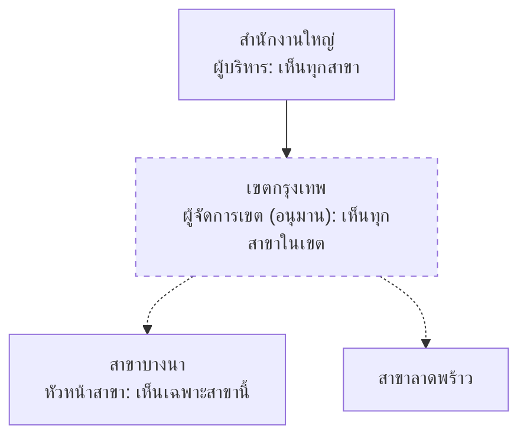

# Visuals for discussion docs

The user confirms a design fastest by looking at it. A discussion doc explains with pictures as well as sentences. Section 3 opens with at least one picture. A decision whose options look or flow differently gets one small picture per option, all of the same type.

**The text is authoritative.** A picture illustrates the tagged statements and tables and never holds a fact the text lacks. The approve merge, the consult fold-in and chat tools all work from the text, and context packs skip image files. A revision that changes a fact updates every picture of it in the same revision.

Fenced blocks (mermaid, wireframes) do not count toward the ~200-line cap, so pictures are never cut to save lines.

## Which picture for which question

| Question the reader has | Picture | Form |
|---|---|---|
| What happens, in what order, who does it | flow, one lane per role | `flowchart LR` with a `subgraph` per role |
| Who talks to whom, and what happens when it fails | interaction | `sequenceDiagram` with `alt` / `opt` |
| Which states a record goes through | lifecycle | `stateDiagram-v2` |
| What the data looks like | tables and relations | `erDiagram` |
| Who sits above whom, which unit sees what | hierarchy | `flowchart TB` |
| What the screen shows for each role | wireframe | a real screenshot once one exists, else ASCII in a `text` fence |
| What is in scope, the menu groups | tree | `flowchart LR`; `mindmap` optional |
| What a person goes through step by step | journey | `sequenceDiagram`; `journey` optional |
| When things happen (cut-off, month-end, go-live) | timeline | `gantt`; `timeline` optional |

Default to flowchart, sequenceDiagram, stateDiagram-v2 and erDiagram. `mindmap`, `timeline` and `journey` are newer and some previews do not render them. Use them only when a flowchart would read worse.

## Showing where a picture comes from

A picture carries the same origin as the text, marked in a way that works in every diagram type:
- **In the label:** a node, participant, state or attribute that is inferred or proposed says so in its text, for example `BM["หัวหน้าเขต (อนุมาน)"]` or `"ส่งอีเมลแจ้ง (เสนอ: codex)"`.
- **Legend line under every picture**, in Thai: the question the picture answers, and which parts are inferred or proposed. For example: `ภาพนี้ตอบ: ใครเห็นงานของสาขาไหน | (อนุมาน) = Claude ตีความเอง ยังไม่มีในเอกสารลูกค้า`
- **Dashes as an extra, flowcharts only:** `-.->` for an inferred edge, and a class for inferred nodes:

~~~text
classDef guess stroke-dasharray: 5 5
class BM,RM guess
~~~

## Mermaid rules that avoid broken diagrams

- Quote every label that has Thai, spaces or punctuation: `A["หัวหน้าสาขา (บางนา)"]`. Parentheses, brackets, braces, `;` and `#` inside an unquoted label break the parser, and `discuss.mjs check` warns about them in flowcharts. Quoting avoids every such case.
- Node ids are ASCII (`BM`, `JobList`); only labels are Thai. Use `<br/>` for a line break inside a label.
- About 15 nodes at most per picture. Split by question rather than shrinking the picture.
- `erDiagram`: entity and attribute names in ASCII, Thai in the attribute comment: `string JobNo "เลขงาน"`.
- `stateDiagram-v2`: ASCII state ids, with Thai through `state "รอรับงาน" as Waiting`.
- `sequenceDiagram`: `participant BM as หัวหน้าสาขา`.
- Optional check: if `mmdc --version` works (mermaid-cli, which needs a browser, so it is never required), render the doc into `.mflow/cache/discuss-<NN>/` to catch syntax errors before handing it over. Otherwise re-read each block against these rules.

## Screens: screenshots first, wireframes before

- Once `/mflow:screen` has made the screen, link its per-role screenshots from the doc with a relative path: ``. Every screenshot still needs its statements in the text.
- Before a screen exists, draw an ASCII wireframe in a `text` fence. Characters that work: `+--+`, `|`, `[ บันทึก ]` for buttons, `[x]` for checkboxes, `(o)` for radio buttons, `____` for inputs, `▼` for dropdowns.
- Thai vowels and tone marks take no column in a monospace font, so right-hand borders drift. Leave boxes open on the right, or put Thai text last on a line.
- Draw only what the decision needs: which menus, columns, buttons and fields appear. Leave out colours and spacing; the theme kit decides those.
- Access control is clearest as the same screen drawn once per role, with a line saying what disappears.
- Use the same example people and data as the scenarios (คุณสมชาย, สาขาบางนา).

## Examples

A data-scope hierarchy with one inferred role:

~~~text

ภาพนี้ตอบ: ใครเห็นงานของสาขาไหน | (อนุมาน) และเส้นประ = Claude ตีความเอง ยังไม่มีในเอกสารลูกค้า
~~~

The same screen for two roles:

~~~text
```text
หน้ารายการงาน: คุณสมชาย (หัวหน้าสาขาบางนา)
+-------------------------------------------------------------
| ค้นหา ____________  สถานะ ▼   [ ค้นหา ]      [ + สร้างงาน ]
| เลขงาน          | ลูกค้า     | สถานะ   | ยอดขาย   | ต้นทุน
| JOB-2569-00012  | บริษัท ก   | รอรับ   | 12,500   | 9,800
+-------------------------------------------------------------

หน้ารายการงาน: คุณวิภา (พนักงานขาย สาขาบางนา)
+-------------------------------------------------------------
| ค้นหา ____________  สถานะ ▼   [ ค้นหา ]
| เลขงาน          | ลูกค้า     | สถานะ   | ยอดขาย
| JOB-2569-00012  | บริษัท ก   | รอรับ   | 12,500
+-------------------------------------------------------------
```
ต่างกัน: พนักงานขายไม่เห็นคอลัมน์ต้นทุน และไม่มีปุ่มสร้างงาน [ที่มา: tor-v1 §4.2]
~~~
